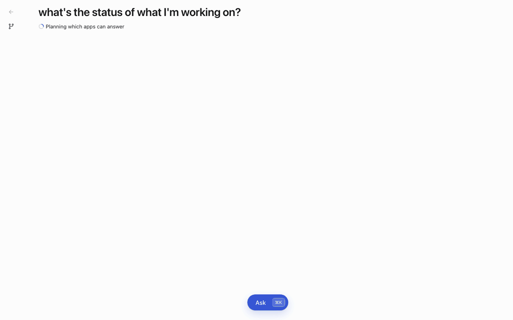
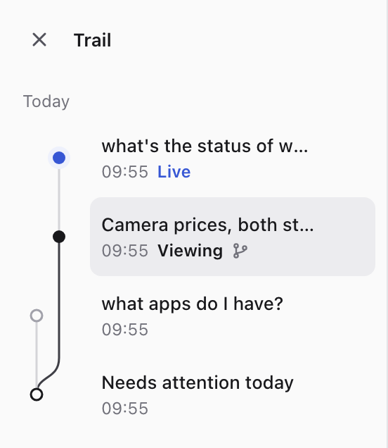
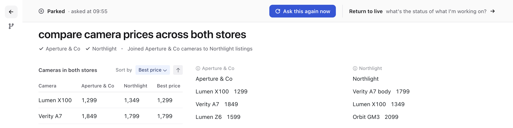
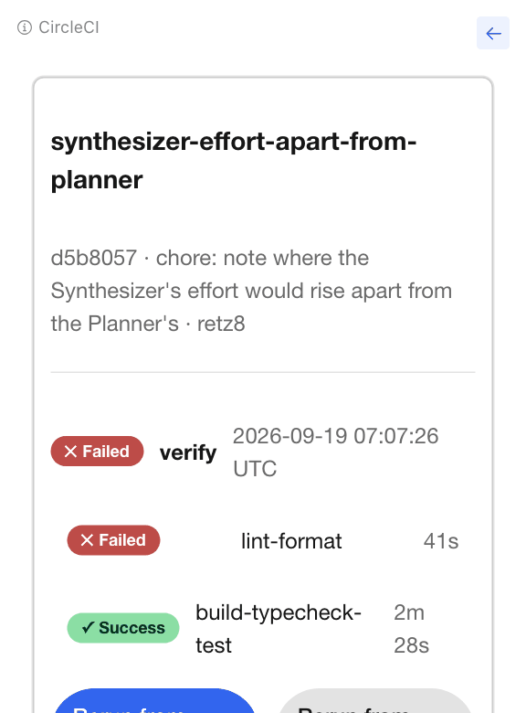
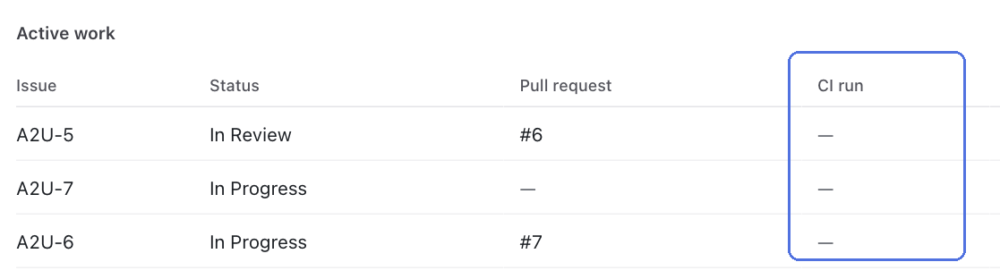
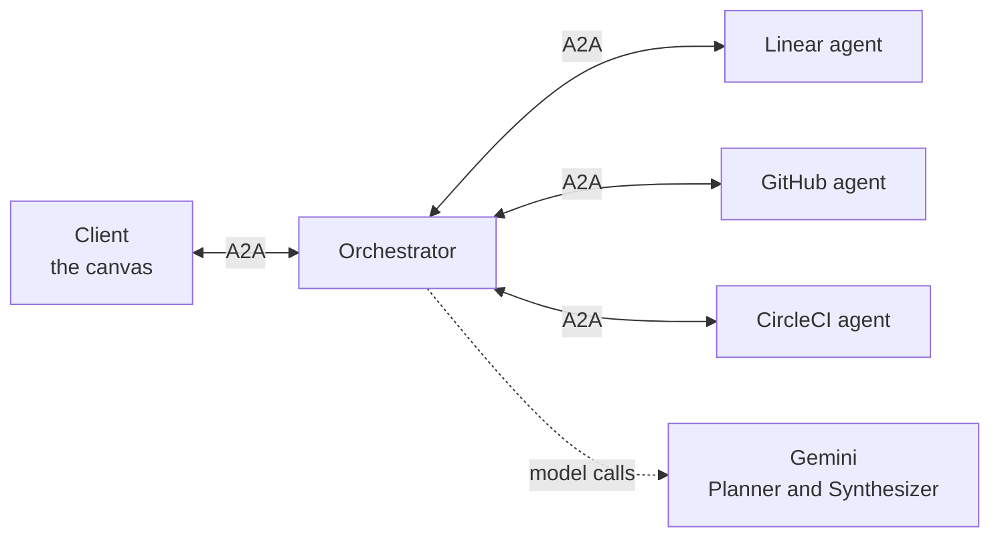

# A2UIVerse

> **The application ecosystem for A2UI agents.**

A2UIVerse is an open application ecosystem built on **[A2UI](https://a2ui.org)** and **[A2A](https://github.com/a2aproject/A2A)**.

A2UI defines how agents describe user interfaces.
**A2UIVerse defines how those interfaces become composable applications.**

Ask one question. Several agents answer at once, each painting its own interface, and you get **one screen**, not three chat replies.

<p align="center">
  
  <br>
  <em>"What's the status of what I'm working on?" The layout lands first, Linear, GitHub and CircleCI each fill their slot in their own look, and the merged table on top joins them. Replayed from a recording, with the waits shortened.</em>
</p>

## Why A2UIVerse?

**A2UIVerse = A2UI + Universe**

Rather than treating agents as features inside applications, A2UIVerse treats agents as **first-class, composable application primitives**.

It explores what an application ecosystem looks like when AI agents can be packaged, discovered, installed, orchestrated, and composed into interactive experiences.

**A2UIVerse is to A2UI agents what a browser is to websites.** A browser draws pages from any site, in markup it didn't write; A2UIVerse draws UI from any A2UI agent. But where a browser needs an address and shows one site at a time, A2UIVerse takes a question and puts every app that holds part of the answer on one screen.

| On the web                                | In A2UIVerse                                                        |
| ----------------------------------------- | ------------------------------------------------------------------- |
| A website                                 | An app: an A2A agent that answers with UI in A2UI                   |
| HTML and CSS                              | A2UI, drawn with the app's own catalog                              |
| Typing an address                         | Asking a question; A2UIVerse picks the apps                         |
| One site per tab                          | Several apps on one screen, each in its own look, and a merged view |
| Tabs and a history stack                  | A canvas per question, each still working, on a trail that branches |
| Permission prompts only the browser draws | Sign-in and consent only the shell draws, never an app (to come)    |

## What it does

### One question, one screen

Ask in words, from the palette (`⌘K`). A2UIVerse picks the apps that hold the answer, including ones you didn't name, lays out a screen, and asks them all at once. Each app fills its slot with UI it generates, in its own design system: GitHub in Primer, Gmail and Calendar in Material 3, CircleCI and Linear in their own looks. The shell names each app above its slot and never reaches inside it. [More in the client README](apps/client/README.md).

### A merged view across apps

When the answers can be joined, a table on top brings them together: above, each Linear issue with its pull request in GitHub and its CI run in CircleCI. A model writes the table as formulas pointing into each app's data, never as copied values, and every claim that two entries are the same thing is checked against the data before it's accepted. The client computes the table itself and keeps it live as the apps' data changes, with no further model call. Each value shows how sure it is, and clicking it jumps to where it came from. [See one row merged, step by step](apps/orchestrator/README.md#merges-across-apps).

### Honest when apps are slow or fail

One app failing never fails the rest: its slot says why and offers Retry, and its data leaves the merge. The merge doesn't wait on a straggler: a late app still fills its slot when it arrives, and Include folds it in. Only the first merge is automatic; every later model call has a press behind it, so the merged view never changes without a visible reason.

### Every question kept

<table>
  <tr>
    <td align="center" valign="top"></td>
    <td align="center" valign="top"></td>
  </tr>
  <tr>
    <td align="center"><em>The trail: four questions on two branches.</em></td>
    <td align="center"><em>A past answer, stamped with when it was asked.</em></td>
  </tr>
</table>

Every question opens its own canvas, and none is thrown away when the next one is asked. A past answer still works like a browser tab: clicks and sorts land in it, and anything it was still loading keeps arriving. "Ask this again now" gets today's answer as a new canvas and leaves the past one as it was. Asking from a past answer starts a branch, and the trail draws every question on the branch it grew from.

### Back and forward inside each app

<table>
  <tr>
    <td align="center" valign="top"></td>
    <td align="center" valign="top"></td>
  </tr>
  <tr>
    <td align="center"><em>CircleCI's slot: Back from a run to its runs list, then Forward.</em></td>
    <td align="center"><em>The merged view at the same moments.</em></td>
  </tr>
</table>

Clicking into something inside an app, like a CI run, paints a new screen in its slot, with a back arrow beside the app's name. Each app keeps its own history, apart from the others. Going back restores the merged view too, from the wiring remembered for that combination of screens, with no model call.

### Any A2UI agent can join

**App = MCP server + Agentic BFF + A2UI catalog.** Five apps, GitHub, Gmail, Google Calendar, CircleCI and Linear, live in [`a2uiverse-apps`](https://github.com/retz8/a2uiverse-apps), with a kit to build agents on and a scaffolder for new apps. On the way to the screen, an app's A2UI is changed only where two apps could collide, so an A2UI agent takes part with no changes to its code.

## How it works



The client talks only to the orchestrator, and the orchestrator to the apps. One question goes like this:

1. **Router** ranks the installed apps' agent cards against the question, with a small embedding model, and hands a shortlist on.
2. **Planner**, the first model call, picks the apps, writes each one's request, and designs the layout. The layout reaches the client before any app is asked.
3. **Apps** are asked in parallel, and each answer is relayed into its slot as it arrives. The client draws it with that app's own catalog.
4. **Synthesizer**, the second model call, runs once the apps have answered, when the plan reserved a merged view. It writes the view as formulas over the apps' data.
5. **Client** evaluates the formulas, and again on every change, with no model call.

| Part                                                        | What it is                                                                                                  |
| ----------------------------------------------------------- | ----------------------------------------------------------------------------------------------------------- |
| [`apps/client`](apps/client/)                               | The canvas: the palette, the composed screen, the merged view, the trail. Vite and React                    |
| [`apps/orchestrator`](apps/orchestrator/)                   | The hub: an A2A agent server that picks the apps, plans the screen, relays the answers and writes the merge |
| [`apps/marketplace`](apps/marketplace/)                     | Where apps will be published and found. Not built yet                                                       |
| [`packages/sdk`](packages/sdk/)                             | The contract between the orchestrator and the client, and generic A2UI tools                                |
| [`packages/shell-catalog`](packages/shell-catalog/)         | The shell's own A2UI catalog: the basic catalog on Radix Themes, plus the components that compose a screen  |
| [`a2uiverse-apps`](https://github.com/retz8/a2uiverse-apps) | The apps, their agent kit and the scaffolder, in their own repo                                             |

The design is in [SPEC.md](SPEC.md).

## Getting it running

### Watch a replay, with nothing to set up

```bash
pnpm install
pnpm dev:client
```

Open **http://localhost:5173/?beat=9** for the session in the GIF above, replayed from a recording with no orchestrator, no apps and no model. `?beat=trail` replays four questions on two branches, and `?beat=23` the way back inside an app.

### Run it for real

You need **Node 22** or newer (Corepack resolves the pinned pnpm), [uv](https://docs.astral.sh/uv/), a [Gemini API key](https://aistudio.google.com/apikey), and [`a2uiverse-apps`](https://github.com/retz8/a2uiverse-apps) checked out beside this repo.

```bash
git clone https://github.com/retz8/a2uiverse-apps ../a2uiverse-apps
pnpm install
echo "GOOGLE_API_KEY=<your key>" > apps/orchestrator/.env
pnpm dev:all        # the apps, then the platform
```

Open **http://localhost:5173** and press `⌘K`. The apps start in `deterministic` mode, answering from recordings with no key of their own, while the Planner and the Synthesizer run live. For real data, start the apps in `live` mode with `pnpm dev:all --mode live`; each app's agent README says which credentials it needs.

<details>
<summary><b>Every command</b></summary>

```bash
pnpm dev:all          # the apps, then the platform
pnpm dev              # the platform only: client, orchestrator, marketplace
pnpm dev:agents       # the apps only: --only <ids>, --mode deterministic|stub|live, --agents-dir <path>
pnpm agents:list      # what the launcher finds, and what it would refuse to start
pnpm dev:client       # one platform process, in its own terminal
pnpm dev:orch
pnpm dev:marketplace
pnpm verify           # build, typecheck, test, lint and format check
```

Ports: client `5173`, orchestrator `10001`, marketplace `10002`. The apps take `11001` and up, the mock stores `12001` and up; only the orchestrator reaches them.

</details>

<details>
<summary><b>The launcher</b></summary>

The launcher has no list of apps. It reads the `manifest.json` in every folder of the agents dir, the sibling `a2uiverse-apps` by default, so an app scaffolded with `create-a2ui-agent` launches by existing. `--agents-dir <path>` or `A2UIVERSE_AGENTS_DIR` points it elsewhere, and the orchestrator it starts reads its apps from the same place.

A folder with a broken manifest or no agent is named with its reason and skipped, and the rest still run. Two apps claiming one port stop the run.

`dev:all` waits for every app's agent card before starting the platform, because the orchestrator reads the cards once, at startup: an app that comes up later can't be asked anything until it restarts.

The two mock stores, for testing the merged view, sit one folder down and run only when asked:

```bash
pnpm dev:all --agents-dir ../a2uiverse-apps/mocks
```

</details>

<details>
<summary><b>Repository layout</b></summary>

```
apps/
  client/          the canvas (Vite + React)
  orchestrator/    the A2A agent server: routing, planning, composition
  marketplace/     where apps will be published and found
packages/
  sdk/             @a2uiverse/sdk: the orchestrator and client's contract
  shell-catalog/   the shell's own A2UI catalog: schema and React implementation
scripts/           the dev:agents launcher
docs/
  design/          the design records: each part as built, its classes and flows
  images/          the screenshots in the READMEs
```

A pnpm workspace with Turborepo over it. Each package's README has its own commands and configuration.

</details>

## Where it's headed

What's built so far is the composed screen. Next comes the ecosystem around it:

- **Apps as bundles**: an app installed locally as one package, and the list of apps no longer written into the code.
- **Sign-in the shell owns**: when an app needs access, a tile and a consent dialog drawn by the shell, never by the app, with credentials kept in a vault.
- **A marketplace**: a local index of published apps, package hosting, a publish step, and a new app tried out by rendering its first screen.
- **Store and App Library pages**: trusted pages to browse and install apps, and to manage installed ones and their accounts.
- **Installing mid-question**: a question no installed app can answer finds one in the marketplace, installs it, and carries on.
- **One sitting, end to end**: publish a new app, discover it, install it, compose it with an existing one, and act inside it, with no code changes.

## License

MIT. See [LICENSE](LICENSE).
