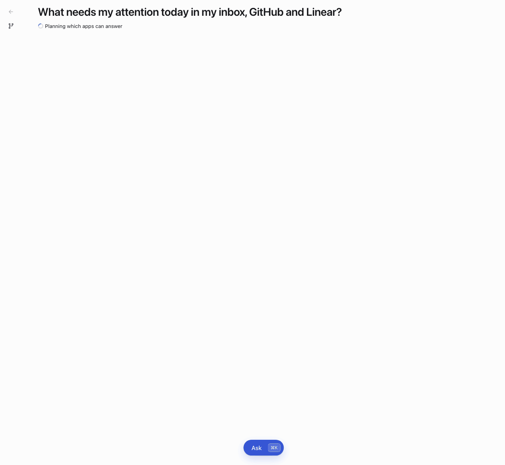
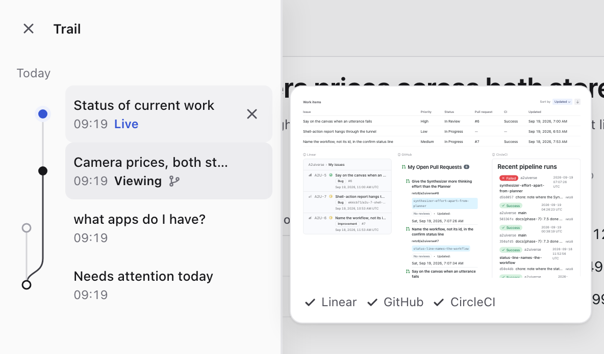
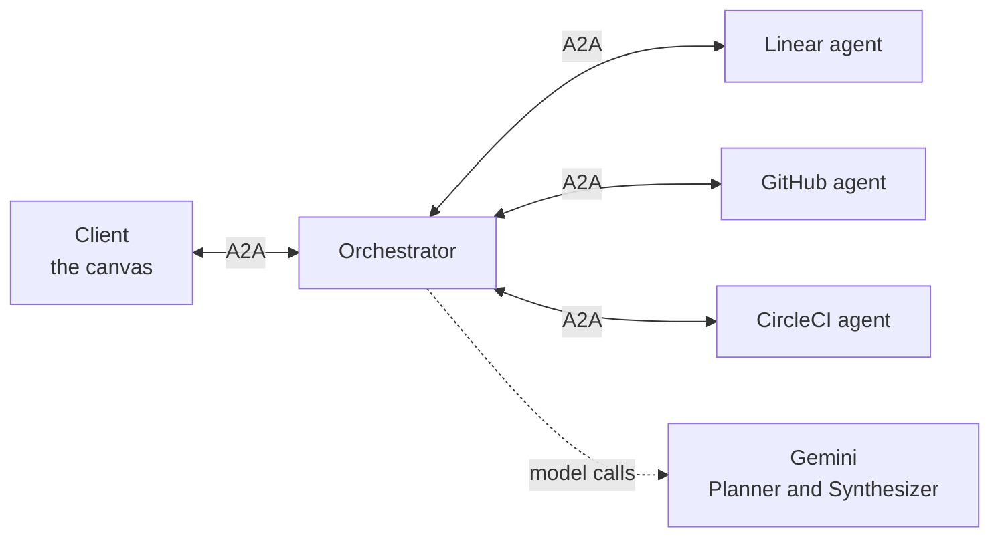

# A2UIVerse

> **The application ecosystem for A2UI agents.**

A2UIVerse is a semantic application runtime that composes independently-owned agent UIs into one persistent, interactive surface. It's built on **[A2UI](https://a2ui.org)** and **[A2A](https://github.com/a2aproject/A2A)**.

A2UI asks: _how does an agent express UI?_\
**A2UIVerse asks: how do the UI and data that many agents express become one application?**

Ask one question. Several agents answer at once, each painting its own interface, and you get **one screen**, not three chat replies.

<p align="center">
  
  <br>
  <em>"What needs my attention today in my inbox, GitHub and Linear?" The layout lands first, Gmail, GitHub and Linear each fill their slot in their own look, and the merged table on top puts them on one timeline. Replayed from a recording, with the waits shortened.</em>
</p>

## Why A2UIVerse?

**A2UIVerse = A2UI + Universe**

Rather than treating agents as features inside applications, A2UIVerse treats agents as **first-class, composable application primitives**.

It explores what an application ecosystem looks like when AI agents can be packaged, discovered, installed, orchestrated, and composed into interactive experiences.

**A2UIVerse is to A2UI agents what a browser is to websites.** A browser draws pages from any site, in markup it didn't write; A2UIVerse draws UI from any A2UI agent. But where a browser needs an address and shows one site at a time, A2UIVerse takes a question and puts every app that holds part of the answer on one screen.

| On the web                                | In A2UIVerse                                                         |
| ----------------------------------------- | -------------------------------------------------------------------- |
| A website                                 | An app: an A2A agent that answers with UI in A2UI                    |
| HTML and CSS                              | A2UI, drawn with the app's own catalog                               |
| Typing an address                         | Asking a question; A2UIVerse picks the apps                          |
| One site per tab                          | Several apps on one screen, each in its own look, and a merged view  |
| Tabs and a history stack                  | An answer per question, each still working, on a trail that branches |
| Permission prompts only the browser draws | Sign-in and consent only the shell draws, never an app               |

The full design, from its axioms to its milestones, is in **[SPEC.md](SPEC.md)**.

## What it does

### One question, one screen

Ask in words, from the palette (`⌘K`). A2UIVerse picks the apps that hold the answer, including ones you didn't name, lays out a screen, and asks them all at once. Each app fills its slot with UI it generates, in its own design system: GitHub in Primer, Gmail and Calendar in Material 3, CircleCI and Linear each in a catalog of its own. The shell names each app above its slot and never reaches inside it. [More in the client README](apps/client/README.md).

### A merged view across apps

When the answers can be joined, a table on top brings them together: above, the morning's mail, issues and pull requests on one timeline. Asked for the status of your work, it puts each Linear issue on one row with its pull request in GitHub and its CI run in CircleCI. A model writes the table as formulas pointing into each app's data, never as copied values, and every claim that two entries are the same thing is checked against the data before it's accepted. The client computes the table itself and keeps it live as the apps' data changes, with no further model call. Each value shows how sure it is, and clicking it jumps to where it came from. [See one row merged, step by step](apps/orchestrator/README.md#merges-across-apps).

### Honest when apps are slow or fail

One app failing never fails the rest: its slot says why and offers Retry, and its data leaves the merge. The merge doesn't wait on a straggler: a late app still fills its slot when it arrives, and Include folds it in. Only the first merge is automatic; every later model call has a press behind it, so the merged view never changes without a visible reason.

### Every question kept

<p align="center">
  
  <br>
  <em>The trail: four questions on two branches. Hovering an entry previews its answer.</em>
</p>

<p align="center">
  
  <br>
  <em>A past answer, stamped with when it was asked.</em>
</p>

Every question gets its own answer, and none is thrown away when the next one is asked. A past answer still works like a browser tab: clicks and sorts land in it, and anything it was still loading keeps arriving. "Ask this again now" gets today's answer as a new one and leaves the past one as it was. Asking from a past answer starts a branch, and the trail draws every question on the branch it grew from.

### Sign-in the shell draws

An app that needs you signed in never draws its own sign-in. Its slot takes a tile the shell draws, saying what the app will be able to do in the words of its card, with one Sign in that opens the app's sign-in in a new window; when you're done, the slot fills in place, and the rest of the screen never waits on it. After its first tile in a sitting, an app you haven't signed in to is one quiet line. An app that needs more access part-way, to open a message or confirm a write, asks on its name row, with Allow and Not now. An app can hold several accounts, each named on what it paints: a question about where things stand gathers from all of them, and a command that names none asks which. No app can put a password, code or card field on the screen: a paint with one is refused and the app asked once to answer without it; if it doesn't, its slot says why and offers to continue on the app's own site. The orchestrator keeps the sign-ins in its vault; no credential reaches the client or the models. [More in the authority design record](docs/design/authority.md).

### Back and forward inside each app

<table>
  <tr>
    <td align="center" valign="top"></td>
    <td align="center" valign="top"></td>
  </tr>
  <tr>
    <td align="center"><em>CircleCI's slot: a run, its failing job, Back twice, the run opened again, then Back twice: the runs list, and the job left behind.</em></td>
    <td align="center"><em>The merged view at the same moments.</em></td>
  </tr>
</table>

Clicking into something inside an app, like a CI run, paints a new screen in its slot, with a back arrow beside the app's name. Each app keeps its own history, apart from the others, and drops nothing: go back and open something else, and Back still reaches the screen you left. Going back restores the merged view too, from the wiring remembered for that combination of screens, with no model call.

### Any A2UI agent can join

**App = MCP server + Agentic BFF + A2UI catalog.** Five apps, GitHub, Gmail, Google Calendar, CircleCI and Linear, live in [`a2uiverse-apps`](https://github.com/retz8/a2uiverse-apps), with a kit to build agents on and a scaffolder for new apps. On the way to the screen, an app's A2UI is changed only where two apps could collide, so an A2UI agent takes part with no changes to its code. An app is installed into a running platform from its agent card and its catalog, packed by Stellify: the client loads the catalog when it's first needed, and nothing in A2UIVerse's code names an app. Sign-in is read from the card too: A2UIVerse signs in to an app by the scheme its card declares, as any OAuth client would.

## How it works


```mermaid
flowchart LR
    C["Client<br/>the canvas"] <-->|A2A| O["Orchestrator"]
    O <-->|A2A| L["Linear agent"]
    O <-->|A2A| G["GitHub agent"]
    O <-->|A2A| CI["CircleCI agent"]
    O -.->|model calls| M["Gemini<br/>Planner and Synthesizer"]
```

The client talks only to the orchestrator, and the orchestrator to the apps. One question goes like this:

1. **Router** ranks the installed apps' agent cards against the question, with a small embedding model, and hands a shortlist on.
2. **Planner**, the first model call, picks the apps, writes each one's request, and designs the layout. The layout reaches the client before any app is asked.
3. **Apps** are asked in parallel, and each answer is relayed into its slot as it arrives. The client draws it with that app's own catalog.
4. **Synthesizer**, the second model call, runs once the apps have answered, when the plan reserved a merged view. It writes the view as formulas over the apps' data.
5. **Client** evaluates the formulas, and again on every change, with no model call.

Before an app is asked, the orchestrator's **AuthVault** checks the app's card against the accounts it holds, and the request carries the account's credential as an HTTP header. An app you aren't signed in to isn't asked: its slot takes the sign-in tile, and signing in sends the request then.

| Part                                                        | What it is                                                                                                                                             |
| ----------------------------------------------------------- | ------------------------------------------------------------------------------------------------------------------------------------------------------ |
| [`apps/client`](apps/client/)                               | The canvas: the palette, the composed screen, the merged view, the trail. Vite and React                                                               |
| [`apps/orchestrator`](apps/orchestrator/)                   | The hub: an A2A agent server that picks the apps, plans the screen, relays the answers and writes the merge, and keeps the apps' sign-ins in its vault |
| [`apps/marketplace`](apps/marketplace/)                     | Where apps are published and found: the index of published apps with its search, their catalogs hosted, and the publish step with its smoke test       |
| [`packages/sdk`](packages/sdk/)                             | The contract between the orchestrator and the client, and generic A2UI tools                                                                           |
| [`packages/shell-catalog`](packages/shell-catalog/)         | The shell's own A2UI catalog: the basic catalog on Radix Themes, plus the components that compose a screen                                             |
| [`packages/stellify`](packages/stellify/)                   | Stellify, the pack and publish tool: turns a catalog package into the catalog artifact the registry installs, and takes an app to the marketplace      |
| [`packages/registry-snapshot`](packages/registry-snapshot/) | The catalog table and the seven catalog packages, packed, at one pinned commit, for the tests and replays                                              |
| [`a2uiverse-apps`](https://github.com/retz8/a2uiverse-apps) | The apps, their agent kit and the scaffolder, in their own repo                                                                                        |

Going deeper: **[SPEC.md](SPEC.md)** is the full design, and [`docs/design/`](docs/design/) has a guide to each part: the [synthesis](docs/design/synthesis.md) behind the merged view, the [client](docs/design/client.md), the [orchestrator](docs/design/orchestrator.md), the [shell catalog](docs/design/shell-catalog.md), the [agent kit](docs/design/agent-kit.md), [app install](docs/design/app-install.md), and [authority](docs/design/authority.md): sign-in, accounts and the credential bar.

## Getting it running

### Watch a replay, with nothing to set up

```bash
pnpm install
pnpm --filter @a2uiverse/client preview:snapshot
```

Open **http://localhost:4173/?beat=27** for the session in the GIF above, replayed from a recording with no orchestrator, no apps and no model; the apps' catalogs come from the registry snapshot the command builds. `?beat=trail` replays four questions on two branches, and `?beat=26` the way back inside an app.

### Run it for real

You need **Node 22** or newer (Corepack resolves the pinned pnpm), [uv](https://docs.astral.sh/uv/), a [Gemini API key](https://aistudio.google.com/apikey), and [`a2uiverse-apps`](https://github.com/retz8/a2uiverse-apps) checked out beside this repo.

```bash
git clone https://github.com/retz8/a2uiverse-apps ../a2uiverse-apps
pnpm install
echo "GOOGLE_API_KEY=<your key>" > apps/orchestrator/.env
pnpm dev:all        # the apps and the platform, the apps installed
```

Open **http://localhost:5173** and press `⌘K`. The apps start in `deterministic` mode, answering from recordings with no key of their own, while the Planner and the Synthesizer run live. The first time you ask something an app holds, its slot asks you to sign in, and the app's sign-in page offers made-up accounts. For real data, start the apps in `live` mode with `pnpm dev:all --mode live`: each agent then needs a Gemini key in its own `.env`, and you sign in to each vendor in the browser. GitHub, and Gmail and Calendar together, sign in through an OAuth client you register once; Linear and CircleCI need nothing set up. Each app's agent README has the steps.

<details>
<summary><b>Every command</b></summary>

```bash
pnpm dev:all          # the apps and the platform, the apps installed
pnpm dev              # the platform only: client, orchestrator, marketplace
pnpm dev:agents       # the apps only, installed into the running orchestrator: --tier mocks, --only <ids>, --mode deterministic|stub|live, --agents-dir <path>, --no-install, --agent-state <dir>
pnpm agents:list      # what a launch would run, and what would stop it: --tier mocks
pnpm dev:client       # one platform process, in its own terminal
pnpm dev:orch
pnpm dev:marketplace
pnpm verify           # build, typecheck, test, lint and format check
pnpm sweep:secrets    # after a sitting: the journal and captured output searched for every token and key the vault and the agents hold, counts only: --state-dir, --agents-dir, --logs <dir>
```

Ports: client `5173`, orchestrator `10001`, marketplace `10002`. The apps take `11001` and up, the mock stores `12001` and up; the orchestrator reaches them, and the browser only their sign-in pages.

</details>

<details>
<summary><b>The launcher</b></summary>

The launcher's roster, `scripts/dev-roster.mjs`, lists every app it starts from the `a2uiverse-apps` checkout: its id, its folder, its tier and its port. `--agents-dir <path>` or `A2UIVERSE_AGENTS_DIR` points it at a checkout other than the sibling one. A new app is added to the roster with the port its agent was scaffolded on.

A launch runs one tier. The default tier is the five apps; the two mock stores, for testing the merged view, are a tier of their own and run in place of the apps:

```bash
pnpm dev:all --tier mocks
```

The launcher starts the agents and the platform together, builds each app's catalog package in the checkout, packs it with Stellify and, once the orchestrator answers, installs each app as soon as its agent is up. Then it uninstalls every roster app it did not launch, so the orchestrator holds what runs; an app you installed by hand that the roster does not name is left alone. `dev:agents` does the same against an orchestrator you started yourself. `--no-install` starts the agents only — nothing built, packed, installed or uninstalled — for installing apps by hand with the orchestrator's `registry` command.

Each agent is started with `--host localhost` and its roster port. `A2UIVERSE_PUBLIC_URL`, a pattern with a `{port}` slot such as `https://<tunnel-id>-{port}.asse.devtunnels.ms`, gives each agent, as `--public-url`, the address the browser reaches its sign-in pages at, for a browser on another machine; unset, they stay on `localhost`. `--agent-state <dir>` keeps each agent's sign-in store in `<dir>/<app id>`, passed as `--state-dir`, in place of the agent's own `.state/`. The launcher handles no credentials: each agent reads its own `agent/.env`.

An app that does not build, does not pack, never comes up, or is refused at install is named with its reason and left out, uninstalled if an earlier launch installed it; the rest still run. A roster app missing from the checkout is skipped. An unknown tier, an unknown `--only` id, or two apps of the tier on one port stop the launch. Stopping the launcher uninstalls nothing: the next launch sets the registry right.

</details>

<details>
<summary><b>Repository layout</b></summary>

```
apps/
  client/          the canvas (Vite + React)
  orchestrator/    the A2A agent server: routing, planning, composition
  marketplace/     where apps are published and found: the index, the hosted catalogs, the publish step
packages/
  sdk/             @a2uiverse/sdk: the orchestrator and client's contract
  shell-catalog/   the shell's own A2UI catalog: schema and React implementation
  stellify/        the pack and publish tool
  registry-snapshot/ the registry snapshot the tests and replays load
scripts/           the dev:agents launcher and its roster, the secret sweep
docs/
  design/          the design records: each part as built, its classes and flows
  images/          the screenshots in the READMEs
```

A pnpm workspace with Turborepo over it. Each package's README has its own commands and configuration.

</details>

## Where it's headed

What's built so far is the composed screen, installing an app into it from its card and its packed catalog, signing in to apps, with several accounts each, and the marketplace an app is published to: its index with search, its hosted catalogs, the publish step that tries a new app by asking it to paint its first screen, and Stellify taking an app there from the catalog's own checkout. Next comes the rest of the ecosystem around it:

- **Installing from the marketplace**: the orchestrator installing an app by its id alone and telling when a published update is waiting.
- **Store and App Library pages**: trusted pages to browse and install apps, and to manage installed ones and their accounts.
- **Installing mid-question**: a question no installed app can answer finds one in the marketplace, installs it, and carries on.
- **One sitting, end to end**: publish a new app, discover it, install it, compose it with an existing one, and act inside it, with no code changes.

## Feedback

A2UIVerse is in active development and isn't done. Feedback from anyone interested is welcome: ideas and questions in [Discussions](https://github.com/retz8/a2uiverse/discussions), bugs in [issues](https://github.com/retz8/a2uiverse/issues). [CONTRIBUTING](CONTRIBUTING.md) says more.

## License

MIT. See [LICENSE](LICENSE).

A2UIVerse is an independent project, not affiliated with or endorsed by GitHub, Google, Linear or CircleCI. Their product names identify the services the apps connect to and are trademarks of their owners.
