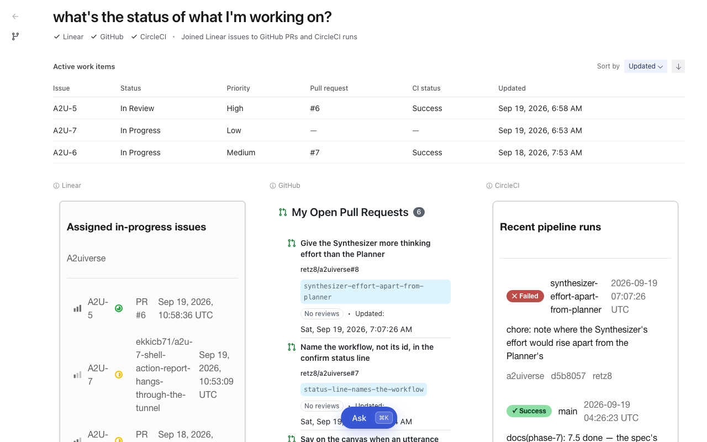

# @a2uiverse/client

The canvas: you ask in words, and the answer is a full screen of UI composed from several apps, each in its own design system and labelled with who painted it. It talks only to the orchestrator, never to an app.

<p align="center">
  
  <br>
  <em>One question, answered by Linear, GitHub and CircleCI, each in its own slot and look. The table on top is the merged view.</em>
</p>

## What it does

### One screen, many design systems

Each app's UI renders with its own catalog: GitHub in Primer, Gmail and Calendar in Material 3, CircleCI and Linear in their own themes, side by side on one page. Every catalog keeps its styles inside its own slot, and the client's collision tests fail if any leak onto the page or into another app.

The shell draws everything around the apps in Radix Themes: the question, the progress line, the palette, Back and Trail, the layout, and each app's name above its slot. It never reaches inside a slot.

### A merged view that stays live

The merged table isn't something a model drew. The orchestrator sends formulas pointing into each app's data, and the client evaluates them itself, again on every change to that data, with no model call. Sorting it is local and free.

Each value shows how sure it is by how strongly it's drawn, and says where it came from on hover. Clicking it scrolls to the element it came from in that app's slot and highlights it.

### Paints as answers arrive, never half-drawn

The layout lands first, with every slot waiting, and each app's UI fills its slot as it arrives. The line under the question says where things stand in the client's own words: a tick per app, then the merge, like "Joining Linear issues to GitHub PRs and CircleCI runs".

A new paint over one already on screen is built and checked off screen, then swapped in whole, so the screen never shows half of something. An app that fails shows a failure tile with Retry in its own slot, and nothing else moves.

### Keeps every question

<p align="center">
  
  <br>
  <em>A past answer: parked, stamped with when it was asked, with Ask this again now and Return to live.</em>
</p>

Every question gets its own answer, and none is thrown away when the next one is asked. Going back to one shows it as it was left, under a band with the time it was asked. It still works like a live tab: clicks, presses and sorts land in it, and anything it was still loading keeps arriving in the background.

"Ask this again now" asks its question again as a new answer and leaves this one as it was. "Return to live" goes to the newest question. Here the palette reads "Ask from this view": whatever you ask is a follow-up to this answer. It all lives in memory; a reload starts fresh.

### History that branches

<p align="center">
  
  <br>
  <em>The trail: four questions on two branches, the newest live.</em>
</p>

A browser keeps one history stack: go back a few pages and open something new, and everything ahead of you is gone. Here nothing is dropped. A question asked from an earlier answer starts a branch from it, and the trail draws every question on the branch it grew from. Hovering an entry previews its answer.

Back goes up the branch, not to the page before. Above, "Camera prices" was asked from "Needs attention today" (the fork mark), though "what apps do I have?" came in between, so Back from "Camera prices" goes to "Needs attention today".

#### Inside each app's answer

Each app's slot has its own Back and Forward, at the right of its name, apart from the trail and from the other apps: stepping CircleCI back to its runs list leaves GitHub and Linear where they are. The merged view follows the step, restored with no model call from the wiring remembered for that combination of screens.

<table>
  <tr>
    <td align="center" valign="top"></td>
    <td align="center" valign="top"></td>
  </tr>
  <tr>
    <td align="center"><em>CircleCI's slot: Back from a run to its runs list, then Forward again.</em></td>
    <td align="center"><em>The merged view at the same moments: its CI run column is empty while the run is open, and fills in again on Back.</em></td>
  </tr>
</table>

## Running it

```bash
pnpm dev:client     # from the repo root: Vite on port 5173
pnpm --filter @a2uiverse/client build | typecheck | test | lint
pnpm --filter @a2uiverse/client test:e2e   # Playwright: builds, serves on 4173, compares screenshots
```

It sends to `VITE_ORCHESTRATOR_URL`, `http://localhost:10001` by default (see `.env.example`). When the orchestrator is somewhere else, set it in an uncommitted `.env.local`. It needs the orchestrator and the apps running too; `pnpm dev:all` from the root starts everything in order.

Playwright's browser installs separately (`pnpm exec playwright install chromium`). Its screenshots are taken at 1024×768 in UTC and aren't committed: on a fresh clone, run `test:e2e --update-snapshots` once to take them.

## Working without a model

`?beat=<name>` replays a recorded or hand-built session through the whole canvas, with no model call and no network, and `&instant` skips the recorded pacing. `?beat=9&instant` is the entity join above, `?beat=trail` the trail, and `?beat=23&instant` the way back.

A beat's presses fire through the same handler the buttons call, answered from the beat itself. The tests and the screenshots in this README come from beats.

<details>
<summary><b>Recorded beats</b></summary>

Real output, captured through the orchestrator and kept as the stream it arrived as, in `recordings/beats/`:

| `?beat=`     | What it shows                                                                                                                                                                                                |
| ------------ | ------------------------------------------------------------------------------------------------------------------------------------------------------------------------------------------------------------ |
| `1` to `3`   | GitHub alone: a PR list, a PR, and a review composed and confirmed (replay `3` as `2,3`)                                                                                                                     |
| `4`          | Side by side: inbox and calendar in two slots, no merged view                                                                                                                                                |
| `5`          | The temporal merge: GitHub, Gmail and Calendar with the merged view                                                                                                                                          |
| `6`          | A question about A2UIVerse itself, answered by the shell                                                                                                                                                     |
| `7`          | A capability gap: nothing installed can answer                                                                                                                                                               |
| `8`          | One app's slot and the shell's own words in one layout                                                                                                                                                       |
| `9`          | The entity join: Linear, GitHub and CircleCI merged, one row per issue                                                                                                                                       |
| `10` to `18` | Late answers and failures: Retry, Include, the home source straggling or failing, a broken stream, a paint the canvas can't draw, too few answers                                                            |
| `19` to `25` | Several answers: a tab finishing in the background, acting in a past answer, "Ask this again now", adding and dropping a source, stepping back with and without a remembered merge, closing a loading answer |

Hand-built beats live in `src/beats/`: `syntheticBeats.ts`, `lateFailureBeats.ts` for late answers and failures, and `durableBeats.ts` for kept answers and the way back.

</details>

## Installed catalogs

Eight catalogs are registered: the shell catalog, the five vendor apps', and the two mock stores', which are always bundled so the client can render whichever apps the orchestrator serves. `src/catalogs/resolver.ts` maps each catalog id to its catalog and the Provider that wraps its fragments.

Vendor catalogs are git dependencies on the `a2uiverse-apps` repo, built on install.

- **Bump one:** `pnpm update <vendor>-catalog --filter @a2uiverse/client`, then re-point its `allowBuilds` line in `pnpm-workspace.yaml` to the new commit.
- **Work on one locally:** `pnpm link ../../../a2uiverse-apps/<vendor>/<vendor>-catalog`.
- **Add a new app's catalog:** add it as a dependency, to `src/catalogs/resolver.ts`, and to `STATIC_CATALOGS` in `src/orchestratorApi.ts`. Installing app bundles will replace these lists.

The client supplies only the shared runtime: React, `@a2ui/react` / `@a2ui/web_core` and zod. An app's design system, such as Primer for GitHub, comes inside its catalog.

## Renderer patch

`@a2ui/react` is patched locally (`patches/@a2ui__react@0.10.2.patch`) with two fixes that only show when several apps share a page:

- **`ChoicePicker`'s radio group name** comes from `React.useId()` instead of the component id, so two fragments' pickers that share an id no longer join one group. Reported upstream as [#2447](https://github.com/a2ui-project/a2ui/issues/2447), fixed in [PR #2449](https://github.com/a2ui-project/a2ui/pull/2449).
- **The loading and unknown-component fallbacks** draw as quiet, themed placeholders instead of hard-coded gray and red.

`src/canvas/composition/rendererPatch.test.tsx` fails if a version bump drops either. Regenerate the patch with `pnpm patch @a2ui/react@<version>`.

<details>
<summary><b>On-demand scripts</b></summary>

None of these are part of `pnpm verify`; each needs live processes.

**Re-record the beats**, through the orchestrator:

```bash
pnpm --filter @a2uiverse/client record:beats --model <model> --beats 1-9
pnpm --filter @a2uiverse/client record:beats --model <model> --beats 10-25 [--fault-port 10091]
```

Beats 1 to 9 run against live apps. Beats 10 to 25 need the apps in `deterministic` mode (`pnpm dev:agents`) and port 10091 free: the recorder starts its own orchestrator there for each, with the case's faults and time limits and the Gemini key in the orchestrator's `.env`, and retakes a take that doesn't show its case, up to three times.

> [!IMPORTANT]
> Start the Gmail agent with `A2UI_RECORD_DIR` set when recording. That's what makes it swap real mail for stand-ins, and the recorder can't tell whether that happened.

**Check a fixture carries no real data**, the backstop for the above:

```bash
A2UI_FIXTURE_FORBIDDEN="<real address>,<real name>" pnpm --filter @a2uiverse/client check:fixtures
```

**Check the relay changes nothing but what it should.** Against `deterministic` apps, it sends one question through the orchestrator and the same requests straight to each app, and checks the two streams match once the orchestrator's own changes are undone.

```bash
pnpm --filter @a2uiverse/client check:transparency
```

</details>

<details>
<summary><b>Source map</b></summary>

```
src/
  canvas.tsx         the entry: resolves the catalogs, mounts the canvas
  orchestratorApi.ts the client's non-A2A channel to the orchestrator
  catalogs/          catalog id → catalog and Provider
  canvas/            the canvas, with a short code guide
  a2a/               the A2A side: the agent card, each answer's session, sending, paintMeta
  a2ui/              applying streamed A2UI batches to a processor
  beats/             the beat format, replay, the synthetic beats
  shared/            error describers and the surface error boundary
tests/               integration tests over the canvas and the transport
e2e/                 Playwright screenshot tests
```

</details>

The design record is [`docs/design/client.md`](../../docs/design/client.md).
