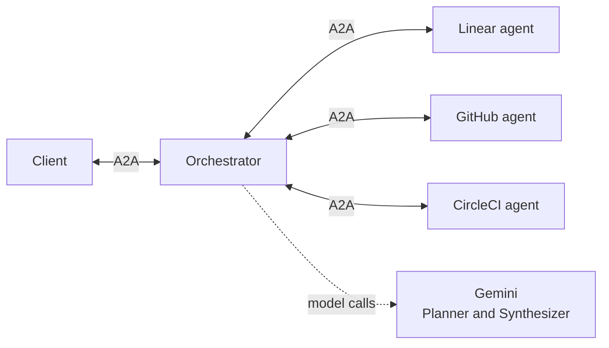

# @a2uiverse/orchestrator

The hub: an A2A agent server, and the only server the client talks to. It finds the apps that can answer a question, plans where their answers will sit, asks them in parallel, and relays what comes back as one composed screen. When the answers can be merged, a second model call writes the merged view.

## Where it sits

<p align="center">
  
  <br>
  <em>One question, answered by Linear, GitHub and CircleCI, each in its own slot and look. The table on top is the merged view.</em>
</p>

None of it reaches the client from an app directly. The client and the apps never talk to each other; each talks A2A to the orchestrator in the middle.



- **To the client**, the orchestrator is one A2A agent that answers every question and every click.
- **To each app**, it's an A2A client with a request. The app answers in its own UI, and the orchestrator decides where that UI goes on the screen.

## What it does

### Picks the apps

The Router embeds the question and ranks every installed app's agent card against it, A2UIVerse's own card among them, then hands a shortlist to the Planner. There's no list of intents to maintain: the match is on the skills each app's card describes.

The Planner, one model call, decides who answers and what each is asked. A question about the state of your work goes to every app that holds part of it, whether or not you named them; a question inside one app goes to that app alone. Each app receives the Planner's request, written for it, rather than your question as typed.

### Composes one screen

In the same call, the Planner designs the layout: a surface in the shell's own catalog, with a slot for each app, a slot for the merged view when there is one, and any headings or words of its own. The layout reaches the client before any app is asked, so the screen appears as soon as the Planner answers.

Each app's UI then fills its slot as it arrives, drawn in the app's own design system, with the app's name above it. The name is the shell's, and the app can't hide it.

### Merges across apps

When the plan reserves a merged view and at least two apps answer, the Synthesizer, a second model call, reads their data and writes the merged view as wiring rather than values. Every cell is a formula pointing into an app's data, like the lowest price across two stores, and the client computes it and keeps it live as the apps' data changes, with no further model call.

When the merge is over one thing seen by several apps, like a Linear issue, its pull request in GitHub and its CircleCI run, the Synthesizer says which entries are the same thing, and each of those claims is checked against the data before it's accepted. A cell shows how sure it is and where it came from, and clicking it goes to the value in its app's slot.

### Stays honest when apps are slow or fail

- **One app failing never fails the rest.** Its slot says why (the app's own words, unreachable, timed out, or a paint the client couldn't draw) and offers Retry, and its data leaves the merge.
- **The merge doesn't wait forever.** Once two apps have answered, 10 seconds with no further answer releases the merge over what arrived. A late app still fills its own slot, and Include folds it into the merge. After 300 seconds an app's slot fails; an answer arriving later is kept until Retry. When the merge is built around one app's items, that app is always waited for.
- **Only the first merge is automatic.** Every later model call has a press behind it: Retry, Include or Try again. The merged view never changes without a visible reason.

### Answers about itself

A question about A2UIVerse itself, like which apps you have or what the screen can do, is answered by the Planner in the layout, with no app asked. It reads the platform's state through a small fixed set of readers, never an app's data. A need that no installed app can meet gets a slot of its own: a tile that searches the Store for it.

## Keeps every answer

An answer isn't thrown away when the next question comes. Each one is kept, keeps working, and remembers its merged views.

### One composition per context

<p align="center">
  
  <br>
  <em>The client's trail: four questions asked, each one a context on the orchestrator. The newest is still loading.</em>
</p>

Every question the client sends is an A2A context, and the orchestrator holds a composition for each: the layout, each app's slot and data, the merged view, and each app's screen history. Every later message carries its context, so a click, a press or a close lands on the right one.

- **A question can name a parent**, the context it was asked from. The Planner then reads that composition, so "add Linear to this" means that answer.
- **Each app gets its own conversation per context**, so answers to different questions never mix.
- **A composition keeps running** after the next question: its apps still answer and its merge still lands, until the client closes it.

### Going back inside an app's answer

Clicking into something inside an app's answer, like a CI run, makes the app paint a new screen in its slot, with a back arrow at the right of its row. The orchestrator remembers the merged view for every combination of screens it has shown, so going back restores it with no model call.

<table>
  <tr>
    <td align="center" valign="top"></td>
    <td align="center" valign="top"></td>
  </tr>
  <tr>
    <td align="center"><em>CircleCI's slot: Back from a run to its runs list, then Forward again.</em></td>
    <td align="center"><em>The merged view at the same moments: its CI run column is empty while the run is open, and fills in again on Back from the wiring the orchestrator remembered, with no model call.</em></td>
  </tr>
</table>

## Leaves apps' UI alone

Every app's UI passes through the orchestrator on its way to the screen, and every click passes back the same way. It changes as little as it can, so any A2UI agent can take part as it is.

- **Surface ids are namespaced by app**, `inbox` becoming `gmail:inbox`, so two apps can't collide on one screen, and changed back on the way in. It's the only change made inside an app's A2UI.
- **Every event is stamped** with the app that painted it, so the client knows which slot it fills.
- **Only the orchestrator ends a turn.** Each app's own "done" is held back, and the orchestrator sends one when all of them have answered.
- **Each app sees only its own data** when the client sends the screen's data back with a click.

## Running it

```bash
pnpm dev:orch                                   # from the repo root
pnpm --filter @a2uiverse/orchestrator build | typecheck | test | lint
```

It listens on port **10001**. Start the apps first with `pnpm dev:agents`, or use `pnpm dev:all` to start both in order. **Agent cards are fetched once, at startup**: an app that comes up later can't be asked anything until the orchestrator restarts. It names any app it couldn't reach at startup, so if nothing gets routed, read that line first.

Started by the launcher, it reads its apps from the `manifest.json` in each folder of the agents dir, so `pnpm dev:all --agents-dir ../a2uiverse-apps/mocks` runs on the two mock stores alone. Started on its own, it falls back to the five apps in `src/registry/entries.ts`.

<details>
<summary><b>Modules</b></summary>

| Module        | Where              | What it does                                                                                                                                                                                                |
| ------------- | ------------------ | ----------------------------------------------------------------------------------------------------------------------------------------------------------------------------------------------------------- |
| Registry      | `src/registry/`    | The installed apps and their agent cards, fetched at startup, with A2UIVerse's own card beside them                                                                                                         |
| Embedder      | `src/embedder/`    | One small embedding model, in-process, no API key                                                                                                                                                           |
| Router        | `src/router/`      | Ranks the apps against the question and returns a shortlist                                                                                                                                                 |
| Planner       | `src/planner/`     | The first model call: the layout, which apps to ask, a title for the answer. On demand it reads the installed apps, the composition the question was asked from and the questions before it, never app data |
| Synthesizer   | `src/synthesizer/` | The second model call: the merged view's wiring, validated, with one retry                                                                                                                                  |
| Composition   | `src/composition/` | One composition per context, the shell's own paints, the relay, each app's data, when to merge, the presses, the fragment histories, and which refs still hold                                              |
| AgentsPool    | `src/agentsPool/`  | The connections to the apps: requests, time limits, cancel                                                                                                                                                  |
| IntentJournal | `src/journal/`     | One line per turn, appended to `STATE_DIR/intent-journal.jsonl`                                                                                                                                             |
| Executor      | `src/executor.ts`  | The A2A entry point that runs it all                                                                                                                                                                        |

The Planner and the Synthesizer run on Gemini through the Vercel AI SDK.

</details>

<details>
<summary><b>Configuration</b></summary>

| Variable                          | Default                                       | Meaning                                                                                                |
| --------------------------------- | --------------------------------------------- | ------------------------------------------------------------------------------------------------------ |
| `PORT`                            | `10001`                                       | Listen port                                                                                            |
| `BASE_URL`                        | `http://localhost:<PORT>`                     | The address its agent card advertises                                                                  |
| `STATE_DIR`                       | `./.state`                                    | The journal and the cached embedding model                                                             |
| `GOOGLE_API_KEY`                  | none                                          | The Gemini key. Without it, questions fail; actions inside fragments still work                        |
| `A2UIVERSE_PLANNER_MODEL`         | `gemini-3.7-flash`                            | The Planner's model                                                                                    |
| `A2UIVERSE_PLANNER_EFFORT`        | `low`                                         | `low` (no thinking) or `default`                                                                       |
| `A2UIVERSE_SYNTHESIZER_MODEL`     | the Planner's if set, else `gemini-3.7-flash` | The Synthesizer's model                                                                                |
| `A2UIVERSE_SYNTHESIZER_EFFORT`    | `low`                                         | `low` or `default`                                                                                     |
| `A2UIVERSE_SHORTLIST_CAP`         | `5`                                           | How many apps the Router hands the Planner                                                             |
| `A2UIVERSE_SOFT_DEADLINE_SECONDS` | `10`                                          | How long with no answer releases the merge without the late apps                                       |
| `A2UIVERSE_HARD_CAP_SECONDS`      | `300`                                         | How long before an app's slot fails                                                                    |
| `A2UIVERSE_HEARTBEAT_SECONDS`     | `30`                                          | How often a quiet stream sends an empty event, so a proxy's idle timeout never cuts it                 |
| `A2UIVERSE_AGENTS_DIR`            | none                                          | Read the apps from this directory's manifests. The launcher sets it                                    |
| `A2UIVERSE_AGENT_URLS`            | none                                          | JSON `{"<appId>": "<url>"}` overriding apps' addresses                                                 |
| `A2UIVERSE_DEBUG_IDS`             | off                                           | `1` adds each app's own task and context ids to what it relays                                         |
| `A2UIVERSE_FAULTS`                | none                                          | Dev only: JSON making an app's answers slow, hang, break, refused, failed or invalid, to test failures |

</details>

The design record, with every step of a turn, is [`_dev/docs/design/orchestrator.md`](../../_dev/docs/design/orchestrator.md).
