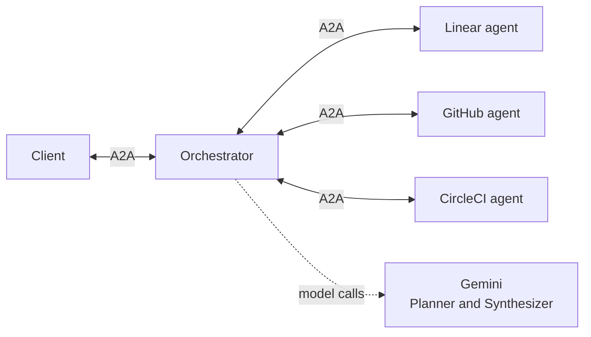
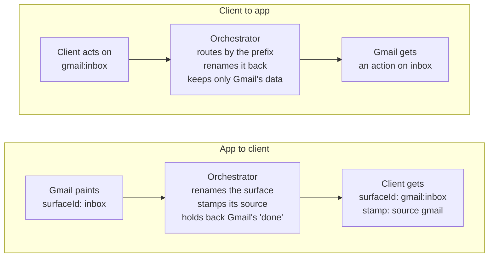
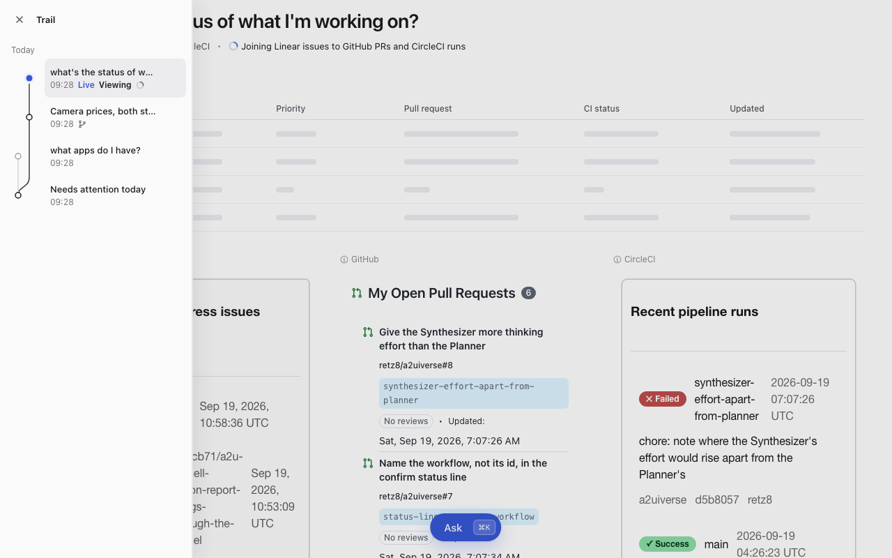
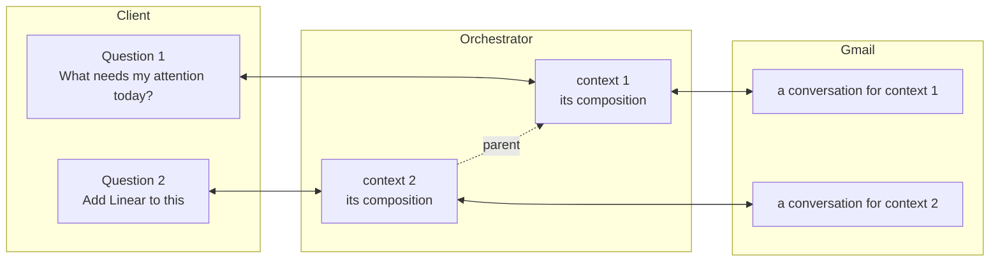
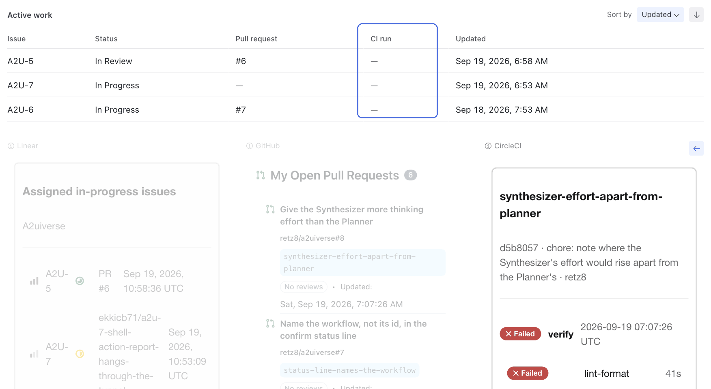

# @a2uiverse/orchestrator

The hub: an A2A agent server, and the only server the client talks to. It finds the apps that can answer a question, plans where their answers will sit, asks them in parallel, and relays what comes back as one composed screen. When the answers can be merged, a second model call writes the merged view.

## Where it sits

<p align="center">
  
  <br>
  <em>One question, answered by Linear, GitHub and CircleCI, each in its own slot and look. The table on top is the merged view.</em>
</p>

None of it reaches the client from an app directly. The client and the apps never talk to each other; each talks A2A to the orchestrator in the middle.



- **To the client**, the orchestrator is one A2A agent that answers every question and every click.
- **To each app**, it's an A2A client with a request. The app answers in its own UI, and the orchestrator decides where that UI goes on the screen.

## How a question is answered

```
question → Router       ranks the apps that could answer, A2UIVerse itself among them
         → Planner      one model call: which apps to ask and what, the layout, a title for the answer
         → first paint  the layout with every slot waiting, before any app is asked
         → apps         one request per app, in parallel; each answer relayed as it arrives
         → Synthesizer  a second model call, when the plan has a merged view and two apps answered
         → merged view  painted into its slot
         → done         once every app has answered, failed or timed out
```

- **The first paint doesn't wait on any app.** The layout reaches the client before any app is asked, so it appears as soon as the Planner answers.
- **One app failing never fails the rest.** Its slot says why (the app's own words, unreachable, timed out, or a paint the client couldn't draw), and its data leaves the merge.
- **The merge doesn't wait forever.** Once two apps have answered, 10 seconds with no further answer releases the merge over what arrived. A late app still mounts in its own slot, and Include folds it in. After 300 seconds an app's slot fails; an answer arriving later is kept until Retry. When the merge is joined on one app's items, that app is always waited for.
- **Only the first merge is automatic.** Every later model call has a press behind it: Retry, Include or Try again.

## What it changes on the way through

Every app's UI passes through the orchestrator on its way to that one screen, and every click on it passes back the same way. The orchestrator changes as little as it can.



- **Surface ids are namespaced by app**, `inbox` becoming `gmail:inbox`, so two apps can't collide on one screen. It's the only change made inside an app's A2UI.
- **Every event is stamped** with the app that painted it, so the client knows which slot it fills. After an app's last event, one more marks where its stream ended.
- **Only the orchestrator ends a turn.** Several apps answer one question, so each app's own "done" is held back, and the orchestrator sends one when all of them have answered.
- **Each app sees only its own data.** When the client sends back the screen's data with a click, the orchestrator passes on only that app's part.

## One composition per context

<p align="center">
  
  <br>
  <em>The client's trail: four questions asked, each one a context on the orchestrator. The newest is still loading.</em>
</p>

The client keeps every question the user asked in its trail, and the user can go back to any of them. On the orchestrator, each one is an A2A context, and the orchestrator holds a composition for it: the layout, each app's slot and data, the merged view, and each app's screen history. Every later message (a click, a press, a close) carries its context, so it lands on the right composition.



- **A question arrives with no context**, and the orchestrator creates one for it. A question sent inside a context it already holds is refused.
- **A question can name a parent**, the context it was asked from. The Planner then reads that composition and the questions before it, so "add Linear to this" means that answer.
- **Each app gets its own conversation per context**, so answers to different questions never mix.
- **A composition keeps running** after the client sends another question: apps still answering finish, and its merged view still lands. Only a close ends it, cancelling whatever it still has in flight.

## Going back inside an app's answer

Clicking into something inside an app's answer, like a CI run or an issue, makes the app paint a new screen in its slot, and a back arrow appears at the right of the app's row.

<p align="center">
  
  <br>
  <em>With a CircleCI run open, the merged table's CI run column is empty. Back to the runs list, and the column fills in again from the wiring the orchestrator remembered, with no model call. Forward returns to the run.</em>
</p>

The orchestrator remembers the merged view's wiring for every combination of screens it has shown:

| When             | GitHub | CircleCI | Merged view                               |
| ---------------- | ------ | -------- | ----------------------------------------- |
| The answer lands | 0      | 0        | made, then remembered                     |
| A run is opened  | 0      | 1        | worked out for the new screen, remembered |
| Back             | 0      | 0        | the remembered one, with no model call    |

On Back, the orchestrator also makes its copy of that app's data match the screen again, so the next merge and the app's next answer start from what you see.

## Modules

| Module        | Where              | What it does                                                                                                                                                                                                |
| ------------- | ------------------ | ----------------------------------------------------------------------------------------------------------------------------------------------------------------------------------------------------------- |
| Registry      | `src/registry/`    | The installed apps and their agent cards, fetched at startup, with A2UIVerse's own card beside them                                                                                                         |
| Embedder      | `src/embedder/`    | One small embedding model, in-process, no API key                                                                                                                                                           |
| Router        | `src/router/`      | Ranks the apps against the question and returns a shortlist                                                                                                                                                 |
| Planner       | `src/planner/`     | The first model call: the layout, which apps to ask, a title for the answer. On demand it reads the installed apps, the composition the question was asked from and the questions before it, never app data |
| Synthesizer   | `src/synthesizer/` | The second model call: the merged view's wiring, validated, with one retry                                                                                                                                  |
| Composition   | `src/composition/` | One composition per context, the shell's own paints, the relay, each app's data, when to merge, the presses, the fragment histories, and which refs still hold                                              |
| AgentsPool    | `src/agentsPool/`  | The connections to the apps: requests, time limits, cancel                                                                                                                                                  |
| IntentJournal | `src/journal/`     | One line per turn, appended to `STATE_DIR/intent-journal.jsonl`                                                                                                                                             |
| Executor      | `src/executor.ts`  | The A2A entry point that runs it all                                                                                                                                                                        |

The Planner and the Synthesizer run on Gemini through the Vercel AI SDK.

## Running it

```bash
pnpm dev:orch                                   # from the repo root
pnpm --filter @a2uiverse/orchestrator build | typecheck | test | lint
```

It listens on port **10001**. Start the apps first with `pnpm dev:agents`, or use `pnpm dev:all` to start both in order. **Agent cards are fetched once, at startup**: an app that comes up later can't be asked anything until the orchestrator restarts. It names any app it couldn't reach at startup, so if nothing gets routed, read that line first.

## Apps

Started by the launcher (`pnpm dev:all`), it reads its apps from the `manifest.json` in each folder of the launcher's agents dir, so `pnpm dev:all --agents-dir ../a2uiverse-apps/mocks` runs on the two mock stores alone. Started on its own, it falls back to the five apps in `src/registry/entries.ts`: GitHub on `11001`, Gmail `11002`, Google Calendar `11003`, CircleCI `11004` and Linear `11005`.

## Configuration

| Variable                          | Default                                       | Meaning                                                                                                |
| --------------------------------- | --------------------------------------------- | ------------------------------------------------------------------------------------------------------ |
| `PORT`                            | `10001`                                       | Listen port                                                                                            |
| `BASE_URL`                        | `http://localhost:<PORT>`                     | The address its agent card advertises                                                                  |
| `STATE_DIR`                       | `./.state`                                    | The journal and the cached embedding model                                                             |
| `GOOGLE_API_KEY`                  | none                                          | The Gemini key. Without it, questions fail; actions inside fragments still work                        |
| `A2UIVERSE_PLANNER_MODEL`         | `gemini-3.7-flash`                            | The Planner's model                                                                                    |
| `A2UIVERSE_PLANNER_EFFORT`        | `low`                                         | `low` (no thinking) or `default`                                                                       |
| `A2UIVERSE_SYNTHESIZER_MODEL`     | the Planner's if set, else `gemini-3.7-flash` | The Synthesizer's model                                                                                |
| `A2UIVERSE_SYNTHESIZER_EFFORT`    | `low`                                         | `low` or `default`                                                                                     |
| `A2UIVERSE_SHORTLIST_CAP`         | `5`                                           | How many apps the Router hands the Planner                                                             |
| `A2UIVERSE_SOFT_DEADLINE_SECONDS` | `10`                                          | How long with no answer releases the merge without the late apps                                       |
| `A2UIVERSE_HARD_CAP_SECONDS`      | `300`                                         | How long before an app's slot fails                                                                    |
| `A2UIVERSE_HEARTBEAT_SECONDS`     | `30`                                          | How often a quiet stream sends an empty event, so a proxy's idle timeout never cuts it                 |
| `A2UIVERSE_AGENTS_DIR`            | none                                          | Read the apps from this directory's manifests. The launcher sets it                                    |
| `A2UIVERSE_AGENT_URLS`            | none                                          | JSON `{"<appId>": "<url>"}` overriding apps' addresses                                                 |
| `A2UIVERSE_DEBUG_IDS`             | off                                           | `1` adds each app's own task and context ids to what it relays                                         |
| `A2UIVERSE_FAULTS`                | none                                          | Dev only: JSON making an app's answers slow, hang, break, refused, failed or invalid, to test failures |

The design record, with every step of a turn, is [`_dev/docs/design/orchestrator.md`](../../_dev/docs/design/orchestrator.md).
