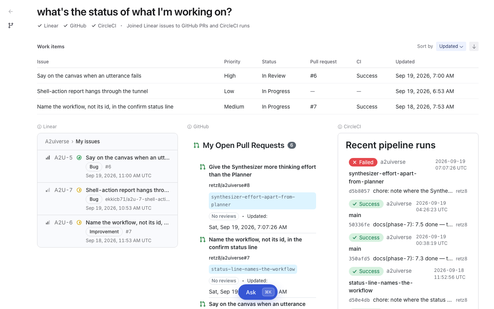
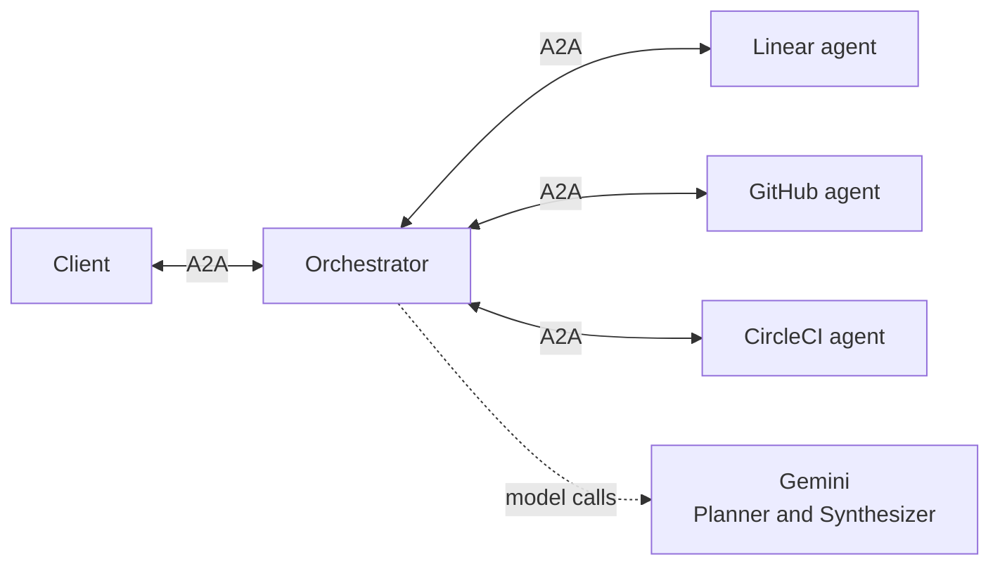
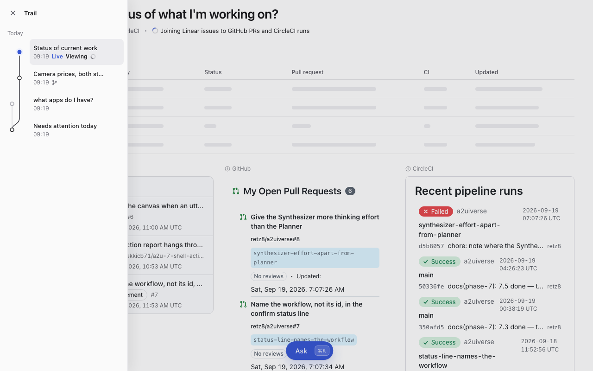

# @a2uiverse/orchestrator

The hub: an A2A agent server, and the only server the client talks to. It finds the apps that can answer a question, plans where their answers will sit, asks them in parallel, and relays what comes back as one composed screen. When the answers can be merged, a second model call writes the merged view.

## Where it sits

<p align="center">
  
  <br>
  <em>One question, answered by Linear, GitHub and CircleCI, each in its own slot and look. The table on top is the merged view.</em>
</p>

None of it reaches the client from an app directly. The client and the apps never talk to each other; each talks A2A to the orchestrator in the middle.


```mermaid
flowchart LR
    C["Client"] <-->|A2A| O["Orchestrator"]
    O <-->|A2A| L["Linear agent"]
    O <-->|A2A| G["GitHub agent"]
    O <-->|A2A| CI["CircleCI agent"]
    O -.->|model calls| M["Gemini<br/>Planner and Synthesizer"]
```

- **To the client**, the orchestrator is one A2A agent that answers every question and every click.
- **To each app**, it's an A2A client with a request. The app answers in its own UI, and the orchestrator decides where that UI goes on the screen.

## What it does

### Knows what's installed

An app is an A2A agent, installed from its agent card. The orchestrator keeps the registry of installed apps in its state directory: each app's card, the URL it came from, the catalogs it paints in, and where the install came by — a local pack, or the marketplace. It's the registry's only writer, through three operations over HTTP: install, uninstall, and install over an app already installed.

- **Install fetches the card** and stores it as written. Every catalog the card names, the standard basic catalog aside, comes with it as a catalog artifact, which is what Stellify packs. Install checks everything the files can prove, and refuses the whole app on any failure, listing every reason at once. It answers with one line saying what it changed.
- **Install by id alone goes through the marketplace.** The orchestrator reads the app's entry there, fetches the card from the URL the entry names, and fetches only the artifact files it doesn't already hold. When the live card declares a catalog or a version the Store has no build for yet, the install is refused with words that say the Store is behind the app — never that the app is broken — and the marketplace is told.
- **A catalog id is held at one build.** An install handing a new build for a catalog other installed apps render in moves the row, and those apps follow it, named in the install's line. The new build must be an additive evolution of the one they render in — nothing removed, no type changed — else the install is refused. An app alone on its row moves it freely.
- **An install is live at once.** The next question can route to the app, with no restart.
- **A fresh state directory is an empty registry**, and that's a valid platform. Only A2UIVerse's own card is there to answer.
- **Installs persist.** At every startup the orchestrator reads the registry, checks each artifact's files against their hashes, and fetches each card again. A damaged registry stops the startup with the file and the problem named.
- **It knows what's new.** At startup and whenever asked, it reads each installed app's marketplace entry and works out one update state per app: up to date; a newer build; a major update, suggested; a card update, with what it newly asks; an update required, the installed line retired; ahead of the Store; no longer published; unknown, the marketplace unreached. A newer build of an app installed from the marketplace installs itself at once, journaled; an app from a local pack is never moved. Every other update is the person's act.

### Picks the apps

The Router embeds the question and ranks every installed app's agent card against it, A2UIVerse's own card among them, then hands a shortlist to the Planner. There's no list of intents to maintain: the match is on the skills each app's card describes.

The Planner, one model call, decides who answers and what each is asked. A question about the state of your work, or what's waiting on you, goes to every app that holds part of it, whether or not you named them, and whether or not you're signed in to it yet; a question inside one app goes to that app alone. Each app receives the Planner's request, written for it, rather than your question as typed, followed by a sentence asking for no password, code or card field and, when the client sent it, your local time and time zone in words.

The same rule holds one level down, over an app's accounts. A question about state gathers from every account of the app, each a source of its own; a command, or an utterance naming an account, goes to that account alone. A command naming no account, for an app with two or more, takes the account choice: the shell draws one press per account, and the press sends the Planner's request to that account.

### Composes one screen

In the same call, the Planner designs the layout: a surface in the shell's own catalog, with a slot for each app, a slot for the merged view when there is one, and any headings or words of its own. The layout reaches the client before any app is asked, so the screen appears as soon as the Planner answers.

Each app's UI then fills its slot as it arrives, drawn in the app's own design system, with the app's name above it. The name is the shell's, and the app can't hide it.

### Merges across apps

When the plan reserves a merged view and at least two apps answer, the Synthesizer, a second model call, reads their data and writes the merged view as wiring rather than values. Every cell is a formula pointing into an app's data, like the lowest price across two stores, and the client computes it and keeps it live as the apps' data changes, with no further model call.

When the merge is over one thing seen by several apps, like a Linear issue, its pull request in GitHub and its CircleCI run, the Synthesizer says which entries are the same thing, and each of those claims is checked against the data before it's accepted. A cell shows how sure it is and where it came from, and clicking it goes to the value in its app's slot.

Take the first row of the table at the top, issue A2U-5. The three apps answered it in their own data:

```text
Linear    issue A2U-5    title "Say on the canvas when an utterance fails"   status "In Review"
GitHub    PR #6          title "Say on the canvas when an utterance fails"   branch "ekkicb71/a2u-5-say-on-the-canvas-…"
CircleCI  run 6039cf16   status "Success"                                    branch "ekkicb71/a2u-5-say-on-the-canvas-…"
```

The Synthesizer writes the row as formulas pointing at those entries, with a match claim: the facts that make them one work item, named in its own words. Shortened, it reads:

```text
status   value(linear   /issues[id="A2U-5"]/status)
pr       value(github   /prs[repository="retz8/a2uiverse",number=6]/number)
ci       value(circleci /runs[id="6039cf16-…"]/status)

match
  same title    equal(linear …/title,   github …/title)
  same branch   equal(github …/branch,  circleci …/branch)
```

The orchestrator runs each fact against the apps' data before accepting the row; a fact that doesn't hold goes back to the Synthesizer with the values it found. The client then evaluates the formulas into In Review, #6 and Success, and again whenever the data they point at changes.

### Stays honest when apps are slow or fail

- **One app failing never fails the rest.** Its slot says why (the app's own words, unreachable, timed out, a paint the client couldn't draw, a catalog the client couldn't load, or the app uninstalled since) and offers Retry, and its data leaves the merge. Retry sends again what failed: the click inside the app's answer, when a click failed, otherwise the app's request from the plan. It also takes an app that answered in words alone. A paint in a catalog the app isn't entitled to fails its slot with no Retry, as does a paint carrying a credential field the app didn't repair.
- **One press at a time into an app's answer.** A press into a fragment while a press on that app still runs is refused and journaled, the app sent nothing.
- **The merge doesn't wait forever.** Once two apps have answered, 10 seconds with no further answer releases the merge over what arrived. A late app still fills its own slot, and Include folds it into the merge. After 300 seconds an app's slot fails; an answer arriving later is kept until Retry. When the merge is built around one app's items, that app is always waited for.
- **Only the first merge is automatic.** Every later model call has a press behind it: Retry, Include or Try again. The merged view never changes without a visible reason.

### Answers about itself

A question about A2UIVerse itself, like which apps you have or what the screen can do, is answered by the Planner in the layout, with no app asked. It reads the platform's state through a small fixed set of readers, never an app's data: the installed apps list each app's accounts by label, never a credential. A need that no installed app can meet gets a slot of its own: a tile that searches the Store for it.

### Signs in to apps

The orchestrator's **AuthVault** holds the apps' sign-ins, one entry per app and account, in an owner-only file in the state directory. A credential reaches an app only as an HTTP header on the request, as the card's scheme names it, never inside a message, and it never reaches the client, the models, the journal or the logs.

- **The card is checked before every dispatch.** Its `security` is read against what the vault holds for that app and account. When no alternative can be met, the slot takes the authority tile at once and the app isn't asked. The full tile shows once per app per page load; after that, the app's slots are one quiet line.
- **Sign-in runs in a window the client opens** on the orchestrator's sign-in routes. For an OAuth or OpenID Connect scheme, the vault is a generic OAuth client: authorization code with PKCE, at the authorization server the card names, registering itself by its client ID metadata document where the server takes one, otherwise by dynamic registration. An `http` bearer or `apiKey` scheme is pasted on a token page the orchestrator serves, with the scheme's `description` and the card's `documentationUrl`. Any other scheme fills the slot with "not supported here" and Manage apps; the app stays installed.
- **The client polls the attempt**, and once signed in sends a Retry for the slot whose Sign in was pressed, which is dispatched and paints in place.
- **An account's label** comes from the ID token's display claims, and its `sub` keeps one account signed in twice as one entry; without them it's the app's name and its number, "Gmail account 2". An account's source is the app id and its number, `gmail.2`. The add-account tile, which the Planner places when you ask to add an account, starts a sign-in for the app's next account.
- **Expiry is silent.** A token within a minute of its known expiry is refreshed before the dispatch, and once after a 401 the vault didn't predict; only when the refresh fails does the slot ask to sign in again.
- **More access mid-task.** An app that ends its task in `auth-required`, naming a scheme on its card and the missing scopes by their keys there, puts a request on its fragment's name row; before it has painted, its slot takes the tile asking for more access. Allow opens the sign-in for the missing scopes and sends again the press that needed them; Not now drops that press, and so does a later press in the same fragment. A key the installed card doesn't declare makes the request invalid, and its slot fails as for a malformed paint.
- **Uninstall** deletes the app's accounts and revokes their tokens where the authorization server advertises a revocation route, best-effort. Installing over an app keeps its accounts.

**The credential bar.** No paint with a credential input reaches the screen. Every text request the orchestrator writes carries the guidance sentence; a paint whose components name a password, one-time code, PIN or card number, by their names or the option values their catalog declares, is refused whole, and what it had shown is taken down. The app is sent the reason once, to answer again; if it doesn't repair, its slot fails with no Retry, and a "Continue on" link naming the app, to the card's `provider.url` or else its `documentationUrl`.

## Keeps every answer

An answer isn't thrown away when the next question comes. Each one is kept, keeps working, and remembers its merged views.

### One composition per context

<p align="center">
  
  <br>
  <em>The client's trail: four questions asked, each one a context on the orchestrator. The newest is still loading.</em>
</p>

Every question the client sends is an A2A context, and the orchestrator holds a composition for each: the layout, each app's slot and data, the merged view, and each app's screen history. Every later message carries its context, so a click, a press or a close lands on the right one.

- **A question can name a parent**, the context it was asked from. The Planner then reads that composition, so "add Linear to this" means that answer.
- **Each app gets its own conversation per context**, so answers to different questions never mix.
- **A composition keeps running** after the next question: its apps still answer and its merge still lands, until the client closes it.

### Going back inside an app's answer

Clicking into something inside an app's answer, like a CI run, makes the app paint a new screen in its slot, with a back arrow at the right of its row. The orchestrator remembers the merged view for every combination of screens it has shown, so going back restores it with no model call. Every screen keeps its number and none is dropped, so a screen reached again by any route finds the merged view remembered for it. A quick run of presses costs nothing for the screens it passes through: the check that may call the model waits until the pressing stops.

<table>
  <tr>
    <td align="center" valign="top"></td>
    <td align="center" valign="top"></td>
  </tr>
  <tr>
    <td align="center"><em>CircleCI's slot: a run, its failing job, Back twice, the run opened again, then Back twice: the runs list, and the job left behind.</em></td>
    <td align="center"><em>The merged view at the same moments: its CI column is empty while a run or its job is open, and fills in again on the runs list from the wiring the orchestrator remembered, with no model call.</em></td>
  </tr>
</table>

## Leaves apps' UI alone

Every app's UI passes through the orchestrator on its way to the screen, and every click passes back the same way. It changes as little as it can, so any A2UI agent can take part as it is.

- **Surface ids are namespaced by source**, the app and the account it painted under: `inbox` becomes `gmail:inbox`, or `gmail.2:inbox` for one of two Gmail accounts, so no two sources collide on one screen, and it's changed back on the way in. It's the only change made inside an app's A2UI.
- **Every event is stamped** with the app that painted it, so the client knows which slot it fills.
- **Only the orchestrator ends a turn.** Each app's own "done" is held back, and the orchestrator sends one when all of them have answered.
- **Each app sees only its own data** when the client sends the screen's data back with a click.
- **Each app is told which catalogs it may paint in**: the ones handed at its install, plus the basic catalog. A paint in any other catalog is refused at the orchestrator and fails that app's slot.

## Running it

```bash
pnpm dev:orch                                   # from the repo root
pnpm --filter @a2uiverse/orchestrator build | typecheck | test | lint
```

It listens on port **10001** and starts from whatever its registry holds, nothing at first. Install an app while it runs, with the app's agent up and its catalog packed by Stellify:

```bash
pnpm --filter @a2uiverse/orchestrator registry install github http://localhost:11001/.well-known/agent-card.json ../a2uiverse-apps/github/github-catalog/dist/artifact
pnpm --filter @a2uiverse/orchestrator registry install github       # from the marketplace, by id alone
pnpm --filter @a2uiverse/orchestrator registry uninstall github
pnpm --filter @a2uiverse/orchestrator registry list
pnpm --filter @a2uiverse/orchestrator registry updates
```

Install takes the app's id, its card's full URL, and a directory for each catalog its card names other than the basic catalog, as `stellify pack` wrote it. An app on the basic catalog needs none. With the id alone, the app is installed from the marketplace: its entry read, its card fetched from the URL the entry names, its artifacts fetched. Installing an id that's already installed replaces it. The command prints what the install changed, in one line:

```text
installed github · card 0.1.0 · catalog sha256-muNbmR5m…
updated github · card 0.1.0 · catalog sha256-muNbmR5m… → sha256-bYxc_jOA…
reinstalled github · nothing changed · card 0.1.0 · catalog sha256-muNbmR5m…
installed inbox · card 0.1.0 · catalog sha256-muNbmR5m… → sha256-bYxc_jOA… · gmail followed
```

A refusal prints every finding, one per line, and exits 1. The command reads the write token the orchestrator puts in its state directory at startup, so it only works against an orchestrator running on the same state directory.

`list` prints each installed app with its card URL, its catalogs and where it came from, `marketplace` or `local`. `updates` runs the update check and prints one line per installed app — the id, the state, the installed and published versions, and the state's details in words:

```text
gmail  newer build  0.1.0  catalog https://…/gmail/catalog.json sha256-muNbmR5m… → sha256-bYxc_jOA…
github  major update  0.1.0 → 1.0.0  new catalog https://…/github/v2/catalog.json
linear  card update  0.1.0 → 0.2.0  asks linear: issues:write
circleci  ahead of the Store  0.1.0  the Store lacks catalog https://…/circleci/v2/catalog.json
shop-a  not published  0.0.0
```

**Agent cards are fetched at startup**: an app whose agent is down then stays installed but can't be routed to until the orchestrator restarts or the app is installed again. It names any app it couldn't reach, so if nothing gets routed, read that line first. **The update check runs at startup too**, before the orchestrator listens: a newer build of a marketplace app lands before any client preloads, and the boot log says what moved. A marketplace that can't be reached is one line, every state unknown until the next check, never a failed boot.

The registry's routes, all under `/registry`:

| Route                       | What it is                                                                                                                    |
| --------------------------- | ----------------------------------------------------------------------------------------------------------------------------- |
| `GET apps.json`             | The installed apps, as the registry stores them                                                                               |
| `GET catalogs.json`         | The catalog table: the client's own catalogs, then each installed artifact by its id                                          |
| `GET artifacts/<id>/<path>` | An artifact's files, served as immutable content                                                                              |
| `GET updates.json`          | Runs the update check — the newer builds of marketplace apps installing themselves on the way — and answers one state per app |
| `POST install`              | `{appId, cardUrl, catalogs: [{files: {<path>: <base64>}}]}`, or `{appId}` alone for the marketplace, with the write token     |
| `POST uninstall`            | `{appId}`, with the write token                                                                                               |

The sign-in routes, all under `/auth`, which the browser reaches with no write token. Each attempt is bound to the browser that started it by a cookie, beside `state`, PKCE and the `nonce`, and the token page's form is taken only from the orchestrator's own origins, its public one and `http://localhost:<PORT>`:

| Route                             | What it is                                                                                                                               |
| --------------------------------- | ---------------------------------------------------------------------------------------------------------------------------------------- |
| `GET client.json`                 | The vault's client ID metadata document                                                                                                  |
| `GET start?attempt&canvas&source` | Opened in the sign-in window: redirects to the authorization server, or to the token page; the bare app id as the source adds an account |
| `GET key?attempt`, `POST key`     | The token page, where a key or token is pasted, and its form                                                                             |
| `GET callback`                    | The authorization server's return                                                                                                        |
| `GET attempts/<id>`               | The attempt's outcome, which the client polls                                                                                            |

<details>
<summary><b>Modules</b></summary>

| Module        | Where                 | What it does                                                                                                                                                                                                                                                     |
| ------------- | --------------------- | ---------------------------------------------------------------------------------------------------------------------------------------------------------------------------------------------------------------------------------------------------------------- |
| Registry      | `src/registry/`       | The installed apps, their cards and the catalog table, persisted in the state directory; install — from a pack or from the marketplace by id — uninstall and their routes; the update check and the automatic build update; A2UIVerse's own card beside the apps |
| Embedder      | `@a2uiverse/embedder` | One small embedding model, in-process, no API key — the workspace package the marketplace's index ranks with too, so a question ranks the same against both                                                                                                      |
| Router        | `src/router/`         | Ranks the apps against the question and returns a shortlist                                                                                                                                                                                                      |
| Planner       | `src/planner/`        | The first model call: the layout, which apps to ask, a title for the answer. On demand it reads the installed apps, the composition the question was asked from and the questions before it, never app data                                                      |
| Synthesizer   | `src/synthesizer/`    | The second model call: the merged view's wiring, validated, with one retry                                                                                                                                                                                       |
| AuthVault     | `src/vault/`          | The sign-ins: the vault file, the generic OAuth client, the schemes it can do, the card checked before a dispatch, the header a dispatch carries, refresh, revocation, the sign-in routes and their pages                                                        |
| Accounts      | `src/accounts/`       | Each app's sources, one per account, and what each is called                                                                                                                                                                                                     |
| Composition   | `src/composition/`    | One composition per context, the shell's own paints, the relay, each app's data, when to merge, the presses, the fragment histories, and which refs still hold                                                                                                   |
| AgentsPool    | `src/agentsPool/`     | The connections to the apps: requests, time limits, cancel; the credential header, a 401 and an `auth-required`, and the credential bar over what they paint                                                                                                     |
| IntentJournal | `src/journal/`        | One line per turn, one per install, uninstall or refusal, and one per sign-in fact (started, signed in, failed, expired, refreshed, revoked, a request for more access, Not now, superseded), never a credential, appended to `STATE_DIR/intent-journal.jsonl`   |
| Executor      | `src/executor.ts`     | The A2A entry point that runs it all                                                                                                                                                                                                                             |

The Planner and the Synthesizer run on Gemini through the Vercel AI SDK.

</details>

<details>
<summary><b>Configuration</b></summary>

| Variable                                | Default                                       | Meaning                                                                                                                                                                                 |
| --------------------------------------- | --------------------------------------------- | --------------------------------------------------------------------------------------------------------------------------------------------------------------------------------------- |
| `PORT`                                  | `10001`                                       | Listen port                                                                                                                                                                             |
| `BASE_URL`                              | `http://localhost:<PORT>`                     | The address its agent card advertises, and the vault's: its client ID metadata document and the return address an authorization server sends the browser to. The tunnel URL in a tunnel |
| `STATE_DIR`                             | `./.state`                                    | The registry, the vault (`vault/vault.json`), the journal and the cached embedding model                                                                                                |
| `GOOGLE_API_KEY`                        | none                                          | The Gemini key. Without it, questions fail; actions inside fragments still work                                                                                                         |
| `A2UIVERSE_PLANNER_MODEL`               | `gemini-3.7-flash`                            | The Planner's model                                                                                                                                                                     |
| `A2UIVERSE_PLANNER_EFFORT`              | `low`                                         | `low` (no thinking) or `default`                                                                                                                                                        |
| `A2UIVERSE_SYNTHESIZER_MODEL`           | the Planner's if set, else `gemini-3.7-flash` | The Synthesizer's model                                                                                                                                                                 |
| `A2UIVERSE_SYNTHESIZER_EFFORT`          | `low`                                         | `low` or `default`                                                                                                                                                                      |
| `A2UIVERSE_SHORTLIST_CAP`               | `5`                                           | How many apps the Router hands the Planner                                                                                                                                              |
| `A2UIVERSE_SOFT_DEADLINE_SECONDS`       | `10`                                          | How long with no answer releases the merge without the late apps                                                                                                                        |
| `A2UIVERSE_HARD_CAP_SECONDS`            | `300`                                         | How long before an app's slot fails                                                                                                                                                     |
| `A2UIVERSE_HEARTBEAT_SECONDS`           | `30`                                          | How often a quiet stream sends an empty event, so a proxy's idle timeout never cuts it                                                                                                  |
| `MARKETPLACE_URL`                       | `http://localhost:10002`                      | The marketplace installs by id resolve through, the update check reads and reports to. Unreached: one boot line, every state unknown                                                    |
| `A2UIVERSE_MARKETPLACE_TIMEOUT_SECONDS` | `10`                                          | How long each request to the marketplace gets                                                                                                                                           |
| `A2UIVERSE_DEBUG_IDS`                   | off                                           | `1` adds each app's own task and context ids to what it relays                                                                                                                          |
| `A2UIVERSE_FAULTS`                      | none                                          | Dev only: JSON making a source's answers slow, hang, break, refused, failed, invalid or carry a credential field, to test failures; a bare app id hits every account of the app         |

</details>

The design record, with every step of a turn, is [`docs/design/orchestrator.md`](../../docs/design/orchestrator.md). Sign-in, accounts and the credential bar are [`docs/design/authority.md`](../../docs/design/authority.md). How an app is installed, from Stellify's pack to the client's load, is [`docs/design/app-install.md`](../../docs/design/app-install.md).
