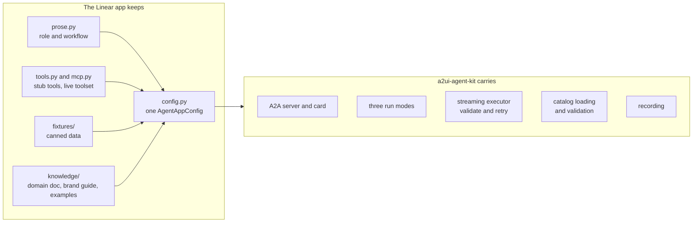
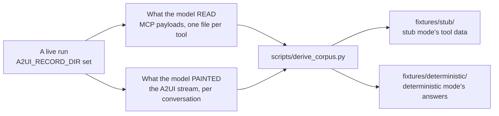
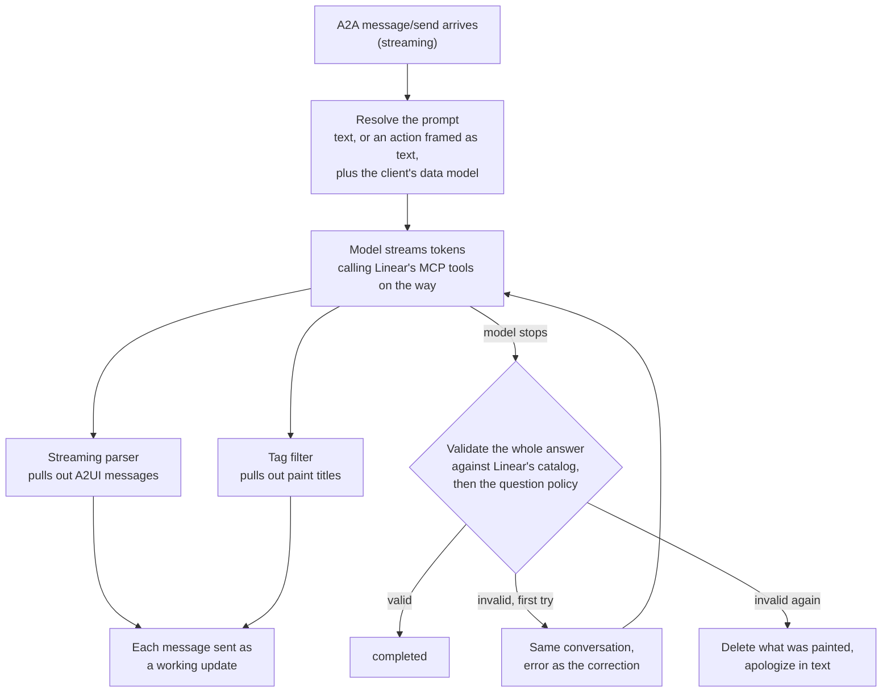
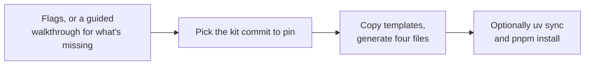

# Agent kit: how an app's agent is built

This guide explains **`a2ui-agent-kit`**, the Python kit every app's agent in [`a2uiverse-apps`](https://github.com/retz8/a2uiverse-apps) is built on, and **`create-a2ui-agent`**, the scaffolder that starts a new app on it. It's written for a frontend engineer meeting the agent side for the first time. It starts with the ideas, walks one question through an agent, then opens up the techniques inside, and ends with the design decisions and where the code lives.

One example runs through the whole guide: the **Linear agent** (`linear/agent/` in the apps repo) answering the request _"Show my in-progress and assigned issues as a compact list…"_. That's the request A2UIVerse's Planner wrote for Linear when you asked "what's the status of what I'm working on?", and the agent's answer is the Linear slot in the [synthesis guide](synthesis.md)'s screenshot. It's recorded, so every number below is real.

The kit speaks **A2UI and A2A and nothing else**. It knows nothing about A2UIVerse; any A2A client can talk to an agent built on it. The one place A2UIVerse shows up is optional, and it's covered in [Paint titles and question marks](#5-paint-titles-and-question-marks-are-tags-in-the-prose).

## Problem it solves

Every app in the apps repo has the same shape: **App = MCP server + Agentic BFF + A2UI catalog**. The agent is the Agentic BFF: an A2A server that takes a question, calls its vendor's MCP server, and answers with UI it generates in A2UI, drawn from its own catalog. There are five vendor apps (GitHub, Gmail, Google Calendar, CircleCI, Linear) and two mock stores.

Without a kit, every one of those agents would carry its own copy of the same hard parts:

- an A2A server and an agent card;
- streaming the model's A2UI to the client as it's written, so the UI assembles on screen instead of appearing all at once;
- checking the finished UI against the app's catalog, and asking the model to fix it when it's wrong;
- three ways to run: with no model at all, with a model over canned data, and with a model over the real service;
- recording live runs, so the canned data is real-shaped rather than invented.

The kit carries all of that. **An app keeps only what is its own**: its agent card, its prompt prose, its tools, its canned data, and what the model should know about the product.



## Five ideas to hold on to

### 1. An app is one config object

Everything the kit needs from an app is on **one frozen dataclass**, `AgentAppConfig`. The app builds it once, in `app/config.py`, and hands it to the kit. The kit never goes looking for anything; it is handed a config. Here's the Linear agent's, trimmed:

```python
# linear/agent/app/config.py (trimmed)
CONFIG = AgentAppConfig(
    name=APP_NAME,                       # the agent card
    skills=SKILLS,
    default_port=11005,
    catalog_path=_AGENT_DIR.parent / "linear-catalog" / "catalogs" / "v0.9.1" / "catalog.json",
    catalog_kind="basic",                # the basic A2UI catalog, themed as Linear
    role_description=prose.ROLE_DESCRIPTION,
    workflow_descriptions=(prose.WORKFLOW_DESCRIPTION, prose.SHELL_DESCRIPTION, prose.SCOPE_DESCRIPTION),
    domain_knowledge_path=_APP_PKG / "knowledge" / "linear-domain.md",
    build_response=build_response,       # deterministic mode: an action to canned A2UI
    build_text_response=build_text_response,  # deterministic mode: a question to canned A2UI
    question_policy=require_carries_action,
    stub_tools=STUB_TOOLS,               # stub mode: tools over canned data
    live_toolset_factory=_live_toolset,  # live mode: Linear's MCP server
)
```

And the whole entrypoint:

```python
# linear/agent/app/__main__.py
from a2ui_agent_kit.cli import run
from app.config import CONFIG

run(CONFIG)
```

The config carries two kinds of thing: **data** (names, ports, paths, prose) and **callables** (the canned-response pair, the tools, the question policy). Passing behavior in as functions, instead of subclassing a base agent, keeps every app's differences in one readable place.

### 2. Three run modes on one port, with one agent card

Every agent runs in one of three modes, chosen by `--mode`:

| Mode            | Who answers                             | Needs                                    |
| --------------- | --------------------------------------- | ---------------------------------------- |
| `deterministic` | canned A2UI, no model                   | nothing                                  |
| `stub`          | the model, over canned tool data        | a Gemini key                             |
| `live`          | the model, over the vendor's MCP server | a Gemini key and the vendor's credential |

The modes differ in exactly one place. `deterministic` uses a different executor (no model at all). `stub` and `live` use the same model executor and differ only in **which tools** the model is handed: the config's `stub_tools`, or what `live_toolset_factory()` returns. Everything else, the server, the card, the port, the catalog, is identical.

That includes the **agent card**. One card describes the agent in every mode, because the mode is a launch detail. A card describing "the no-model demo harness" would describe something no user asks for, and A2UIVerse's Router, which ranks agents by their cards, would rank it against nothing.

The model defaults to `gemini-3.7-flash`. The `MODEL_NAME` environment variable wins over the config's `model`, which wins over that default.

### 3. Model writes A2UI as text, streamed, then checked

In the model modes, the model answers in text: some prose, and A2UI messages inside `<a2ui-json>` blocks. The kit does three things with that text:

1. **Streams it.** As tokens arrive, a streaming parser pulls complete A2UI messages out of the partial text, and each one is sent to the client right away, as an A2A `working` update. The client paints the surface as it's written.
2. **Checks it at the end.** Once the model stops, the whole answer is validated against the app's own catalog: known components, correct props, a `root`, everything reachable, every binding pointing at real data.
3. **Retries once.** If the check fails, the model is called again in the same conversation, with the error message as a correction.

In the recorded Linear turn, the first output arrived about 29 seconds in, after the model had read what it needed from Linear. The surface then streamed in 36 A2A updates over the next 7 seconds: one title, one `createSurface`, 14 data model updates and 20 component updates. The whole turn took 36.3 seconds.

### 4. One live run feeds all three modes

The canned data in `deterministic` and `stub` isn't written by hand. It's **derived from a recorded live run**, which is what keeps it real-shaped:



Setting `A2UI_RECORD_DIR` arms two recorders at once: one keeps every MCP result the model read, the other keeps every A2UI batch the agent streamed. The app's `scripts/record_beats.py` drives a fixed script of questions (the **beats**) against the running agent, and `scripts/derive_corpus.py` turns the recordings into both fixture folders. For Linear:

```bash
A2UI_RECORD_DIR=.recordings uv run python -m app --mode live --host localhost
uv run python scripts/record_beats.py --model gemini-3.7-flash
uv run python scripts/derive_corpus.py
```

Values stay real, with one exception each app decides for itself. Linear, for example, replaces the key owner's email with `me@example.com` in every tool result **before the model reads it**, so both the recorded payloads and the painted streams are clean.

### 5. Paint titles and question marks are tags in the prose

A2UI messages are sealed: the protocol's schema allows no extra fields, so an agent can't attach "this surface is called _Assigned Issues_" to a `createSurface`. The kit carries that kind of information **beside** the A2UI instead. The model writes a tag in its prose, right before the surface's A2UI block:

```text
<paint-title surface="assigned-issues">Assigned Issues</paint-title>
<a2ui-json>[{"version": "v0.9", "createSurface": {"surfaceId": "assigned-issues", …}}, …]</a2ui-json>
```

The kit strips the tag out of the prose and sends it as its own A2A data part, **`paintMeta`**, marked with the MIME type `application/json+a2ui-shell`, just ahead of the `createSurface` it names:

```json
{"paintMeta": {"surfaceId": "assigned-issues", "title": "Assigned Issues"}}
```

A surface that asks the user something carries `kind="question"`. In the recorded follow-up "Move it to In Progress.", Linear paints `{"surfaceId": "status-proposal", "title": "Move to In Progress", "kind": "question"}`. And a turn that deliberately paints nothing (a declined confirmation, a request outside the app) says so with `<no-surface/>`.

**This is optional and degrades cleanly.** A client that doesn't know `paintMeta` ignores the part. A2UIVerse's canvas is the client that reads it: the title names the app's back and forward arrows, and a question raises the app's slot (see [client.md](client.md)). An app opts in by adding the prose block that teaches the model the tags (`SHELL_DESCRIPTION`) and choosing a question policy; `create-a2ui-agent --ecosystem` does both.

## One question, end to end

Here's the Linear agent in `live` mode, answering the Planner's request:



**1. The request arrives.** The kit's server is the A2A SDK's Starlette app with the kit's executor behind it. A streaming `message/send` reaches `LlmAgentExecutor.execute`, which opens an A2A task for the answer.

**2. The prompt is resolved.** Usually the message carries text: the Planner's request. When it carries a click instead (an A2UI action, like opening an issue), there's no text, so the kit frames one: _"The user activated the "open-issue" action on the current surface. Compose the next surface…"_, with the action's values listed. Either way, if the client sent its current data model (surfaces created with `sendDataModel: true` report it with every message, under `a2uiClientDataModel`), that's appended too, so the model sees edits the user made locally, like a checked box.

**3. The model runs.** The responder wraps Google's Agent Development Kit (ADK): an `LlmAgent` with the assembled system prompt and the mode's tools. Conversations are kept **per A2A context**, so a follow-up ("Move it to In Progress.") continues the same model session. In `live` mode the tools are Linear's MCP server, with the inventory pinned to 10 of the server's tools: the issue, comment, team, status, label and user reads, plus the two writes.

**4. Tokens stream out as UI.** Every token goes to the streaming parser. Whenever a complete A2UI message can be pulled out, it's sent immediately. Prose goes through the tag filter first, so a `<paint-title>` becomes a `paintMeta` part, sent ahead of its `createSurface`. In the recording, `paintMeta` left at 28.7 seconds and `createSurface` at 29.0.

**5. The answer is checked.** When the model stops, the kit collects every A2UI message from the full text and validates them. A turn that creates a surface is checked as a whole surface; a turn that only updates a surface the client already has (a detail opened in place, a list re-sorted) is checked as an update. Then the app's **question policy** runs: Linear's requires that a surface declared a question carries at least one action, so the user can actually answer it.

**6. Done, retried, or apologized.** A valid answer ends the task as `completed`. An invalid one sends the model the error and tries once more. If that fails too, the kit deletes every surface the attempts created, so the client isn't left with half a UI, and ends with a plain-text apology.

**In `deterministic` mode** there's no model: the executor hands the question to the app's canned-response pair and sends the whole answer in one `completed` update. **In `stub` mode** everything above is the same except step 3's tools, which read fixtures instead of calling Linear.

## Inside the machinery

### Streaming first, validating at the end

`agent-kit/src/a2ui_agent_kit/executor_llm.py` is the heart of the kit. Its rule is **stream first, validate at the end, retry**. Streaming first means the user watches the UI assemble rather than waiting for the whole answer. Validating at the end is necessary because half a surface can't be judged: a `root` that hasn't arrived yet isn't missing.

Streaming partial JSON has sharp edges, and the kit's `LenientA2uiStreamParser` handles two of them on top of the A2UI SDK's own v0.9 parser:

- **Transient cycles.** The parser "heals" partial JSON to read it early. A chunk that ends in the middle of a child's id (`"row-0-lv"` cut at `"row-0"`) can briefly look like a component pointing at itself. The SDK treats a cycle as fatal; the kit skips that early read instead, and the next chunk resolves it. Real cycles are still caught by the final check.
- **Ids that aren't strings.** A model that writes an object where an id belongs would crash the SDK's component cache, which uses the id as a dictionary key. The kit swaps in a small `dict` subclass whose `__setitem__` drops non-string keys, which covers both places the SDK writes to it.

**A retry patches in place.** One parser is kept across both attempts, with its memory of what it already sent. So a retry that repeats most of the first attempt sends only the components that changed, and the surface on screen is patched rather than wiped and redrawn. Nothing is torn down between attempts; only when every attempt has failed does the kit delete what it painted.

The kit also tells failures apart, because each needs a different retry:

| Failure                                             | Retry                                                      | Final words if it fails again            |
| --------------------------------------------------- | ---------------------------------------------------------- | ---------------------------------------- |
| The answer fails validation                         | the validator's message, as a correction                   | "couldn't compose a valid interface"     |
| The model made a malformed tool call, and wrote nothing | a correction naming that mistake and the way out       | the same                                 |
| The provider failed (quota, a 5xx, the network)     | the same prompt, unchanged: it wasn't the model's mistake | "the language model is temporarily unavailable" |

`MAX_ATTEMPTS` is 2: one try and one retry.

### Streaming tag filter

`paint_meta.py`'s `PaintTitleTagFilter` pulls `<paint-title …>…</paint-title>` and `<no-surface/>` out of prose that arrives in arbitrary chunks. A chunk can end anywhere, including in the middle of a tag:

```text
chunk 1: "Here are your issues.\n<paint-ti"
chunk 2: "tle surface=\"assigned-issues\">Assigned Issues</paint-title>\n"
```

The filter keeps a small **buffer** and works like a lexer with lookahead:

1. Pull out every complete tag in the buffer: a `paint-title` becomes a `paintMeta` dict; a `no-surface` raises a flag.
2. Find the earliest point where the rest of the buffer **could still become a tag**: a lone `<`, a prefix like `<paint-ti`, or an open tag whose closing tag hasn't arrived.
3. Release everything before that point as prose, and hold the rest back for the next chunk.

A `<` that turns out not to start a tag is released as soon as the next characters rule a tag out, so ordinary prose is never held for long. When the stream ends, `flush()` releases whatever is still held, so a cut-off stream loses no prose. A fresh filter is made for each attempt, so a half tag from a failed attempt can't leak into the retry.

### Checking a surface: four passes

`catalog.py`'s `CatalogContext.validate_surface` checks a finished surface in four passes, each aimed at a mistake models really make, with an error message that tells the model how to fix it, because the retry reads that message:

0. **A binding on a literal prop.** Some props can only hold a fixed value, like an icon's name, which is an enum. A model that binds one to data (`{"path": "/status"}`) gets a message naming the prop, its allowed values, and the fix, before the generic schema error could bury it.
1. **Conformance.** Every component matches its catalog schema: known components, declared props, right types.
2. **Completeness and topology.** There's a `createSurface`, a component with id `root`, and every component is reachable from the root, with no dangling children, no cycles and no orphans.
3. **Bindings resolve.** The kit rebuilds the data model from the answer's own `updateDataModel` messages, then walks the tree from `root` and checks that every binding points at a value. Inside a list template it resolves against each list item, and when a model wrote an absolute path where a relative one was meant, the message says exactly that: use `'title'`, not `'/title'`.

The catalog's **kind** changes two details. A **custom** catalog (GitHub's, built on Primer) doesn't model the `id` every component carries, so pass 1 runs on a copy with ids stripped. A **basic** catalog (the themed A2UI basic catalog, like Linear's) requires `id` on every component and composes each component's props from `allOf` branches, so ids stay and the props are flattened before pass 0 can read them.

An update-only turn goes through `validate_update` instead: passes 0, 1 and 3, but not pass 2. The `createSurface`, the `root` and reachability live on the client, so the agent can't check them for an update.

### Question policies

Which surfaces count as questions, and what a question must look like, differs by app, so the config picks a **policy**, a plain function `(payload, paint_metas) -> None` that raises when something's wrong. The kit ships two:

| Policy                         | Rule                                                                                         | Used by                          |
| ------------------------------ | -------------------------------------------------------------------------------------------- | -------------------------------- |
| `require_carries_action`       | a surface declared a question must carry at least one action, or the user can't answer it   | the basic-catalog apps, like Linear |
| `require_root_component(name)` | a question must have a `name` root, and a `name`-rooted surface must be declared a question | GitHub, with `ConfirmationDialog` |

The second is a small **factory**: it takes the component name and returns the policy function, so one rule serves any catalog that has a purpose-built dialog component.

### Deterministic mode: the fixture responder

`responses.py`'s `fixture_responder` builds the canned-response pair most apps use. Linear's:

```python
build_response, build_text_response = fixture_responder(
    _FIXTURES_DIR,
    {"open-issue": "open-issue.json", "confirm-change": "confirm-change.json", "decline-change": "decline-change.json"},
    text_fixture="my-issues.json",
    surface_prefix="linear",
)
```

- **Any question** answers with the same fixture, `my-issues.json`: 16 A2UI messages (one `createSurface`, 14 data model updates, one component update). The text path doesn't try to understand the question. Guessing intent from words is the model modes' job, and a second, worse router here would only hide that.
- **An action** looks up its fixture by name. An unknown action gets a visible `Unhandled event: <name>` text, never a silent no-op.
- **Surface ids.** A client can't be asked to create a surface id that already exists, and the executor keeps no state between requests. So every answer that creates a surface gets a **fresh id** from a counter: `linear-1`, `linear-2`, and so on. That includes an action whose fixture carries a `createSurface`, like opening an issue: it's a new screen, as the live agent paints it. An action without one updates the surface the click came from.

### Tool hooks at the lowest boundary

`toolset.py` gives every MCP tool two hooks: `shape_args` on the arguments going out, `shape_result` on the result coming back. Every vendor app's live toolset is a `PolicyMcpToolset` or a subclass of it, whether or not it uses the hooks, so the seam is always there. (The mock stores have no MCP server; their live tools are plain functions.)

The hooks sit inside `McpTool._run_async_impl`, the lowest point ADK offers, instead of in ADK's tool callbacks. The reason is specific: an MCP `CallToolResult` carries the same payload **twice**, as text `content` and as `structuredContent`. A callback that rewrites one leaves the other for the model to read. At the lowest boundary there's only one dict each way.

ADK builds its tool objects internally, so the kit can't construct them itself. Instead it **re-classes them in place** after listing: `tool.__class__ = PolicyMcpTool`. The tool keeps everything ADK set up (auth, filtering, retries, the session) and gains the hooks. Linear's subclass uses the result hook when recording, to replace the key owner's email before the model reads it and to capture the payload for the stub data. `accepted_args()` reads a tool's own MCP schema, so an app that pins an argument onto every call can skip tools that don't declare it; the server would reject the call otherwise.

Beside it, `tool_shaping.py` gives apps a walker for annotating results with notes for the model (like "this payload is a projection; a field that isn't here wasn't fetched"). It builds a new dict rather than changing the old one, and **never raises**: a bug in shaping must not cost a live turn, and an unshaped payload is just the plain result.

### Cancel, and a task store that holds the line

When a client cancels (A2A's `tasks/cancel`), the SDK calls the executor's `cancel`, which answers with a bare `canceled` status, and then cancels the running `execute`. The `CancelledError` lands wherever the attempt was waiting, usually on the model stream. The attempt's `finally` closes the stream, which stops ADK's run, and no further attempt starts. An MCP call already sent is abandoned: the server finishes it, and the reply goes nowhere.

A2A says a task that reached a terminal state (`completed`, `canceled`, `rejected`, `failed`) can't be restarted. The A2A SDK's in-memory store didn't hold that line: it handed every reader the same object, the readers updated it in place, and a `working` update still queued could land after `canceled`, leaving the task reading `working`. The kit's `TerminalGuardedTaskStore` keeps **its own copy** of each task, hands out **copies**, and **refuses to overwrite** a task that already ended.

### One card, every mode: the server

`server.py` builds the agent card from the config, advertising A2UI's v0.9.1 extension with the catalog id the app supports, and `cli.py` runs it with uvicorn. Two details come from running agents through a dev tunnel:

- **CORS** allows `localhost` on any port and `*.devtunnels.ms`.
- **Keep-alive is 300 seconds**, not uvicorn's 5. With 5, an idle connection between turns was closed by the server while a tunnel kept reusing it, and the next request hung.

`--base-url` sets the address the card advertises, for when the client reaches the agent through a tunnel or proxy.

### Caching per config

The config is a frozen dataclass declared with `eq=False`. That keeps **identity** hashing: two configs are the same only if they're the same object. It means the config can be a cache key directly, and `catalog_context(config)` is wrapped in `functools.lru_cache`, so each app loads and parses its catalog once, however many places ask for it.

## Scaffolder: create-a2ui-agent

`create-a2ui-agent` (a TypeScript CLI in the apps repo) writes a whole new app that runs before you edit anything:

```bash
pnpm exec create-a2ui-agent path/to/app --id acme-mail --catalog basic --yes
```

```
acme-mail/
  README.md             the app: its MCP server, agent and catalog
  agent/                the agent on the kit: deterministic, stub or live
  acme-mail-catalog/    the A2UI catalog: schema, React implementation, Provider
  manifest.json         the app manifest
```



The techniques inside:

- **Templates with tokens.** Template files are copied as they are, with `__TOKEN__` placeholders (`__DISPLAY_NAME__`, `__PORT__`) filled in, in file contents and file names alike. A token the scaffolder doesn't define is an error, not a silent blank. `_gitignore` becomes `.gitignore` on the way, since npm won't publish a real `.gitignore`.
- **Overlays.** The agent is built in layers: the common `templates/agent`, then `templates/agent-kind/basic` or `custom` over it, then `templates/agent-google-adc` when the app signs in with a Google login. A later layer overwrites the files beneath it.
- **Four files generated in code**, where a template would be too rigid: `pyproject.toml` (with the kit pin), `app/config.py` (the `AgentAppConfig`, with or without the paint-title prose and a question policy), `app/mcp.py`, and `manifest.json`.
- **A port suggestion.** One above the highest port any sibling app's manifest uses, or 11001 when there are none, so a new app beside the five lands on 11006.
- **Pinning the kit.** The new agent takes the kit as a git dependency pinned to one commit, so an app scaffolded today keeps working when the kit changes. The pin is the commit the CLI runs from. If that commit isn't pushed, nobody could fetch it, so the scaffolder pins the newest commit a remote carries instead, and says whether the kit changed in between.
- **A drift gate.** The scaffolder's tests scaffold both catalog kinds into a temporary folder, point the new agent at the working tree's kit, and run the new agent's and catalog's own tests. A kit change that would break new apps fails there first.

The apps in the repo don't pin: they take the kit as an **editable path dependency** (`path = "../../agent-kit"`), so they always run on the kit as it is.

## How an app meets A2UIVerse

The kit knows nothing about A2UIVerse. The connection is made from A2UIVerse's side:

- **The launcher** in the `a2uiverse` repo finds each app by its `manifest.json` and starts its agent through the kit's own entrypoint, with the port from the manifest: `uv run python -m app --mode <mode> --host localhost --port <port>`.
- **The orchestrator** talks A2A to the agent like any client. It renames the agent's surfaces (`assigned-issues` becomes `linear:assigned-issues`) and places them in the app's slot; see [orchestrator.md](orchestrator.md).
- **The canvas** reads `paintMeta`, and draws the answer with the app's catalog; see [client.md](client.md). When the answer is joined with other apps' answers, [synthesis.md](synthesis.md) takes over.

## Design decisions

| Decision | What it buys | What it costs |
| --- | --- | --- |
| **An app is one config object** | Every app's differences in one place; the kit never guesses | Adding a new kind of per-app behavior means a new config field |
| **Three modes, one port, one card** | Any mode drops in for any other; the card always describes the product | The card says nothing about which mode is running; the log does |
| **Stream first, validate at the end** | The UI assembles on screen as the model writes it | An invalid answer is visible until the retry patches it, or the teardown removes it |
| **A retry patches in place** | No wipe and redraw between attempts | The parser keeps state across attempts, and must be reset carefully between them |
| **Error messages that name the fix** | The retry has what it needs to succeed | Each common mistake needs its own targeted check |
| **Canned data derived from one live run** | Stub and deterministic data are real-shaped, never invented | Refreshing them means a new live run, with real credentials |
| **Titles and questions as tags beside A2UI** | A2UI stays standard; any client ignores what it doesn't know | The model must write the tags; the prose teaches it, and the question policy checks it |
| **Tool hooks at the lowest boundary** | One payload each way, never a second copy for the model to read | Re-classing ADK's tool objects relies on ADK's internals |
| **Terminal tasks can't move** | A cancelled task stays cancelled | A store of the kit's own, until the A2A SDK's next major line reads each task once |
| **Apps pin the kit by commit when outside the repo** | A scaffolded app keeps working as the kit moves | Taking a kit change means re-pinning |

## Trying it without a model

Every agent runs with nothing set up in `deterministic` mode:

```bash
cd linear/agent
uv sync
uv run python -m app --mode deterministic   # port 11005, canned answers
```

`stub` mode needs only a Gemini key, and never touches the vendor. The kit's tests and every app's tests run with **no model calls and no credentials** (`uv run pytest`). The model executor sits behind a one-method responder protocol (`stream(prompt, correction, context_id)` yields text), so its streaming, validation and retry logic is tested with a fake responder, and `testing.py`'s `run_executor` drives any executor in-process.

## Where the code is

In `a2uiverse-apps/agent-kit/src/a2ui_agent_kit/`:

| Module                         | What it does                                                                                   |
| ------------------------------ | ---------------------------------------------------------------------------------------------- |
| `config.py`                    | `AgentAppConfig`, and the default model                                                         |
| `cli.py`                       | The entrypoint: flags, `.env` loading, logging, uvicorn                                         |
| `server.py`, `task_store.py`   | The A2A app, the one agent card, CORS; the terminal-guarded task store                          |
| `modes.py`                     | Mode to executor; the ADK agent with the mode's tools                                           |
| `executor_llm.py`              | Streaming, validation at the end, the retry, cancel                                             |
| `executor_deterministic.py`, `responses.py` | The no-model executor; the fixture responder and stub fixture loader                |
| `responder.py`                 | The responder protocol, and the ADK-backed implementation with a session per context          |
| `catalog.py`, `versions.py`    | Catalog loading, `validate_surface` and `validate_update`; the wire version tag                 |
| `prompt.py`, `knowledge.py`    | System prompt assembly from the config's prose, domain doc and brand guide                      |
| `paint_meta.py`                | The tag filter, the `paintMeta` part, the two question policies                                 |
| `toolset.py`, `tool_shaping.py`| The MCP tool hooks; the annotation walker                                                       |
| `recorder.py`, `corpus.py`, `beats.py` | Recording what was painted and what was read; the beat driver                           |
| `google_adc.py`                | Optional: sign in to a Google MCP server with Application Default Credentials                   |
| `testing.py`                   | Run an executor in-process, for tests                                                           |

The scaffolder is `a2uiverse-apps/create-a2ui-agent/`: `src/cli.ts` (flags and the flow), `src/prompts.ts` (the walkthrough), `src/scaffold.ts` (composing templates), `src/generate.ts` (the four generated files), `src/kit.ts` (the pin), `src/ports.ts`, and `templates/`. Its drift gate is `test/scaffold-run.test.ts`.

## Words used in this guide

| Word | Meaning |
| --- | --- |
| **Agentic BFF** | The agent: takes a question, calls the vendor's MCP server, answers with UI |
| **A2A** | The agent-to-agent protocol the agent serves: messages, tasks, streaming updates, agent cards |
| **A2UI** | The protocol for agents to generate UI: surfaces, components, data models |
| **Surface** | One A2UI screen: a component tree and its data model |
| **Catalog** | The components an app's UI is built from: a schema the model writes against, and a React implementation |
| **Basic / custom catalog** | The themed A2UI basic catalog, or a catalog of its own (GitHub's, on Primer) |
| **MCP server** | The vendor's server the agent calls for data and actions |
| **ADK** | Google's Agent Development Kit, which runs the model and its tool calls |
| **Mode** | `deterministic`, `stub` or `live`: who answers |
| **Executor** | The A2A SDK's name for the object that answers a request |
| **Responder** | The kit's wrapper that streams the model's text |
| **Fixture** | Canned data: tool results for `stub`, A2UI answers for `deterministic` |
| **Beat** | One scripted question in a recording session |
| **paintMeta** | A surface's title and question mark, sent beside the A2UI |
| **Question policy** | The app's rule for what a question surface must look like |
| **Kit pin** | The commit of the kit a scaffolded app depends on |
