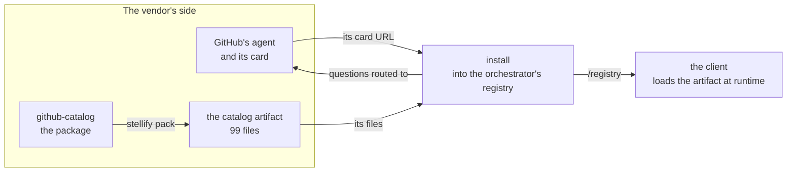
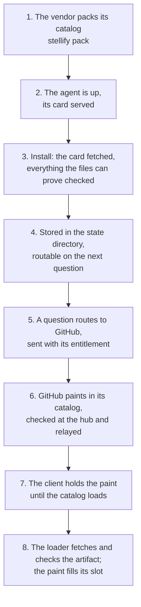
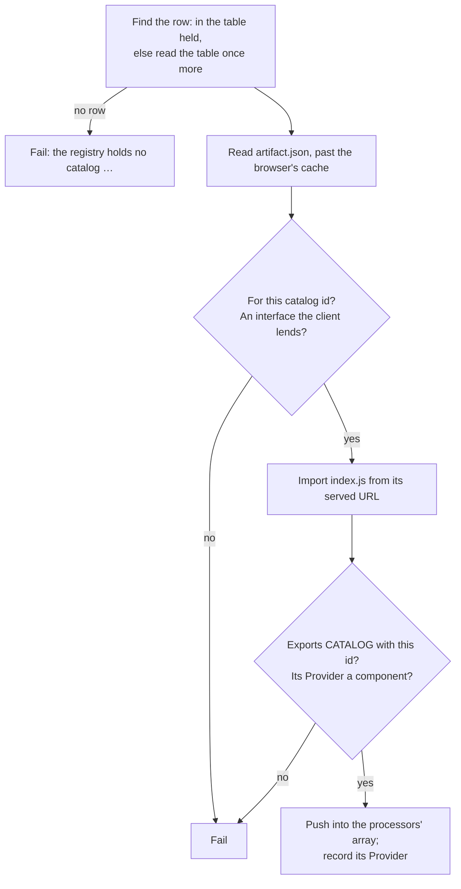

# App install: how an app gets into A2UIVerse

This guide explains **app install**: how an app A2UIVerse has never seen becomes one it routes questions to and draws on the canvas, with no line of A2UIVerse's code naming it. It's written for a frontend engineer meeting A2UIVerse for the first time. It starts with the ideas, follows one app from its catalog package to its first paint, then opens up the algorithms and data structures, and ends with the design decisions and where the code lives.

One example runs through the whole guide: **the GitHub app**, installed into an empty registry from its agent card and its packed catalog, then asked _"What pull requests need my review?"_. It's a real install, made by hand on the deterministic apps, and every id and hash below is a real one. You can repeat it yourself (see [Trying it without a model](#trying-it-without-a-model)).

## Problem it solves

An app in A2UIVerse is an A2A agent running somewhere, which answers a question by painting A2UI in its own catalog: GitHub paints in a catalog of components built on Primer, GitHub's design system. To draw that paint, the canvas needs three things the protocol doesn't give it:

1. **Something that says the app exists**: which agents are installed, where each one is, and what it can do.
2. **The catalog's code.** A2UI names a catalog by id, and GitHub's card names `https://github.com/retz8/a2uiverse-apps/blob/main/github/github-catalog/catalogs/v0.9.1/catalog.json`. But A2UI has no way to deliver a catalog's implementation, or to say where one is: it assumes the client was built with every catalog it renders. A2UIVerse's client was built before GitHub's catalog existed, and isn't rebuilt for each app.
3. **A reason to let it in.** A catalog is code, and it runs in your browser, on one page with every other app's catalog and the shell. Something has to decide what is let in, and stop one app painting in another's catalog.

A2UIVerse answers with two units joined by an id, a pack tool, and one writer:

- The **app** is its agent card, and nothing else.
- The **catalog** is its own unit: a **catalog artifact**, a folder of files the client loads at runtime, packed from the vendor's catalog package by **Stellify** ("to turn into a star").
- The **registry**, the orchestrator's persisted state, is the one place that says what's installed. **Install** is the one way in, and it checks everything the files can prove before anything is stored.



## Six ideas to hold on to

### 1. An app is its agent card

An A2A agent describes itself in an **agent card**, a JSON document it serves at `/.well-known/agent-card.json`. A2UIVerse reads nothing else about an app: there's no manifest, and nothing is added to the card. Here's GitHub's, trimmed:

```jsonc
{
  "name": "GitHub",
  "description": "Reads and acts on the user's GitHub: finds the pull requests that need them, …",
  "url": "http://localhost:11001",
  "version": "0.1.0",
  "capabilities": {
    "streaming": true,
    "extensions": [{
      "uri": "https://a2ui.org/a2a-extension/a2ui/v0.9.1",
      "params": {"supportedCatalogIds": ["https://github.com/retz8/a2uiverse-apps/blob/main/github/github-catalog/catalogs/v0.9.1/catalog.json"]}
    }]
  },
  "skills": [
    {"id": "pr_triage", "name": "Pull request triage",
     "examples": ["What needs my attention today?", "What pull requests need my review?", "…"]}
    // …Reading a pull request, Composing a review, Acting on GitHub
  ]
}
```

Everything the platform needs is in it:

| From the card | Used for |
| --- | --- |
| `name` | the app's name above its slot, and in the Planner's view of the platform |
| `description`, `skills` | routing: the Router ranks a question against them |
| `url` | where a question to the app is sent |
| `supportedCatalogIds`, under the A2UI extension | the catalogs the app paints in |

The one thing the platform adds is the **app id**, `github` here: the namespace on every surface the app paints (`github:notifications-1`), and the app's name in every ref the merged view makes into its data. It's given at install: a lowercase slug, with `shell` reserved for A2UIVerse itself.

### 2. A catalog is its own unit, joined by its id

An A2UI catalog has two faces: the **schema**, `catalog.json`, which says what components exist and what props they take, and the **implementation**, the React components that draw them. GitHub's two are one package in the apps repo, `github-catalog`.

The catalog is installed beside the app, not inside it, and the two meet only through the **catalog id**. One app may paint in several catalogs, and several apps may share one. The **catalog table** says, for each catalog id, where its implementation comes from:

```jsonc
// GET /registry/catalogs.json, after GitHub's install
[
  {"catalogId": "https://a2ui.org/specification/v0_9/catalogs/basic/catalog.json", "provided": "client"},
  {"catalogId": "https://github.com/retz8/a2uiverse/blob/main/packages/shell-catalog/catalogs/v0.9.1/catalog.json", "provided": "client"},
  {"catalogId": "https://github.com/retz8/a2uiverse-apps/blob/main/github/github-catalog/catalogs/v0.9.1/catalog.json",
   "artifact": "sha256-muNbmR5mKt8syNMd8F2CwoX3dD4io6xoVLEbHSB_GG8", "entry": "index.js"}
]
```

Two rows are always there: the standard **basic catalog**, which every A2UI client ships, and the **shell catalog**, A2UIVerse's own. The client has both built in, so they name no artifact. Every other row names an installed one.

### 3. Catalog artifact: a folder under one URL

Stellify packs `github-catalog` into a **catalog artifact**, a folder the orchestrator serves under one base URL, `/registry/artifacts/sha256-muNbmR5m…/`:

```
artifact.json                                    the descriptor: every other file and its hash
index.js                                         the whole catalog, one ES module, 2.2 MB
catalog.json                                     the schema, byte for byte
dist/primer-scoped.css                           the package's own stylesheet
node_modules/@primer/react/dist/…/*.css          94 of Primer's component stylesheets
node_modules/@primer/primitives/…/light.css      Primer's tokens, light and dark
node_modules/@primer/primitives/…/dark.css
```

The **descriptor**, `artifact.json`, names everything:

```jsonc
// artifact.json, trimmed: 99 files in all
{
  "catalogId": "https://github.com/retz8/a2uiverse-apps/blob/main/github/github-catalog/catalogs/v0.9.1/catalog.json",
  "entry": "index.js",
  "schema": "catalog.json",
  "hostInterface": "0.9.1",
  "files": {
    "catalog.json": "sha256-Oh2nkmMlLbWW3dMdYNClrCyQ6PQCTX6Ta8rkWBIxcLQ=",
    "dist/primer-scoped.css": "sha256-wUxytl+aoj55Eo3DO4U/78JsiZffBgRd0Hd/uzQ0jNo=",
    "index.js": "sha256-UT8YNrJn4/GH+83Z6v1bSJan13300vZwEGnLPPVqxnc=",
    "node_modules/@primer/react/dist/ActionBar/ActionBar-3767d551.css": "sha256-70jMseXmGWC1itfLStJn1OMCy+3PJpF3meCiRx3uVC0="
    // …
  },
  "package": {"name": "github-catalog", "version": "0.1.2"},
  "packedBy": {"tool": "@a2uiverse/stellify", "version": "0.1.0"}
}
```

Every file is listed with its **hash**, so a file that's missing, changed or extra is caught. The **artifact id**, `sha256-muNbmR5m…`, is the hash of `artifact.json` itself. Because the descriptor lists every other file's hash, that one id covers all 100 files: change one byte of one stylesheet and the id changes. So what's at an artifact's URL never changes. The orchestrator serves it as immutable content, and nothing downstream ever asks whether it's stale.

### 4. Host-module interface: one React for the whole page

GitHub's catalog imports React, the A2UI runtime and zod. If its bundle carried copies of its own, the page would hold two Reacts, and hooks would break as soon as GitHub's components rendered inside the client's tree. So the artifact leaves those out and reads them from one object the client puts on the page before any artifact loads, `globalThis.__a2uiverse_host__`, the **host-module interface**:

```ts
interface HostInterface {
  version: string;                             // "0.9.1": the A2UI version it lends
  modules: Record<HostSpecifier, unknown>;     // the client's own module for each specifier lent
  loadStylesheet(url: string): Promise<void>;  // one <link> per URL, resolved once it has loaded
}
```

It lends exactly seven imports: `react`, `react/jsx-runtime`, `react-dom`, `react-dom/client`, `@a2ui/react/v0_9`, `@a2ui/web_core/v0_9` and `zod`. Everything else a catalog imports, Primer included, is bundled into its own `index.js`. An artifact names the interface version it was built against, and the client refuses one it doesn't lend.

The vendor never writes code against this interface: Stellify rewrites the imports in the bundle, never in the vendor's source ([Packing](#packing-what-stellify-does) shows how).

### 5. Registry: one writer, three operations

The **registry** is the orchestrator's persisted state: the installed apps and the catalog table, kept as files in its state directory. The orchestrator is its only writer, through three operations:

- **Install** an app: its id, its card's URL, and an artifact for each catalog its card names other than the basic catalog.
- **Uninstall** an app, by id.
- **Install-over**: install an id that's already installed. Its card, its artifacts and its entitlement are replaced in place.

Each is an HTTP call on the orchestrator's own port, under `/registry`, carrying a write token, and a small command wraps them. A change is live at once: the next question can route to a new app, and a page already open loads the new catalog when the app's first paint arrives, with no reload. The orchestrator boots from the registry alone. A fresh state directory is an empty registry, and that's a working platform, with only A2UIVerse's own card to answer.

### 6. Entitlement: each app paints in its own catalogs

An app's **entitlement** is the set of catalogs it may paint in: the ones handed at its install, plus the basic catalog. GitHub's has two:

```json
["https://a2ui.org/specification/v0_9/catalogs/basic/catalog.json",
 "https://github.com/retz8/a2uiverse-apps/blob/main/github/github-catalog/catalogs/v0.9.1/catalog.json"]
```

It's fixed at install and changes only by install-over. The orchestrator tells each app its own entitlement, never the table, and refuses a paint outside it. So no app paints in another app's catalog, whatever else is installed, and the shell catalog, in nobody's entitlement, stays the shell's.

## One app, end to end



**1. The vendor packs.** In the catalog package's own checkout, after its build:

```bash
cd ../a2uiverse-apps/github/github-catalog
pnpm build
pnpm exec stellify pack
# github-catalog 0.1.2 — 99 files written to …/github-catalog/dist/artifact
```

Stellify bundles the built entry, copies every stylesheet the code reaches, runs the checks install will run, and writes `dist/artifact/`. It runs none of the vendor's code and edits none of its files. It's one dev dependency of the package, pinned to a commit of this repo, and a package laid out like GitHub's needs no configuration.

**2. The agent is up.** GitHub's agent serves its card at `http://localhost:11001/.well-known/agent-card.json`.

**3. Install.** From this repo:

```bash
pnpm --filter @a2uiverse/orchestrator registry install github \
  http://localhost:11001/.well-known/agent-card.json \
  ../a2uiverse-apps/github/github-catalog/dist/artifact
# installed github · card 0.1.0 · catalog sha256-muNbmR5m…
```

The command reads the artifact folder, base64-encodes every file, and posts `{appId, cardUrl, catalogs: [{files}]}` to `POST /registry/install` with the write token. The files travel in the request: the orchestrator never reads a path it's handed. It fetches the card, then checks the app, collecting every finding before it answers and refusing the whole app on any:

- the app id is a slug, and not `shell`;
- the card fetches, with a `url` and a `name`, and its catalog declaration is valid A2UI;
- **coverage, both ways**: every catalog the card declares is handed or is the basic catalog, and every artifact handed is one the card declares;
- each artifact passes the **static gate**, everything its files alone can prove;
- no artifact is handed for the basic or the shell catalog;
- no catalog another installed app holds is swapped for another version.

[Checking an app at install](#checking-an-app-at-install) has the details.

**4. Stored, and live.** The card is embedded for routing, the artifact is written under `artifacts/sha256-muNbmR5m…/`, and the record goes into `registry.json`:

```jsonc
{
  "id": "github",
  "cardUrl": "http://localhost:11001/.well-known/agent-card.json",
  "card": {"name": "GitHub", "url": "http://localhost:11001", "version": "0.1.0", "…": "the card as fetched, verbatim"},
  "catalogs": {"https://github.com/…/github-catalog/catalogs/v0.9.1/catalog.json": "sha256-muNbmR5mKt8syNMd8F2CwoX3dD4io6xoVLEbHSB_GG8"},
  "entitlement": ["https://a2ui.org/…/basic/catalog.json", "https://github.com/…/github-catalog/catalogs/v0.9.1/catalog.json"],
  "installedAt": "2026-10-03T00:49:11.509Z"
}
```

Install answers with one line saying what changed, `installed github · card 0.1.0 · catalog sha256-muNbmR5m…`, and the journal gets a line of kind `registry`. Nothing restarts: the Router ranks GitHub on the very next question, and the Planner's `installed_apps` reader lists it.

**5. A question routes to GitHub.** You ask _"What pull requests need my review?"_. The Router ranks GitHub's card against it (one of its skills' examples is that very question), and the Planner dispatches to it. The AgentsPool reads GitHub's record once, as the dispatch starts, and sends the Planner's request with GitHub's entitlement as the message's `a2uiClientCapabilities`:

```json
{"v0.9": {"supportedCatalogIds": ["https://a2ui.org/…/basic/catalog.json", "https://github.com/…/github-catalog/catalogs/v0.9.1/catalog.json"]}}
```

That's A2UI's own handshake: a client says which catalogs it can render, and the agent paints in one of them. The client GitHub sees is the orchestrator, and what it says is GitHub's entitlement.

**6. GitHub paints, and the hub checks.** GitHub's first event carries a `createSurface` in its catalog. The orchestrator checks the catalog id of every `createSurface` it relays against the entitlement it sent. GitHub's is in it, so the paint goes through, stamped and namespaced like any other ([`orchestrator.md`](orchestrator.md#relay-three-changes-and-no-more) has the relay).

**7. The client holds the paint.** The page has been open since before the install. Its boot read the catalog table then and found nothing to load. Now a surface arrives in a catalog it doesn't hold. Each answer has a **catalog gate** in front of its turn runner: the gate holds the batch, and everything after it in that answer, while the catalog loads. GitHub's slot shows "Loading…".

**8. The loader loads the artifact.** The **catalog loader**:

1. finds no row for GitHub's catalog in the table it read at boot, so it reads the table again, past the browser's cache, and finds it;
2. reads `artifact.json`, and checks that it's for this catalog and built against an interface version the client lends;
3. imports `index.js` from its served URL, `…/registry/artifacts/sha256-muNbmR5m…/index.js`. As it evaluates, the entry reads React and the rest from the host interface and starts 77 stylesheet loads at once, each a `<link>` the host appends in import order. The import settles once all 77 have loaded;
4. checks the module: it exports `CATALOG`, a catalog whose id is GitHub's, and its `Provider` is a component;
5. pushes the catalog into the one array every answer's processor reads, and records its Provider for its surfaces.

The gate releases the held batches, in order. GitHub's surface is created in its catalog and mounts in its slot inside the fragment boundary, with GitHub's Provider around it, and "My Open Pull Requests" draws in Primer. The answer from before the install, the one with the capability tile, is still in the trail.

On the next reload, the paint waits for nothing: the boot's **preload** loads every artifact the table lists, in the background, before any question is asked.

## Inside the machinery

### Packing: what Stellify does

`packages/stellify` turns a built catalog package into an artifact in one in-memory pipeline (`src/pack.ts`, `src/bundle.ts`). `pack` writes the result; `check` runs the same pipeline and writes nothing, for a vendor's CI.

1. **Find the inputs.** The built entry is what `package.json`'s `exports["."]` names, else `main`. The schema is `catalogs/v0.9.1/catalog.json`. A `stellify.config.ts` with four optional fields (`entry`, `schema`, `catalogId`, `outDir`) covers a package laid out otherwise; GitHub's has none.
2. **Read the schema, never run the code.** The catalog id is the schema's `catalogId`. The schema must compile as an A2UI catalog.
3. **Bundle with esbuild** into one ES module: for the browser, no code splitting, no minification, no source maps. Two esbuild plugins do the rewriting below.
4. **Assemble, hash, describe.** The files are sorted by path and hashed, the descriptor is built, and the result is checked by the same sdk functions install runs.

Every failure is a **finding**, `file: reason`, and every one is reported together. Nothing throws on a refusal.

**The host rewrite.** Every import is classified by the sdk's `classifySpecifier`:

| Import | Class | What happens |
| --- | --- | --- |
| one of the seven lent | host | becomes a read from the host interface |
| any other under `react`, `react-dom`, `@a2ui/react`, `@a2ui/web_core` or `zod`, like `react-dom/server` | refuse | a finding: the host doesn't lend it |
| everything else: `@primer/react`, the package's own files | bundle | bundled into `index.js` |

A host import resolves to a tiny virtual CommonJS module, so every named import (`useState`, `jsx`) becomes a property read at runtime and Stellify needs no list of what each module exports. From GitHub's `index.js`:

```js
// a2uiverse-host:react
var require_react = __commonJS({
  "a2uiverse-host:react"(exports, module) {
    module.exports = globalThis.__a2uiverse_host__.modules["react"];
  }
});
```

**The stylesheet rewrite.** A catalog imports its CSS the way any React package does, and each Primer component imports its own sheet. A browser can't import CSS as a module, and a vendor shouldn't have to change how it writes styles. So each stylesheet import, static or dynamic, becomes a load through the host, resolved against the module's own URL:

```js
// a2uiverse-stylesheet:node_modules/@primer/react/dist/BaseStyles-fda34843.css
var load = globalThis.__a2uiverse_host__.loadStylesheet(new URL("node_modules/@primer/react/dist/BaseStyles-fda34843.css", import.meta.url).href);
if (loads.done) await load;
else loads.early.push(load);
```

`import.meta.url` is wherever `index.js` was imported from, so every sheet resolves under the artifact's base URL, and no URL is written into the bundle. That's why the client imports the entry from its served URL: a blob would have no base to resolve against. The sheet itself is copied into the artifact, its bytes never rewritten.

**Waiting for the sheets, once.** A component shouldn't render before its CSS applies. Awaiting each sheet in turn would make GitHub's 77 a chain of 77 round trips. Instead, the loads the entry makes as it evaluates are only started, their promises collected in `loads.early`, and Stellify's wrapper around the entry ends with:

```js
await Promise.all(loads.early);
loads.done = true;
```

The entry finishes once the slowest sheet has loaded. A load made later, like the three sheets GitHub's Provider loads lazily (Primer's light and dark tokens and its own scoped sheet), sees `loads.done` and awaits its own sheet. The host appends each `<link>` synchronously as it's called, so the cascade follows import order whatever order the sheets arrive in.

**Where each file goes.** The artifact mirrors the package, so a relative `url()` or `@import` inside a copied sheet keeps resolving, and no CSS needs rewriting:

- A file of the package keeps its path from the package root, `dist/primer-scoped.css`, wherever the package sits: in its own checkout, or installed in a `node_modules`.
- A dependency's file goes under the name its `package.json` gives, `node_modules/@primer/react/dist/…`, never pnpm's real path inside its store.
- Each copied sheet is scanned for `url(…)` and `@import`, and every file they reach is copied beside it. A reference outside the package and its dependencies is refused; `data:` and absolute URLs are left alone.

**Same input, same bytes.** Paths are sorted, nothing records a time or an absolute path, and esbuild's output is stable, so packing one package twice gives the same artifact, hash for hash. Two apps handing the same catalog hand the same artifact, which is one row in the table.

### Hashes and the artifact id

`packages/sdk/js/src/artifact.ts` holds both:

- **A file's hash** is SHA-256 in standard base64: `sha256-Oh2nkmMl…CQ6PQCTX6Ta8rkWBIxcLQ=`. It's computed with Web Crypto, so Stellify and the orchestrator in Node and the client in the browser run one function.
- **The artifact id** is the hash of `artifact.json`'s exact bytes, spelled URL-safe because it's a path segment (`+` becomes `-`, `/` becomes `_`, no padding): `sha256-muNbmR5mKt8syNMd8F2CwoX3dD4io6xoVLEbHSB_GG8`.

It's a **hash tree** one level deep, like a Merkle tree: the id is a hash over the descriptor, and the descriptor holds a hash for every file. Checking an artifact is checking each file against the descriptor. The id is always computed from the descriptor's bytes, never taken from whoever handed it.

### Checking an app at install

`apps/orchestrator/src/registry/registry.ts` (`Registry.install`) and `gate.ts`. Every check is a function of the sdk's, so the marketplace, once it's built, refuses the same things for the same reasons. Install runs every check and collects every finding before it answers. One finding refuses the whole app, and the publisher sees everything there is to fix at once.

**Reading the card's catalogs.** `readSupportedCatalogIds` finds the extension whose URI is A2UI v0.9.1's and reads `supportedCatalogIds` from its params. Upstream A2UI writes those params two ways: flat, as GitHub's card does, and keyed by version (`{"v0.9": {"supportedCatalogIds": […]}}`), as A2UI's own schema says. Both are read, and each is validated against the pinned schema. A malformed declaration is a finding, never read as "declares none".

**Coverage, both ways.** With `declared` the card's catalog ids and `handed` the id of each artifact handed:

```
missing = declared − handed − public     a catalog the card paints in that nothing implements
orphan  = handed − declared              an artifact no card names
```

Both must be empty. `public` is the basic catalog alone. A card that declares no catalogs installs on the basic catalog, and install answers with a note saying so. A card that declares the shell catalog can't install: unhanded, it's missing, and handed, it's refused as the client's own.

**The static gate** (`gateArtifact`) checks each artifact with nothing evaluated:

1. `artifact.json` is there, parses, and conforms to the descriptor's JSON Schema; its entry and its schema are among its files.
2. Every listed file is there with its hash, and nothing unlisted is.
3. The host interface is one the platform supplies, `0.9.1`.
4. The schema parses, its `catalogId` is the descriptor's, and it compiles as an A2UI catalog.

What only running code can show, like what the module exports and whether `CATALOG.id` agrees, is the client's check, when it loads the artifact.

#### Credential inputs are checked at the paint

Install doesn't look for credential inputs in a catalog. The orchestrator checks every paint instead, and refuses one that carries a password, code or card field, whatever catalog it's in ([`orchestrator.md`](orchestrator.md#agentspool-one-handle-per-dispatch), the credential bar). It reads the options each installed catalog's components declare, which the registry keeps when it installs or loads an artifact.

**One hash per catalog id.** The table holds one artifact per catalog id. An artifact for a held id at another hash is a new version of that catalog. It's accepted only when no other installed app names that id, and refused otherwise, naming the apps that hold it: `catalog "…/github-catalog/catalogs/v0.9.1/catalog.json" is held at another hash by github`. Two apps share a catalog by handing the same artifact: same id, same hash.

### Store on disk

`apps/orchestrator/src/registry/store.ts`:

```
.state/registry/
  registry.json                  {"apps": [...]}: every installed app's record, sorted by id
  artifacts/sha256-muNbmR5m…/    one folder per artifact: artifact.json, index.js, catalog.json, its stylesheets
  write-token                    this run's write token, readable by the owner only
```

- **Every write is a rename.** `registry.json` is written to a temporary file and renamed over the old one; an artifact is written into a temporary folder and renamed to its id. A crash leaves the old state or the new one, never half of each. An artifact whose folder already exists isn't written again, so apps sharing one share a folder.
- **Artifacts are collected after every write.** Install, install-over and uninstall all end the same way: the artifacts some record still names are kept, and every other folder under `artifacts/` is removed. An artifact lives exactly as long as an installed app names it, and an install-over to a new hash drops the old one. The basic and the shell catalog have no folder: their rows are built from code at every boot.
- **The boot checks everything again.** At startup the orchestrator reads `registry.json`, checks each record's shape, and hashes every file of every artifact a record names. A file that won't parse, or an artifact missing or changed, stops the boot with the path and the problem.

### Two cards per app

The record keeps the card as it was fetched at install. At every startup the orchestrator fetches each card again from its stored URL, all in parallel, and that's the card the run uses: where questions are sent, the skills the Router ranks, the name the Planner reads. An agent that's down at startup stays installed, can't be routed to for the run, and is named in the boot log.

The card on disk changes only by install-over, and a refreshed card never grows the entitlement. An agent that starts declaring a new catalog paints in it only once it's installed over with that catalog's artifact.

### Install summary

`installSummary(previous, next)` in `registry.ts` writes the line the command and the launcher print:

```
installed github · card 0.1.0 · catalog sha256-muNbmR5m…
updated github · card 0.1.0 · catalog sha256-muNbmR5m… → sha256-bYxc_jOA…
reinstalled github · nothing changed · card 0.1.0 · catalog sha256-muNbmR5m…
updated github · card 0.1.0 · catalog …/catalogs/v0.9.1/catalog.json sha256-muNbmR5m… gone · catalog …/v2/catalogs/v0.9.1/catalog.json sha256-A9ZrhYLo… new
```

It's a small diff of the two records, written in parts joined by `·`:

1. The verb: `installed` when there was no record; `updated` when the card or the set of catalogs and their artifacts differs; otherwise `reinstalled`, followed by `nothing changed`.
2. The card's version, `old → new` when it moved.
3. Each catalog the old record had and the new one doesn't, named in full, `gone`.
4. Each catalog of the new record: its artifact; `old → new` when the artifact moved; the id named in full and `new` when the catalog is new.

An artifact id is shortened to `sha256-` and its next eight characters. (The catalog ids above are shortened for the page; the line prints them whole.)

### Routes shaped like static files

`apps/orchestrator/src/registry/api.ts` serves everything under `/registry` on the orchestrator's own port:

| Route | What it serves |
| --- | --- |
| `GET apps.json` | the installed records, `Cache-Control: no-cache` |
| `GET catalogs.json` | the catalog table, `Cache-Control: no-cache` |
| `GET artifacts/<id>/<path>` | an artifact's files, `Cache-Control: public, max-age=31536000, immutable` |
| `POST install` | `{appId, cardUrl, catalogs: [{files: {<path>: <base64>}}]}`, with the write token |
| `POST uninstall` | `{appId}`, with the write token |

The read routes are shaped like files on purpose: a folder with the same layout, served by any static server, stands in for the orchestrator. The [registry snapshot](#dev-harness-the-launcher-and-the-snapshot) the tests load is exactly that. A write answers `200` with what it did, `400` for a malformed request, `401` for a missing or wrong token, `404` to uninstall an app that isn't installed, and `422` with every finding of a refusal.

**The write token.** The orchestrator's port is public through the dev tunnel, and an artifact is code that runs in your browser. So writes need a token: 32 random bytes, written into `.state/registry/write-token` at every startup, readable by the owner only, sent as `Authorization: Bearer <token>`, and compared in constant time. Only something on the machine with the state directory can read it: the command and the launcher.

### Entitlement at the hub

`apps/orchestrator/src/agentsPool/agentsPool.ts`. A dispatch reads the app's record once, as it starts, and keeps that snapshot to its end:

- It sends the message's `a2uiClientCapabilities` as the app's entitlement, in place of what the client sent, so an app is told only what it may paint in.
- `catalogOutside` checks the `catalogId` of every `createSurface` in every event the app sends. A miss is never relayed: the app is sent A2A's `tasks/cancel`, and the dispatch fails with the `catalog` cause, carrying the id. The slot's failure tile says "This app sent something that can't be shown here." with no Retry, since the same paint would be refused the same way.
- An app that isn't installed when the dispatch starts isn't asked at all: its slot fails with the `uninstalled` cause.

The snapshot is what keeps uninstall and install-over safe in the middle of a question: a dispatch already running finishes under the entitlement it was sent with, and the next one reads the registry as it stands.

### Loading in the client

`apps/client/src/catalogs/`.

**At boot** (`canvas.tsx`):

1. `registerHost()` puts the host interface on `globalThis.__a2uiverse_host__`: the client's own module for each of the seven, and `linkStylesheetLoader`. It's the first thing the entry does, because an artifact reads the interface as it evaluates.
2. `createCatalogLoader` builds the loader over the registry's URL, holding the client's own two catalogs from the start.
3. `preload()` starts in the background, and the canvas renders at once. The shell never waits on the registry.

**One load**, in `fetchAndCheck`:



The structures behind it:

- **`loading: Map<catalogId, Promise>`** keeps one load in flight per catalog, so the preload and a paint arriving in that catalog share one. An entry goes when its load settles.
- **`resolved: Map<catalogId, ResolvedCatalog>`** holds the catalogs loaded. The first load of a catalog id wins for the session, so every answer renders a catalog the same way.
- **One catalog array.** Every answer's `MessageProcessor` is built over the loader's `catalogs` array, and a loaded catalog is pushed into it. web_core looks a catalog up in that array when a surface is created, so an answer opened before an install still finds the new catalog. web_core doesn't promise to hold the array by reference; a test pins that it does.
- **A failed load isn't kept**, so the next paint in that catalog, or a Retry, tries again.

**The Provider.** A catalog brings at most one `Provider`, its whole way into the page. GitHub's wraps its surfaces in a `github-catalog-scope` element with Primer's `ThemeProvider` and `BaseStyles`, and loads Primer's light and dark tokens and its own scoped sheet lazily. `SurfaceFrame`, in `CatalogContext.tsx`, wraps each surface in its own catalog's Provider and nothing else, and the client registers nothing at the app root for any vendor. [`client.md`](client.md#many-design-systems-on-one-page) explains how the fragment boundary and the collision detector keep catalogs' CSS apart.

**The catalog gate** (`catalogGate.ts`) sits in front of each answer's turn runner. A batch whose catalogs are all held passes straight through. A batch that creates a surface in a catalog not held is held, with everything after it in that answer, in order, until the load settles, so the turn runner itself stays synchronous.

**Bounded asks.** Through a dev tunnel, a request sometimes gets no answer at all, not even an error. A stylesheet's `<link>` then fires neither `load` nor `error`, the entry's `Promise.all` never settles, and the slot would say "Loading…" for good. So every request of a load is bounded, and asked once more:

| Request | No answer in | Asked again as | Then |
| --- | --- | --- | --- |
| the table, `catalogs.json` | 10 s | the same URL, past the cache | the load fails |
| the descriptor, `artifact.json` | 10 s | the same URL, past the cache | the load fails |
| a stylesheet | 10 s | `…css?attempt=2`, a fresh `<link>` in the first one's place | the load fails |
| the entry, `index.js` | 30 s | `index.js?attempt=N` | the load fails |

Two browser behaviours shape the third column:

- **The browser holds a second request for a URL behind a first one still unanswered**, so asking the same URL again through its cache never leaves the page. The JSON reads go past the cache (`cache: 'no-store'`), and a stylesheet's second ask goes under a URL of its own.
- **The browser keeps a module whose evaluation failed** and answers its URL with the same failure. So from its second import on, the entry goes under a fresh `?attempt=N`, counted per catalog for the session. That's also what lets a Retry after a failed load really load again.

**A load that fails.** The gate drops the fragment's messages, and the answer reports a **catalog load failure** to the orchestrator: A2UI's generic client error, with the code `CATALOG_LOAD_FAILED` and the catalog id, sent on a stream beside the turn. The orchestrator fails the slot with the `load` cause: "Something went wrong loading this.", with Retry. The id rides on the slot and is never shown.

**What the client advertises.** The client's own messages to the orchestrator always carry the basic and the shell catalog as its supported catalogs, whatever it has loaded, since the orchestrator paints only the shell's surfaces. What each app may paint in is the orchestrator's to say.

### Uninstall and install-over with answers open

| Change | The registry | An answer already drawn | The next paint |
| --- | --- | --- | --- |
| Uninstall | the record goes; each artifact goes once no record names it | keeps what it drew | a dispatch to the app fails `uninstalled`: "This app isn't installed anymore.", with Retry |
| Install-over, same catalog, a new hash | the row moves to the new artifact; the old one's files go | keeps what it drew | the open page keeps the catalog it loaded first; a reload shows the new one |
| Install-over, a new catalog id | the old id's row goes, the new id's comes | keeps what it drew | the new catalog loads as the paint arrives, with no reload |

**Retry sends again what failed.** Say an answer drawn before GitHub was uninstalled is still open, and you click a pull request in GitHub's slot. The click fails `uninstalled`. GitHub is installed again, and you press Retry on its slot. Retry sends the click again, so the slot shows the pull request it opened, not GitHub's list from the plan. The orchestrator keeps a click that failed on its slot (`failedPress` in `composition/state.ts`) until a click or a Retry there completes. A slot whose question's dispatch failed retries the plan's request.

### Dev harness: the launcher and the snapshot

**The launcher** (`scripts/dev-agents.mjs`) installs through the same operation as the command. Its roster, `scripts/dev-roster.mjs`, names each app it starts from the apps checkout, each on the port its agent was scaffolded with:

| App id | Folder | Tier | Port |
| --- | --- | --- | --- |
| `github` | `github` | default | 11001 |
| `gmail` | `gmail` | default | 11002 |
| `calendar` | `calendar` | default | 11003 |
| `circleci` | `circleci` | default | 11004 |
| `linear` | `linear` | default | 11005 |
| `shop-a` | `mocks/shop-a` | mocks | 12001 |
| `shop-b` | `mocks/shop-b` | mocks | 12002 |

`pnpm dev:all` starts the default tier's agents and the platform. It builds each app's catalog package in the checkout, packs it in memory with Stellify's programmatic API (`stellify()`, then `artifactFiles()`), and installs each app once the orchestrator and the app's own card both answer, printing the install's line. Then it uninstalls every roster app it didn't launch, and leaves alone any app the roster doesn't name. An app that fails to build, pack, come up or install is named with its reason and left out; the rest run. `--tier mocks` runs the two mock shops instead, and `--no-install` starts the agents and nothing else, for installing by hand with the command. With `A2UIVERSE_PUBLIC_URL` set, a pattern with a `{port}` slot such as a tunnel address, the launcher gives each agent its `--public-url`: where the browser reaches its sign-in pages, its card and the rest staying on `localhost`. The orchestrator knows nothing about the apps checkout: only the launcher reads it.

**The registry snapshot** (`packages/registry-snapshot`) is the table and the packed artifacts of all seven catalog packages, for the tests and for replays with no orchestrator:

- Its dependencies are the seven catalog packages, pinned to one commit of the apps repo; pnpm installs and builds them.
- `generate.mjs` packs each with Stellify where pnpm installed it, names it with `artifactIdOf`, and writes `dist/registry/catalogs.json` and `dist/registry/artifacts/<id>/`: the layout of the orchestrator's read routes, without `apps.json`. It's git-ignored and never committed.
- The client's vitest suite loads it through the real loader, from disk. `preview:snapshot` builds the client against its own origin and serves the snapshot under `/registry`, which Playwright and offline replays read.

**No runtime code names an app.** `scripts/no-app-named.test.mjs`, part of `pnpm verify`, searches the runtime source of the client, the orchestrator and the shell catalog for every roster app's id, catalog package name and catalog id, comments and tests aside. Three paths may name one, and each must still hold a naming, so a stale entry fails: the replays' recorded fixtures, and the Planner's and the Synthesizer's worked examples.

## When things go wrong

| What happened | What you see |
| --- | --- |
| Stellify finds a problem | `file: reason`, one line each, then "N findings; nothing written"; exit 1 |
| Install fails any check | Nothing changes. Every finding is answered at once, `422`; the command prints `refused github:` and each finding, and exits 1 |
| The card can't be fetched at install | Refused: `the card at … could not be fetched: …` |
| No write token, or the wrong one | `401`; the command names the state directory it read the token from |
| The registry on disk is damaged | The orchestrator doesn't start; the error names the file and the problem |
| An agent is down at startup | It stays installed and unroutable for the run; the boot log names it |
| An app paints outside its entitlement | The paint is dropped; the slot fails with the `catalog` cause, no Retry |
| A question or a click reaches an app uninstalled since | The slot fails with the `uninstalled` cause, with Retry |
| The client can't load a catalog: the table or the artifact unanswered twice, an interface it doesn't lend, missing exports, another catalog id, an entry that throws | The slot fails with the `load` cause, "Something went wrong loading this.", with Retry |

## Design decisions

| Decision | What it buys | What it costs |
| --- | --- | --- |
| **The card is the app** | Any A2A agent that paints A2UI installs by describing itself; nothing A2UIVerse-specific is asked of it | The platform knows nothing about an app that its card doesn't say |
| **A catalog is its own unit, joined by its id** | Several apps share one catalog; one app paints in several | A table to keep, and a rule for who may change a shared row |
| **No vendor catalog compiled into the client** | Installing an app needs no client build, and no client code names an app | Every vendor catalog is a network load, on every page |
| **A host-module interface** | One React and one A2UI runtime on the page; an artifact carries only its own code | The interface is a contract: lending one more module is a new version |
| **Imports rewritten in the bundle, never the source** | A vendor writes React and CSS as usual, with no wrapper and no config | The code that runs is a rewrite of what the vendor tested |
| **Stylesheets started together, awaited once** | GitHub's 77 sheets cost the slowest sheet, not their sum | The entry waits for every sheet it imports, ones no paint uses among them |
| **An artifact is files under its descriptor's hash** | Immutable content: one id checks every file, and a static server can serve it | Any byte changes the id, so a rebuild against a dependency at another path is another artifact |
| **Install refuses the whole app, every finding at once** | An app is never half installed; the publisher sees every problem in one go | One bad file keeps out the whole app |
| **The gate is static** | Nothing of a vendor's runs on the orchestrator | What only running code shows waits for the client's load |
| **One writer, through operations over HTTP** | The command, the launcher and, later, the Store page all take one path | Writes need the token, which only the machine can read |
| **The registry is files, every write a rename** | Nothing to run beside the orchestrator; a crash leaves the old state or the new | One orchestrator per state directory |
| **One hash per catalog id while another app names it** | No app changes the code another app renders in | A publisher can't update a catalog two of its apps name without uninstalling one |
| **Entitlement checked at the hub** | No app paints in another's catalog, whatever the client advertised | One check per relayed event |
| **The first load of a catalog wins for the session** | Every answer renders a catalog the same way; two versions' stylesheets never meet | An install-over of a catalog shows only after a reload, which loses every answer on the page |
| **Every request of a load bounded, then asked once more** | A request nothing answers fails its slot, with Retry, rather than leaving it loading for good | A load through a very slow link can fail where waiting longer would have worked |
| **Retry sends again what failed** | Retry after a failed click shows what the click opened | A slot keeps the failed click until something there completes |

## Known limits

- **One package packs to one artifact only within one install.** esbuild writes each bundled module's path from the package into the entry, in a comment over the module and as the key of a CommonJS module's wrapper. Pack GitHub's catalog in the apps checkout and again where the registry snapshot installs it, and some of Primer's dependencies sit at other paths: the same source gives another `index.js`, so another id. GitHub's and Linear's artifacts differ from the snapshot's this way; the other five agree. Two installs may also resolve different versions of a dependency.
- **GitHub waits for 77 stylesheets before its first paint**, sheets for components the paint doesn't use among them: through the tunnel, about 80 requests. The artifact carries 97 sheets, and its entry loads 80 of them; 17 are copied and never loaded.
- **Catalog version skew.** An install-over of a catalog shows only after a reload, which loses every answer on the page. An agent restarted with a new catalog id before it's installed over is refused at the hub with the `catalog` cause until it is. After an update to a new catalog id, the old and the new can both be on one page.
- **One publisher can't update a catalog two of its apps name**, since a new hash for an id another app names is refused.
- **Through the tunnel, a reload loads every artifact again.** The tunnel adds its own `Cache-Control: no-cache,no-store` beside the orchestrator's `immutable`, so the browser keeps no artifact across reloads there. Within a page, each is loaded once.

## Trying it without a model

Installing needs no model. Questions do, since the Planner is a model call, but a replay draws an app's paint with none.

- **Install by hand.** Start the deterministic apps and the platform without installing anything, on a fresh state directory for an empty registry: `STATE_DIR=.state-fresh pnpm dev:all --no-install`, and the same `STATE_DIR` for the command, which resolves it against `apps/orchestrator` as the orchestrator does. Copying the old state directory's `models/` in skips the embedding model's download. Then pack and install as in [One app, end to end](#one-app-end-to-end), `registry list` to see it, and `curl http://localhost:10001/registry/catalogs.json` for the table. Open the client and its network panel: the table, `artifact.json`, `index.js` and the stylesheets go by as the preload runs.
- **Install over, and uninstall.** Pack again after a change to the catalog and install again over it to see `updated` and the new hash; install the same pack again to see `reinstalled … nothing changed`; `registry uninstall github` and watch `artifacts/` empty.
- **Replay GitHub.** `?beat=1` replays GitHub's pull request list through the canvas, drawn in the catalog the loader loaded, from the live orchestrator's registry or, with `preview:snapshot`, from the snapshot.
- **The tests.** Stellify's (`pnpm --filter @a2uiverse/stellify test`) pack a small fixture catalog, `test/fixtures/star-catalog`, with a Provider, a lazy stylesheet, a font and a dependency that imports `react-dom/client`: both rewrites, every check, and the same bytes from two places. The orchestrator's `test/registry.test.ts`, `registryApi.test.ts` and `registryCommand.test.ts` install, refuse, install over and uninstall with no network. The client's `src/catalogs/loader.test.ts` loads every snapshot artifact through the real loader, and plays unanswered requests against the bounds.

## Where the code is

| Concern | Where |
| --- | --- |
| The contracts, as JSON | `packages/sdk/contracts/catalog.json`, `packages/sdk/contracts/catalog-artifact.schema.json` |
| The contracts' checks | `packages/sdk/js/src/catalog.ts` (host interface, coverage, entitlement, app id), `packages/sdk/js/src/artifact.ts` (descriptor, hashes, files, schema) |
| Packing | `packages/stellify/src/` (`pack.ts`, `bundle.ts`, `layout.ts`, `stylesheets.ts`, `config.ts`, `manifest.ts`, `write.ts`, `cli.ts`) |
| Install, uninstall, the summary | `apps/orchestrator/src/registry/registry.ts`, `gate.ts` |
| Storage, routes, token, command | `apps/orchestrator/src/registry/store.ts`, `api.ts`, `token.ts`, `command.ts`, `cli.ts`, `types.ts` |
| Routing an installed app | `apps/orchestrator/src/registry/corpus.ts`, `router/router.ts`, `planner/platformReaders.ts` |
| Entitlement at the hub | `apps/orchestrator/src/agentsPool/agentsPool.ts` |
| A failed click kept for Retry; the `load` cause | `apps/orchestrator/src/composition/state.ts`, `executor.ts` |
| Host interface and loading | `apps/client/src/catalogs/host.ts`, `loader.ts`, `clientCatalogs.ts`, `CatalogContext.tsx`, `apps/client/src/orchestratorApi.ts` |
| Holding a paint, reporting a load failure | `apps/client/src/catalogs/catalogGate.ts`, `apps/client/src/canvas/canvasRuntime.ts` |
| The launcher | `scripts/dev-agents.mjs`, `dev-roster.mjs`, `launch-plan.mjs`, `launch-registry.mjs` |
| The registry snapshot | `packages/registry-snapshot/scripts/generate.mjs`, `apps/client/tests/snapshot.ts` |
| No runtime code names an app | `scripts/no-app-named.test.mjs` |

## Words used in this guide

| Word | Meaning |
| --- | --- |
| **App** | An A2A agent that paints A2UI, described by its agent card and nothing else |
| **Agent card** | The JSON an A2A agent serves about itself: name, description, skills, URL, the catalogs it paints in |
| **App id** | The platform's name for an installed app, given at install: a slug, `shell` reserved |
| **Catalog** | An A2UI component vocabulary: its schema, `catalog.json`, and its React implementation |
| **Catalog id** | The id a catalog's schema carries; what the card, the table and a paint name it by |
| **Catalog artifact** | A catalog packed for runtime loading: a descriptor, the schema, one ES module, its stylesheets and fonts |
| **Descriptor** | An artifact's `artifact.json`: its catalog id, entry, schema, host interface, and every file's hash |
| **Artifact id** | The hash of an artifact's descriptor, spelled URL-safe; it covers every file |
| **Catalog table** | Each catalog id and where it comes from: the client itself, or an installed artifact |
| **Stellify** | The pack tool: turns a built catalog package into a catalog artifact |
| **Host-module interface** | The object on the page an artifact reads React, the A2UI runtime and zod from, and loads its stylesheets through |
| **Registry** | The installed apps and the catalog table, the orchestrator's persisted state |
| **Install-over** | An install of an app id already installed, replacing its card, artifacts and entitlement |
| **Coverage** | Every catalog a card declares is handed or public, and every artifact handed is declared |
| **Static gate** | Install's checks over an artifact's files, with nothing run |
| **Entitlement** | The catalogs an app may paint in: those handed at its install, plus the basic catalog |
| **Write token** | The secret the write operations need, written into the state directory at every startup |
| **Catalog loader** | The client's reader of the table, turning each artifact into a catalog the processors use |
| **Preload** | The loader loading every artifact the table lists, in the background from boot |
| **Catalog gate** | The holder in front of an answer's turn runner: a paint waits there while its catalog loads |
| **Catalog load failure** | The client's report that a catalog couldn't load, which fails the slot with the `load` cause |
| **Launcher** | The dev script that starts the apps and installs them through the same operation as the command |
| **Registry snapshot** | The table and the seven packed artifacts at one pinned commit of the apps repo, for tests and replays |
