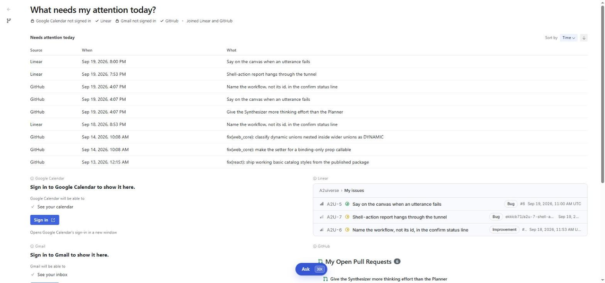
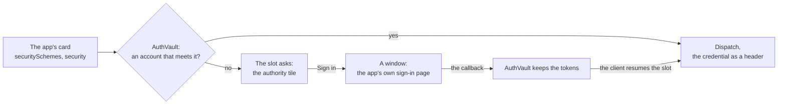
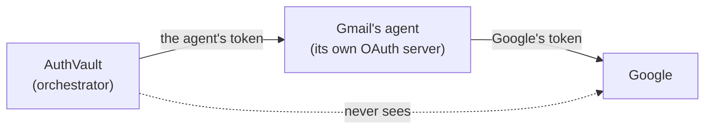
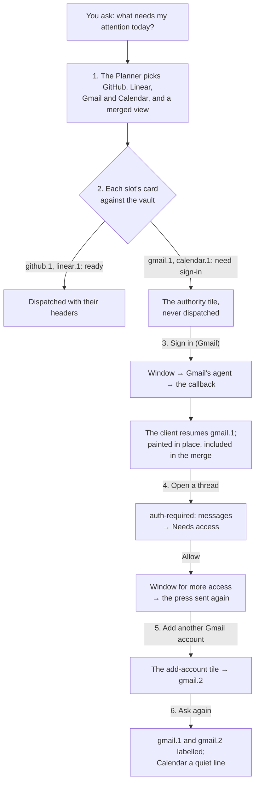
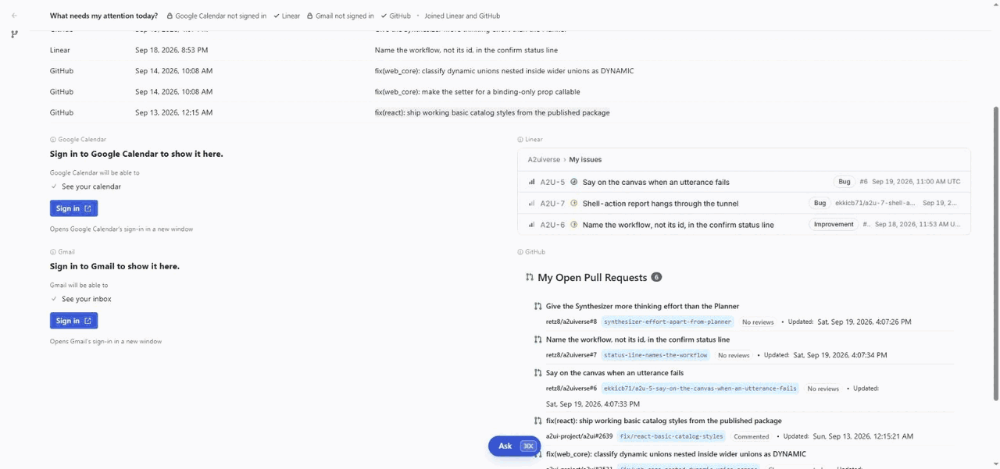
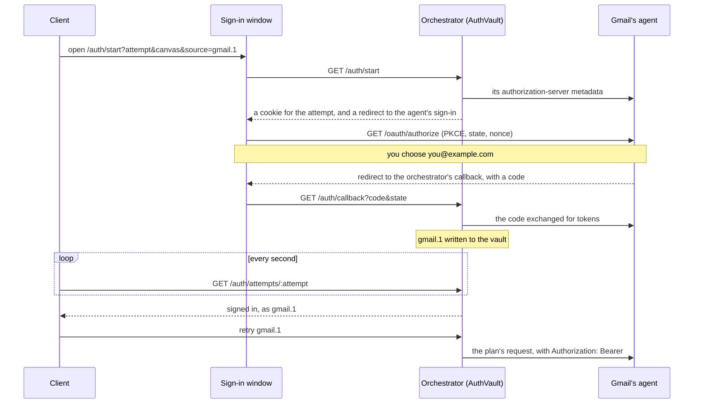
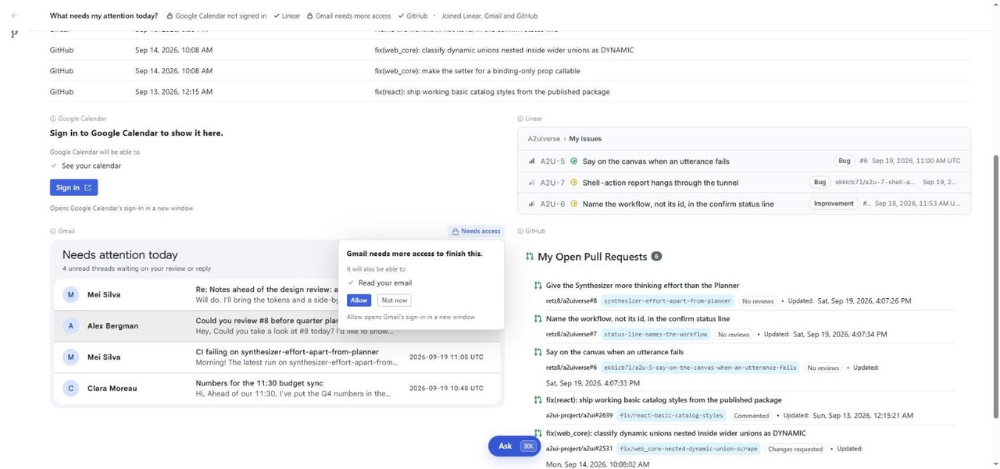
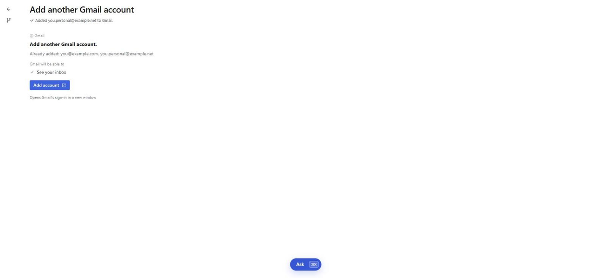
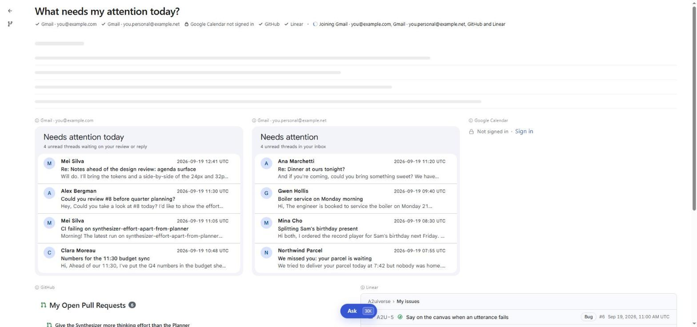
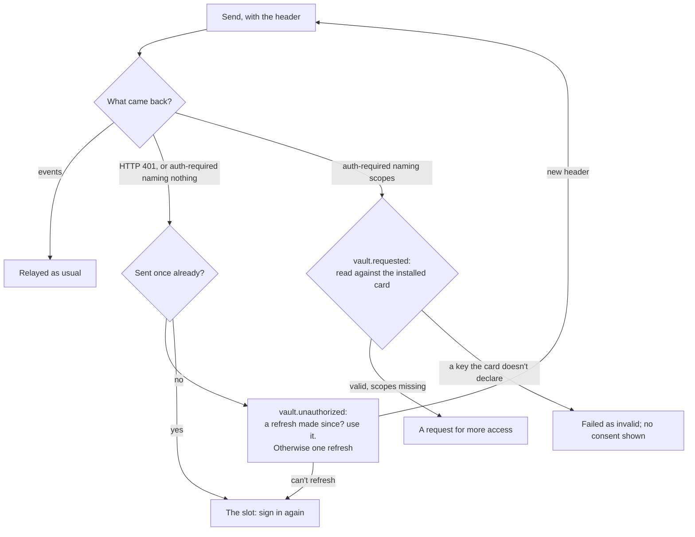

# Authority: how an app gets signed in

This guide explains **authority** in A2UIVerse: how an app that needs you signed in gets its sign-in, and how no password, token or key ever reaches the canvas, the models, the journal or the logs. It's written for a frontend engineer meeting A2UIVerse for the first time. It starts with the ideas, walks one question from start to finish, then opens up the machinery, and ends with the design decisions and where the code lives.

One example runs through the whole guide: the question _"what needs my attention today?"_, asked on the deterministic roster, where each of the five apps answers from its recorded data and signs in with made-up accounts on its own sign-in page. GitHub and Linear are signed in already; Gmail and Google Calendar aren't. You can run it yourself (see [Trying it](#trying-it)).

<p align="center">
  
  <br>
  <em>The first paint. Google Calendar and Gmail each ask you to sign in; GitHub and Linear answer, and the merged view joins those two.</em>
</p>

## Problem it solves

Most apps answer only for someone signed in: Gmail has to know whose inbox. Letting apps on a shared canvas sign people in raises four problems.

1. **Who asks?** If every app drew its own sign-in form, any app could draw one that looks like another's and collect its password. So only the shell asks you to sign in, and no app may paint a password field at all.
2. **Where does the credential live?** Not in the page: the client runs every app's UI side by side. Not with the models: the Planner and the Synthesizer read prompts and write text that's logged. Not in the journal. It lives in one place, the orchestrator's **AuthVault**, and leaves it only as a header on a request to the app that issued it.
3. **The screen can't wait.** A question touching four apps shouldn't stall because one of them needs a sign-in. The other three answer; the one that needs it asks, in its own slot.
4. **Apps come from anyone.** An app is an A2A agent with a card. A2UIVerse has to sign in to it as its card says, with no code written for one vendor or another.

The answer, in one line: **the card says what sign-in an app needs, the shell asks, the vault holds, and a header carries.**



## Six ideas to hold on to

### 1. An app asks on its card

An app says what sign-in it needs in its A2A agent card, in two fields A2A already has. **`securitySchemes`** names each way to sign in, under a key. **`security`** says which of them a request needs. Gmail's card, as it was installed in the example (trimmed):

```jsonc
{
  "name": "Gmail",
  "securitySchemes": {
    "signIn": {
      "type": "oauth2",
      "oauth2MetadataUrl": "http://localhost:11002/.well-known/oauth-authorization-server",
      "flows": {"authorizationCode": {
        "authorizationUrl": "https://<tunnel>-11002.asse.devtunnels.ms/oauth/authorize",
        "tokenUrl": "http://localhost:11002/oauth/token",
        "scopes": {
          "inbox": "See your inbox",
          "messages": "Read your email",
          "organize": "Write drafts and label your email"
        }
      }}
    }
  },
  "security": [{"signIn": ["inbox"]}]
}
```

`security` is a list of alternatives, each a set of schemes that must all hold at once: an **OR of ANDs**. Here there's one alternative, the `signIn` scheme with the `inbox` scope. An empty list, or an empty alternative, means no sign-in is needed. The `scopes` map gives each scope's **words**, written for the person who will read them. Those words are what the shell shows; nothing else on the canvas describes what an app may do.

### 2. A source is an app and its account

Once an app has accounts, everything the orchestrator keeps is keyed by **source**: the app and one of its accounts, written `<app>.<n>`. Gmail with two accounts is `gmail.1` and `gmail.2`, two slots, two conversations with the agent, two copies of the data. An app whose card asks no sign-in keeps its bare id. An app that asks sign-in but holds no account yet is planned as the account its next sign-in will create, `gmail.1`. [`orchestrator.md`](orchestrator.md#sources-an-app-and-its-account) has the keying.

Each account has a **label**, taken from the sign-in itself: the email, user name or name the ID token carries, otherwise "Gmail account 2". When an app has more than one account, its fragments show the label beside the app's name: "Gmail · you@example.com".

### 3. The credential rides a header, and only the vault holds it

A credential travels only as an HTTP header on the A2A request, as the card's scheme names it: `Authorization: Bearer …` for OAuth and a bearer token, the scheme's own header for an API key. It is never part of a message, so it never reaches a partition, the models or the client. The **AuthVault** is the one place that holds credentials: an owner-only JSON file in the orchestrator's state folder, one entry per (app, account).

### 4. Our agents are their own sign-in front door

The vault doesn't sign in to Google. It signs in to **Gmail's agent**, which runs its own small OAuth server: the sign-in page, the token endpoint, refresh, revocation, an ID token. The agent signs in to Google on its side and keeps Google's token; the vault keeps only the token the agent issued.



The agent kit gives every app built on it this front door ([`agent-kit.md`](agent-kit.md) has the kit). In live mode the agent's sign-in page sends you on to the vendor's real sign-in; in deterministic mode it offers made-up accounts on a chooser. The vault can't tell the two apart, and doesn't need to. An agent from someone else is read as its card declares; nothing A2UIVerse-specific is asked of it.

### 5. The tile is the consent; a window is the sign-in

When a slot needs a sign-in, the shell draws the **authority tile** in it: what's needed, the scopes in the card's words, one button, and that it opens a new window. The tile is the consent. There is no second dialog, and no "decline" button: the rest of the canvas never waits on it. Pressing it opens the sign-in in a **real browser window**, never in a frame inside the canvas, and the canvas learns how it ended only from the orchestrator. Then the client sends a **resume** for the slot it was pressed in, and the slot paints in place.

### 6. Two triggers: before the dispatch, and in the middle of it

The orchestrator checks each app's card against the vault **before** dispatching to it. When nothing in the vault meets the card, the slot takes the tile at first paint and the agent isn't called at all. That covers most cases. What the card can't predict, the agent says while it works, in one of two ways A2A gives it: **HTTP 401** (the token stopped working: the vault refreshes it, or the slot asks to sign in again), or an in-task **`auth-required`** naming the scopes it's missing (the person pressed something that needs more access). The second is a **request for more access**, and it's asked on the fragment's attribution row, so the fragment stays.

## One question, end to end



**1. The starting state.** The vault holds two accounts: `github.1`, signed in as GitHub's made-up account `retz8`, and `linear.1`, as `me@example.com`. Gmail and Calendar hold none. You ask _"what needs my attention today?"_. The Planner chooses the apps whose cards show something waiting on you (mail to answer, a meeting, a review asked of you, an issue assigned to you) and a merged view over them. It plans Gmail and Calendar as `gmail.1` and `calendar.1`: the accounts their first sign-ins will create.

**2. The first paint.** Before anything is dispatched, the executor asks the vault for each slot's **standing**. `github.1` and `linear.1` are **ready**: their accounts meet their cards. `gmail.1` and `calendar.1` **need sign-in**: Gmail's card asks for `signIn` with `inbox`, and the vault holds nothing for Gmail. Those two slots take the authority tile in the very first paint, and their agents are never called. The orchestrator paints the slot `state: "authority"` with what it asks:

```jsonc
// gmail.1's Slot in the first paint (trimmed)
{"component": "Slot", "source": "gmail.1", "state": "authority",
 "authority": {"cause": "signIn", "scopes": ["See your inbox"]}}
```

The shell catalog draws it: "Sign in to Gmail to show it here.", "Gmail will be able to" over "See your inbox", **Sign in**, and "Opens Gmail's sign-in in a new window". The progress line says "Gmail not signed in". GitHub and Linear answer as usual, and the merged view joins them. To the merge, a slot that needs sign-in is like a failed one: it counts as done at once, so the merge doesn't wait for it, and once it's signed in its data is folded in when it arrives.

This is the first time this page load has asked about Gmail or Calendar, so each gets the **full tile**. The orchestrator remembers that per page load: the next slot for either, on any canvas, is the quiet line instead (step 6).

**3. Gmail: Sign in.**

<p align="center">
  
  <br>
  <em>Sign in, the waiting form, Gmail's account chooser in the new window, and Gmail painted in place.</em>
</p>



Pressing **Sign in** opens a window on the orchestrator's **start route**. The client names an **attempt**, an id it just made, so it can ask about this sign-in later, along with the canvas and the source. The window is opened with `noopener,noreferrer`, so the canvas gets no handle on it. While the window is open, the slot shows the **waiting form**: "Finish signing in to Gmail in the window that opened.", a spinner over "Waiting for you to finish signing in", then **Open the sign-in again** and **Cancel**. The form stays until the sign-in ends, you cancel, or the attempt runs out after ten minutes, because the window may have opened as a tab that hides the canvas.

At the start route, the vault reads Gmail's card, fetches the agent's authorization-server metadata, and finds out how to introduce itself. Gmail's agent accepts a **client ID metadata document**: a small JSON file the orchestrator serves about itself, whose address *is* its client id. The vault then sends the window to the agent's sign-in page with the scope `inbox`, plus `openid` for an ID token, a PKCE challenge, a random `state` and a `nonce`. On the deterministic roster that page is the account chooser, offering Gmail's two made-up accounts. You choose `you@example.com`.

The agent sends the window back to the orchestrator's **callback** with a code. The vault exchanges the code for tokens, checks the ID token's signature, issuer, audience and nonce, and writes the account: `gmail.1`, labelled `you@example.com`, with the scopes it was granted. The window says "You're signed in to Gmail", counts down five seconds and closes itself. Meanwhile the client has been asking about the attempt every second; it now hears "signed in, as `gmail.1`" and sends the slot's `retry`. The orchestrator dispatches the plan's request to Gmail with the new header, Gmail's fragment paints where the tile was, and the merged view takes Gmail in: "Including Gmail…", then "Joined Linear, Gmail and GitHub".

The journal records the sign-in as facts, never a secret:

```jsonc
{"kind":"signIn","event":"started","appId":"gmail","source":"gmail.1","purpose":"first","schemeKind":"oauth","scopes":["inbox"], …}
{"kind":"signIn","event":"signedIn","appId":"gmail","source":"gmail.1","purpose":"first","account":"new", …}
```

**4. A thread opened: a request for more access.**

<p align="center">
  
  <br>
  <em>Opening a thread needs "Read your email". The fragment stays; the request sits on its attribution row.</em>
</p>

The first sign-in let Gmail see the inbox, nothing more. Opening a thread needs `messages`: in Gmail's sign-in config, the `open-thread` action needs that scope. So when you press a thread, Gmail's agent doesn't run the action. It ends the task in A2A's `auth-required` state, with one line of text for a plain A2A client and the request in the card's own `security` shape:

```jsonc
// the status message's parts
[{"kind": "text", "text": "More access is needed: Read your email."},
 {"kind": "data", "data": {"security": [{"signIn": ["messages"]}]}}]
```

The orchestrator never relays this. The vault reads it against the card **as installed**: `signIn` is a scheme the card declares, and `messages` is one of its scopes, so the request is valid. A key the installed card doesn't declare would make it invalid; it would fail like a malformed paint, and no consent would be shown. The vault works out what's missing (`messages`, since `gmail.1` holds only `inbox`) and journals an `escalationRequested`. Because Gmail's fragment is already on screen, the slot keeps it, and its `Attribution` is painted with `escalation: {scopes: ["Read your email"]}`. The shell catalog draws a fixed-width **Needs access** chip on the row and a card over the fragment's top: "Gmail needs more access to finish this.", "It will also be able to" over "Read your email", **Allow** and **Not now**. Nothing under it moves. The orchestrator **keeps the press** that asked.

- **Not now** sends `dismiss`. The request and the kept press are dropped, the chip goes, the fragment stays as it was, and the journal says `notNow`.
- **Allow** opens the window for `gmail.1` again. This time the vault asks only for the missing `messages`, and it names the account by sending its ID-token subject as `login_hint`. Gmail's agent finds that account, so on the deterministic roster there's no chooser at all. The new token carries everything granted so far, `inbox messages`. Signed in, the client sends `retry`, and the orchestrator sends the kept press again: the thread opens.
- **A different press** inside the fragment drops the request, with its kept press, and the journal says `superseded`. Allow can't later send a press you've moved on from.

**5. A second Gmail account.**

<p align="center">
  
  <br>
  <em>"Add another Gmail account." The progress line says which account was added; the tile now lists both.</em>
</p>

You ask _"add another Gmail account"_. The Planner places a `Slot` holding `addAccount: "gmail"` and dispatches nothing for it. The painter fills in, from the vault and the card, the accounts already added by label and what a new account's first sign-in will let Gmail do. The shell catalog draws it like a full authority tile: "Add another Gmail account.", "Already added: you@example.com", "Gmail will be able to" over "See your inbox", **Add account**, and the new-window line.

**Add account** opens the start route with the **bare app id**, `source=gmail`. The vault takes the app's next account, `gmail.2`, as it stands when the window opens. You choose `you.personal@example.net`. Its ID token's subject is new to Gmail, so it becomes a new entry. The progress line says "Added you.personal@example.net to Gmail.", and the tile's `retry` repaints it listing both accounts. Had you chosen `you@example.com` again, its subject would have matched `gmail.1`: the same account signed in twice stays one, and the line says "you@example.com was already added to Gmail."

**6. The question asked again.**

<p align="center">
  
  <br>
  <em>Each Gmail account in a slot of its own, labelled. Calendar, asked about before on this page load, is one quiet line.</em>
</p>

The Planner now sees Gmail's two sources, each by its label. A question about what's waiting gathers from every account, so `gmail.1` and `gmail.2` each get a slot. With two accounts, every Gmail fragment's attribution shows its label, "Gmail · you@example.com" and "Gmail · you.personal@example.net", and so does every row of the merged view. Calendar still holds no account. This page load has already shown Calendar's full tile once, so its slot is one **quiet line** where its fragment would sit: "Not signed in · Sign in". The line is a full sign-in on its own: pressing it opens the same window.

## Inside the machinery

### Reading a card

`cardNeed` (`vault/schemes.ts`) turns a card into one of three answers.

- **None:** `security` is absent or empty, or one of its alternatives is empty.
- **Sign in:** at least one alternative is usable. That means it names exactly one scheme, and the vault supports that scheme. Usable alternatives are kept in the card's order, and the first one is followed.
- **Unsupported:** no alternative is usable.

| Scheme on the card | The vault |
| --- | --- |
| `oauth2` with the authorization-code flow | Signs in with OAuth, discovering the server from `oauth2MetadataUrl`, or the well-known address at the authorization URL's origin |
| `openIdConnect` | Signs in with OAuth, discovering from `openIdConnectUrl` |
| `http` with `scheme: bearer` | Opens the orchestrator's **token page** for a token to paste |
| `apiKey` in a header | Opens the token page for a key, sent in that header |
| Anything else (`http` basic, mutual TLS, a key in a query string), or two schemes required at once | Not supported here |

### Standing: whether a dispatch may go

Before each dispatch, `standing(source)` answers with no network call:

| Standing | When | The slot |
| --- | --- | --- |
| `open` | The card asks no sign-in | Dispatched, no header |
| `ready` | The account's scheme and scopes meet one alternative | Dispatched, with the header |
| need `signIn` | No account | "Sign in to Gmail to show it here." |
| need `signIn`, `connect` | No account, and the scheme is a pasted key or token | "Connect Shop B to show it here." |
| need `signIn`, `more` | The account is held but short of scopes the card now requires | "Gmail needs more access to show it here.", **Allow** |
| need `again` | The account's refresh failed, or it was refused after one | "Your Linear sign-in has run out.", **Sign in again** |
| need `unsupported` | No alternative the vault can do | "Signing in to Acme Wiki isn't supported here.", **Manage apps** |

The painter turns the need into the `Slot`'s `authority` prop: the cause (`signIn`, `connect`, `more`, `again` or `unsupported`), the scopes in the card's words, and `quiet` when the full tile was already shown. `prepare(source)` is the same check made just before sending, which also refreshes a token that expires within a minute.

### Full tile once per page load

Every message the client sends names its **page load**, a session id made when the page loads ([`client.md`](client.md#sign-in-a-window-a-poll-a-resume)). The vault keeps a set of app ids per session id. `quietFor(session, app)` answers false the first time it's asked about an app, and marks it; after that it answers true, and the slot is painted `quiet`. A reload is a new session, and the full tile comes back.

### Vault file

```jsonc
// <state>/vault/vault.json, owner-only (0600 in a 0700 folder)
{
  "version": 1,
  "apps": {
    "gmail": {
      "next": 3,                      // the ordinal the next sign-in takes, never reused
      "accounts": [
        {"n": 1, "label": "you@example.com", "scheme": "signIn", "kind": "oauth",
         "secret": "…", "refresh": "…", "expiresAt": 1791543394000,
         "issuer": "http://localhost:11002", "clientId": "https://…/auth/client.json",
         "tokenEndpoint": "…", "revocationEndpoint": "…",
         "scopes": ["inbox", "messages"], "sub": "…"}
      ]
    }
  },
  "registrations": {}                 // dynamic registrations, by the server's issuer and our return address
}
```

The file is written whole on every change, through a temporary file and a rename, so a crash never leaves half a file. Writes are chained on one promise, so the last state always lands last. An account whose refresh failed carries `again: true`. A pasted key's account carries `keyHash`, a hash of the key, so pasting the same key again finds the same account.

### Attempt: one sign-in in flight

An **attempt** is the vault's record of one sign-in, held in memory:

| Field | What it's for |
| --- | --- |
| `id` | Made by the client (24 random bytes); the client polls by it |
| `binding` | A random value set as an `httpOnly` cookie on the window at the start route; every later step must carry it |
| `canvas`, `source`, `n` | Where the sign-in was pressed, and the account it's for |
| `purpose` | `first`, `again`, `escalation` or `addAccount` |
| `scheme`, `keys` | The scheme followed and the scopes asked |
| `oauth` | The server's metadata, the client id, the PKCE verifier, `state`, `nonce`, and the account's `sub` when the sign-in is bound to one |
| `state` | `pending`, then `signedIn`, `failed` or `expired`, after ten minutes |

The scopes asked depend on the purpose. A **first** sign-in or an **added account** asks the first usable alternative's scopes. A request for **more access** asks only the missing ones. **Signing in again** asks what the account held together with what the card requires. The vault itself never takes a scope from the address. An attempt that has ended stays readable for another ten minutes, so the client's next poll, or a callback arriving twice through the tunnel, is answered as it ended.

### Following the server: discovery and registration

The vault is a **public client**: it has no secret, and it proves itself with PKCE. It reads the server's metadata (RFC 8414, or OpenID Connect discovery). Then it introduces itself the first way the server allows:

1. **A client ID metadata document**, when the server advertises support for one and can reach it. That means the document's address is https, or the server is on this machine. The document is served at `/auth/client.json`, and its address is the client id. On the deterministic roster every agent is on this machine, so the vault keeps no registration.
2. **Dynamic registration** (RFC 7591), where the server offers it. The client id it gets back is kept per server issuer and return address, so it registers once. A server that later answers `invalid_client` has forgotten it; the registration is dropped and made again next time.
3. Neither: the sign-in can't start, "this sign-in is not supported here".

It always asks for `openid` when the server supports it, whatever the card's scopes, so an ID token comes back with the account's `sub` and a label.

### Protecting the sign-in routes

The `/auth/*` routes have to be reachable from the browser with no secret, so they're protected by what a page on another site can't hold:

| A forged… | Is stopped by |
| --- | --- |
| Start for someone else's canvas | The attempt id is the client's own (random) and used once, and the start route refuses a canvas the orchestrator doesn't hold |
| Callback (login CSRF: your browser signed in to the attacker's account) | The callback must carry the cookie set on this window at start, the `state` that matches it, the PKCE verifier only the vault has, and an ID token with its `nonce` |
| Post of a key into the token page | The form's `Origin` must be one of the orchestrator's own: its public address, or its local one, since a dev tunnel rewrites `Origin` to the local address |
| Scope in the address | Nothing in the address sets a scope; the vault decides what's asked |
| Page in a frame | `X-Frame-Options: DENY` and `frame-ancestors 'none'` on every page |

Every page is served `Referrer-Policy: same-origin`. That keeps the `Origin` header on the orchestrator's own form, which `no-referrer` would turn into `Origin: null`, and sends no referrer anywhere else.

### Callback: who signed in

The callback exchanges the code, checks the ID token, and finds the account.

- **First sign-in, or an added account:** an account with the same `sub` is the same account, so it's updated and the outcome says `existing`. Otherwise it's a new account under the app's `next` ordinal.
- **More access:** the account stays bound. A different `sub` coming back fails the sign-in, "signed in as a different account".
- **Signing in again:** the account stays bound. A different `sub` coming back means the agent lost the account, for example its store was emptied. The account is **re-bound** to the new identity: its tokens, `sub` and label replaced, and the journal record marked `rebound`. The client then says "Signed in to Linear as …" on the slot's canvas. If the new identity is one the app already holds as another account, the sign-in fails, "that account is already added".

The label is the ID token's `email`, then `preferred_username`, then `name`; with none, "Gmail account 2". The granted scopes are the token response's `scope` when it has one, otherwise what was asked joined with what was held.

### Window and the poll

The client's half is in [`client.md`](client.md#sign-in-a-window-a-poll-a-resume): opening the window inside the click (a browser allows a popup only there), https only with localhost exempt, polling the attempt every second, Open the sign-in again on a new attempt (whichever finishes first wins), Cancel that keeps polling, and the resume sent to the canvas the press was made on, on screen or not. Once a source has signed in, the client remembers it for the page load. Another slot's Sign in for that source then sends `retry` straight away, with no window, until a tile painted for it again says otherwise. **Allow** always opens the window, because it asks for scopes the account doesn't hold.

### In the middle of a task: 401, and a request for more access

The AgentsPool sends each dispatch with the header `prepare` returned and watches the stream (`agentsPool/agentsPool.ts`):



**One refresh at a time per account.** Two dispatches to `linear.1` can hit an expired token together. The vault keeps a map from source to the **promise** of its running refresh, so the second caller awaits the first one's refresh instead of starting its own. The new refresh token is written to disk before the new access token is used. A refresh that fails marks the account `again`. `unauthorized` first compares the header that was refused with the account's current one: if they differ, another dispatch has refreshed already, and the new header is simply used.

**A request for more access** goes one of two ways, in `#settleAuthority` (`executor.ts`):

- **The fragment is on screen:** the slot keeps it, `slot.escalation` holds the scheme, the missing keys and their words, and the press that asked is kept as `keptPress`. `Attribution` draws the chip. Allow's `retry` sends `keptPress` again; Not now's `dismiss` drops both. A later press in that fragment drops both too, journaled `superseded`.
- **Nothing painted yet** (the first answer itself needed more): the slot takes the tile with the cause `more`, "Gmail needs more access to show it here.", with **Allow**.

A slot waiting on Allow counts as **quiescent**: the merge doesn't hold for it.

### Sign-in inside the merged view

A slot that needs sign-in behaves like a [failed source](synthesis.md#when-things-go-wrong), with its sign-in in place of Retry. It counts as settled at once, since it was never dispatched, so the merge runs over the sources that answered. Once signed in, its data is folded into the merge when it arrives. A column the Planner planned for it stays reserved, its cells reading **· not signed in**, **· not connected** or **· needs more access**. When the join is anchored on that source as its home (the merged view's rows are its entries), there's nothing to join, so the merged view collapses to a line in words with no press: "The merged view needs Linear issues, and Linear isn't signed in. Signing in to Linear brings it back." The slot's own Sign in brings the merge back.

### Agent kit's front door

An app built on the kit turns sign-in on with a `SignIn` on its config (`agent-kit/src/a2ui_agent_kit/sign_in.py`). The config holds its scopes in its customer's words, the scopes the first sign-in asks, which actions and tools need which scopes, its made-up accounts, and its live **upstream**, the vendor's own sign-in. The kit then:

- writes the card's `securitySchemes` (one `oauth2` scheme, `signIn`) and `security` (the first sign-in's scopes);
- serves an OAuth authorization server next to A2A, on Authlib: metadata at `/.well-known/oauth-authorization-server`, `/oauth/authorize` with S256 PKCE required, `/oauth/token` with refresh tokens that rotate on every use, `/oauth/register`, `/oauth/revoke`, `/oauth/jwks`, and an ID token signed ES256 carrying the account's `sub`, `email`, `preferred_username` and `name`;
- answers 401 to an A2A request without a live token it issued;
- in a request, binds `current_account()`. An action or tool needing a scope the token lacks raises `AuthRequired`, which ends the run in `auth-required` with the missing keys, as in step 4.

The sign-in page's **upstream** is where the account comes from. In deterministic and stub mode it's the chooser over the made-up accounts. Adding `fake_account=<id>` to the sign-in address skips the chooser, for the recorder and the tests; live mode refuses it. In live mode the upstream is `VendorOAuth`, the vendor's real OAuth. It's configured per vendor with its scopes mapped to the vendor's, refreshes the vendor's token five minutes before it runs out, and revokes it when the account's last sign-in ends. A `login_hint` naming an account the agent knows binds the sign-in to it, and the scopes it already granted ride along, so the new token carries the union. A hint naming no account binds nothing, and the person chooses. An app with only an API key uses `ApiKeySignIn` instead: an `apiKey` scheme on the card, and 401 without a known key.

### Journal and the secret sweep

Every sign-in step is one journal line of kind `signIn`: `started`, `signedIn`, `failed`, `expired`, `refreshed`, `refreshFailed`, `revoked`, `escalationRequested` (with `valid`), `notNow` and `superseded`. Each line names the app, the source, the purpose and the scope keys, and never a token. `pnpm sweep:secrets` checks that for a whole sitting. It collects every secret the vault file and each agent's sign-in store hold, then searches the journal and every captured process log for them, and reports counts per file, never a secret. What reaches the browser isn't searched; the vault's own tests cover that.

## Beyond the example

### Credential bar: no password field on the canvas

No password, code or card field is ever painted on the canvas, whatever it's for. The AgentsPool checks every event before relaying it. It matches each painted component's type, its property names, and the property values the catalog declares as fixed options (every `enum` and `const` per component, read from the catalog the surface was created in) as whole words against the sdk's terms: `password`, `otp`, `card number`, `obscured` and the rest. Labels, free text and the app's data are never read, so "Forgot your password?" passes. A paint with a match is refused **whole**:

1. **Refusal.** The event isn't relayed. Any surfaces the answer already showed are taken down, and the app's running task is cancelled.
2. **Repair.** The reason alone goes back to the app once, in the same conversation: "Your last answer included a field that asks for a password, a one-time code, a PIN or a card number: … Answer the same request again without it; for anything like that, offer a link to your own website instead." The slot just loads a little longer.
3. **Fallback.** A repair that paints one again fails the slot with the cause `credential`: a tile in the client's words, no Retry, and **Continue on GitHub**, opening the card's `provider.url`, or else its `documentationUrl`, in a new tab.

Every text request the orchestrator writes to an app ends with the same advice, so most apps never trip it. An app's real ways out are its own: a scheme on its card for signing in, and a link to its own page, through `openUrl`, for a secret that's part of the content, like a payment. Showing a secret, rather than asking for one, isn't covered. The check lives in `agentsPool/credentialBar.ts`; [`orchestrator.md`](orchestrator.md) places it in the pool.

### Connect: a pasted key

Shop B, one of the mock stores, signs in with an API key: its card declares an `apiKey` scheme in a header, with a `description` in its customer's words. The slot says **Connect** instead of Sign in: "Connect Shop B to show it here.", and "Opens a page to paste your Shop B key". The quiet line says "Not connected · Connect", and the merged view's reserved column "· not connected". Connect opens the start route, which sends the window to the orchestrator's own **token page**: "Connect Shop B", "From Shop B:" over the scheme's description, a link to the card's help page, "Paste your key", and **Connect**. The key is posted to the orchestrator and kept as the account's secret; an account gets the label "Shop B account 1". The window says "You're connected to Shop B".

### Not supported here

A card whose `security` names only schemes the vault can't do, like `http` basic, fills the slot with "Signing in to Acme Wiki isn't supported here.", "Acme Wiki asks for a kind of sign-in A2UIVerse can't do. The app stays installed.", and **Manage apps**, which opens the App Library. The app stays installed.

### Refresh, and signing in again

An access token past its expiry is refreshed before the dispatch, with nothing on screen. The journal says `refreshed`. When the refresh fails, or the agent refuses a token that was just refreshed, the account is marked `again`, and its slots take "Your Linear sign-in has run out." with **Sign in again**. Signing in again asks for what the account held and names it with `login_hint`. An agent that has forgotten the account (its store emptied) lets the person choose, and the vault re-binds the account, as in [Callback: who signed in](#callback-who-signed-in).

### Uninstall and revocation

Uninstalling an app deletes its accounts from the vault file first. Then each account's token is revoked (RFC 7009) at the revocation endpoint its server advertised, best-effort; the journal says `revoked`, `failed` or `nowhere`. At a kit agent, revoking the agent's token ends that sign-in, and when an account's last sign-in ends, the agent revokes the vendor's token too. Installing over an app (a new version of the same app) keeps its accounts.

## When things go wrong

| What happened | What you see | Where |
| --- | --- | --- |
| The app holds no account | The full tile once per page load, then the quiet line | `vault.standing`, `quietFor` |
| You closed the window, or it hid behind the canvas | The waiting form stays; Open the sign-in again opens a new window; Cancel puts the tile back | `canvas/signIn.ts` |
| The sign-in ended badly at the app | The window stays open: "Sign-in didn't finish"; the tile goes back as it was | `vault/pages.ts` |
| The attempt ran out (ten minutes) | The tile goes back as it was | `vault.#expire` |
| The token expired | Refreshed before the dispatch, nothing on screen | `vault.prepare` |
| The refresh failed, or the app refused a fresh token | "Your Linear sign-in has run out." and Sign in again | `vault.unauthorized`, `markAgain` |
| The app asked for a scope its card doesn't declare | The slot fails as invalid; no consent shown | `vault.requested` |
| A press needs more access | The chip and its card, the fragment kept; or, before any paint, "needs more access" | `#settleAuthority` |
| The app's server lost the account | Sign in again lets you choose; the account is re-bound and named on the progress line | `vault.callback` |
| You signed in as an account already added | "… was already added to Gmail.", or for signing in again, "that account is already added" | `vault.callback`, `canvas/signIn.ts` |
| The card asks a sign-in A2UIVerse can't do | "isn't supported here", Manage apps | `vault/schemes.ts` |
| The app painted a password field | Refused, repaired once, or the fallback tile with Continue on | `agentsPool/credentialBar.ts` |

## Design decisions

| Decision | What it buys | What it costs |
| --- | --- | --- |
| **The card is checked before dispatch** | Most sign-ins are known at first paint; an agent is never called just to be told no | Per-skill `security` isn't consulted; one card-level requirement covers the app |
| **The credential rides only the header** | No message, partition, prompt, journal line or log can carry one | Every hop that forwards a request must forward its headers, not just its body |
| **The tile is the consent** | One press, no dialog; the canvas never blocks on a sign-in | The tile's words are fixed; an app can't explain why in its own voice |
| **A real window, never a frame** | The sign-in page is the app's own, at its own address, outside the canvas | `noopener` leaves the canvas blind to the window; the outcome has to be polled |
| **Our agents are their own front door** | The vault is one generic OAuth client, with no code per vendor; the vendor's token stays with the agent that uses it | Every kit agent runs an OAuth server; an agent from someone else must offer self-registration or a metadata document |
| **A public client with PKCE** | No client secret to keep or leak | A server that only takes confidential clients can't be signed in to |
| **Accounts by `sub`** | One account signed in twice stays one; labels come from the sign-in | An agent that loses its accounts brings a new identity back; signing in again re-binds it |
| **The request for more access on the attribution row** | The fragment stays; nothing moves; the press is sent again on Allow | A request held for later can be outrun by a later press, so a later press drops it |
| **A paint with a credential field refused whole** | A deterministic check, one repair, then a way out; no model judges it | A component or option word that merely sounds like one is refused too |

## Trying it

- **The example, on made-up accounts.** Run the roster in deterministic mode (`pnpm dev:all --mode deterministic`) with a fresh orchestrator state folder (`STATE_DIR`) and the agents' sign-in stores in a scratch folder (`--agent-state <dir>`), so nothing you keep is signed in. Then ask the example's questions in order. The apps answer from their recorded data and sign in on their choosers. The orchestrator's Planner and Synthesizer still call their model; only the apps run without one. In the tunnel, set `A2UIVERSE_PUBLIC_URL` so each agent's sign-in page has an address the browser can reach (`_dev/docs/tunnel-environment.md`).
- **Read the journal.** `<state>/intent-journal.jsonl`: every `signIn` line beside the turns.
- **Look in the vault.** `<state>/vault/vault.json` holds the accounts, labels and scopes, and the tokens, so treat it as a secret.
- **The tests.** `apps/orchestrator/test/vault.test.ts` runs the orchestrator against `fakeAuthServer.ts`, an in-process authorization server, with no network: the tile at first paint, the resume, forged sign-ins refused, both registrations, refresh and a 401, re-binding, requests for more access, the merge, the token page, uninstall with revocation, and no secret in the journal or the logs. `apps/client/src/canvas/signIn.test.ts` covers the window and the poll. The shell catalog's slot and attribution tests draw every authority form. The kit's `tests/test_sign_in.py` and `tests/test_sign_in_vendor.py` cover the front door.
- **One sign-in through the real window.** `apps/client/e2e-live/sign-in.spec.ts` starts the stack and signs in through the real popup.
- **The sweep.** `pnpm sweep:secrets` after a sitting.

No recorded beat shows a sign-in: the recorder signs every app in through the real flow before it records.

## Where the code is

| Concern | Orchestrator (`apps/orchestrator/src`) | Client (`apps/client/src`) | Shell catalog (`packages/shell-catalog/src`) | Agent kit (`../a2uiverse-apps/agent-kit/src/a2ui_agent_kit`) |
| --- | --- | --- | --- | --- |
| Reading a card | `vault/schemes.ts` | | | `sign_in.py` (writes it) |
| The vault, its file | `vault/vault.ts`, `vault/store.ts` | | | `sign_in_store.py` (the agent's own store) |
| OAuth client and server | `vault/oauth.ts` | | | `sign_in_server.py`, `sign_in_vendor.py`, `sign_in_fake.py` |
| The sign-in routes and pages | `vault/routes.ts`, `vault/pages.ts` | `orchestratorApi.ts` | | |
| Sources and labels | `accounts/accounts.ts` | | | |
| The check before dispatch, the header, 401 | `agentsPool/agentsPool.ts` | | | |
| A request for more access | `vault/vault.ts` (`requested`), `executor.ts` | | `components/attribution/attribution.tsx` | `sign_in.py` (`AuthRequired`) |
| The tile, the quiet line, add-account | `composition/shellPainter.ts` | | `components/slot/slot.tsx`, `components/shared/SignInWaiting.tsx` | |
| The window, the poll, the resume | | `canvas/signIn.ts`, `a2a/pageSession.ts` | | |
| The progress line's words | | `canvas/turnProgress.ts`, `canvas/composition/columnState.ts` | | |
| The credential bar | `agentsPool/credentialBar.ts` | | | |
| Journal, the sweep | `journal/intentJournal.ts`, `../../../scripts/sweep-secrets.mjs` | | | |

## Words used in this guide

| Word | Meaning |
| --- | --- |
| **Authority** | Whatever lets A2UIVerse act for you at an app: a sign-in, a pasted key or token |
| **Scheme** | One way to sign in, declared on the card under a key: `oauth2`, `openIdConnect`, `http` bearer, `apiKey` |
| **Scope** | One thing an app may do once signed in, keyed on the card, with words for the person |
| **`security`** | The card's list of alternatives, each the schemes and scopes a request needs: an OR of ANDs |
| **AuthVault** | The orchestrator's store of credentials, one entry per (app, account), and its OAuth client |
| **Source** | An app and one of its accounts, `gmail.2`; the bare app id for an app with no sign-in |
| **Label** | An account's name in words, from the ID token |
| **Standing** | Whether a dispatch to a source may go now: open, ready, or what it needs |
| **Authority tile** | The shell's tile in a slot that needs sign-in: the consent, one press |
| **Quiet line** | The tile's one-line form after the full tile was shown once on this page load |
| **Attempt** | One sign-in in flight, named by an id the client made, polled until it ends |
| **Front door** | The OAuth server an agent built on the kit runs for its own sign-in |
| **Upstream** | Where a kit agent's sign-in page gets the account: the chooser, or the vendor's sign-in |
| **Request for more access** | An `auth-required` naming missing scopes, asked on the fragment's attribution row |
| **Resume** | The `retry` the client sends for the slot its sign-in was pressed in |
| **Credential bar** | The check that refuses any paint with a password, code or card field |
| **Client ID metadata document** | A JSON file about the vault, served at an address that is its client id |
| **PKCE** | A one-time secret the vault keeps and proves at the token endpoint, so a stolen code is useless |
| **`sub`** | The ID token's stable subject: who signed in, across sign-ins |
