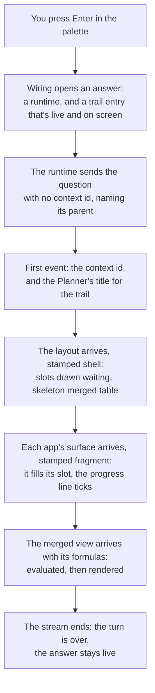
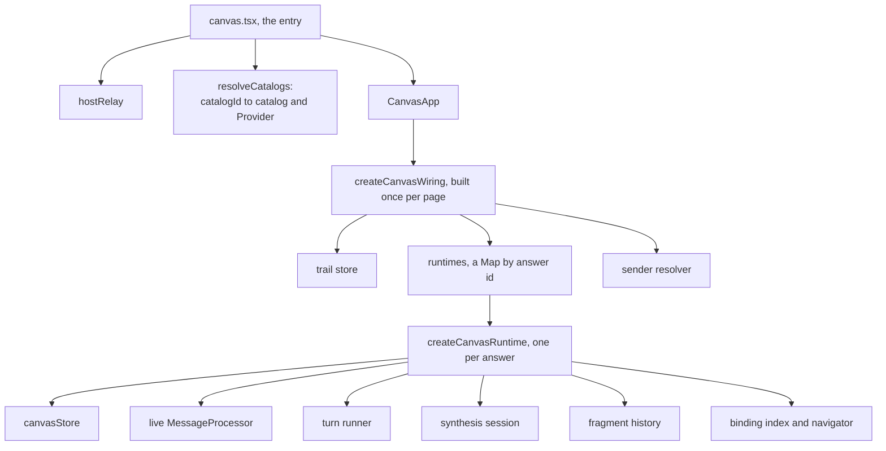
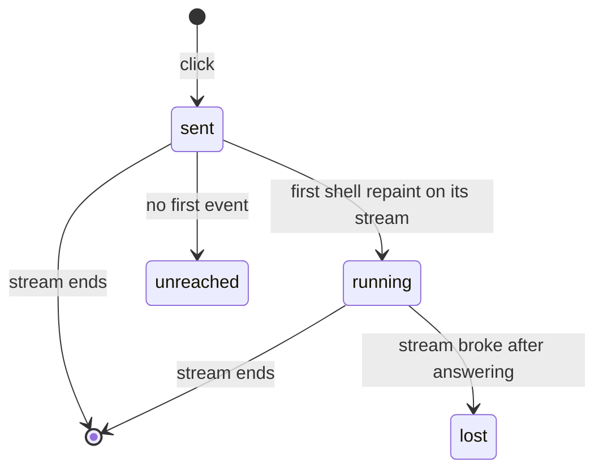
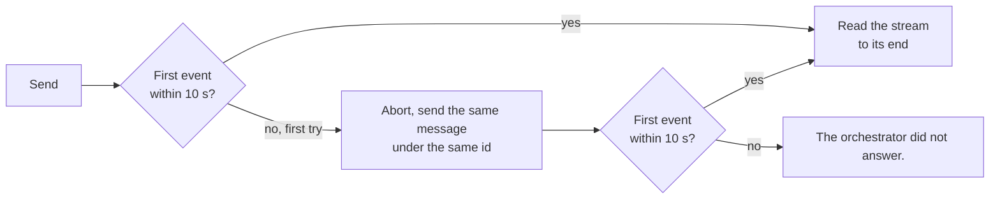

# Client: how the canvas works

This guide explains `apps/client`, **the canvas**: the page where you ask a question in words and get back a full screen of UI, composed from several apps, each in its own design system. It's written for a frontend engineer meeting A2UIVerse for the first time. It starts with the ideas, follows one question from the palette to the finished screen, then opens up the structures and algorithms inside, and ends with the design decisions and where the code lives.

Three recorded sessions run through the guide, and you can replay each one yourself (see [Trying it without a model](#trying-it-without-a-model)):

- `?beat=9`: _"what's the status of what I'm working on?"_, answered by Linear, GitHub and CircleCI, with a merged table on top.
- `?beat=trail`: four questions on two branches, for the trail.
- `?beat=23`: stepping CircleCI's slot back from a run to its runs list.

<p align="center">
  
  <br>
  <em>The first session, replayed with its waits shortened. The layout lands first, each app fills its slot as it answers, and the merged table lands last.</em>
</p>

## Problem it solves

A normal web app renders UI its own team wrote, from its own components, with its own CSS. The canvas renders UI it has never seen before: written on the fly by several agents, each in a different design system, arriving over a stream, piece by piece, while you keep clicking. That raises four problems:

1. **Many design systems on one page.** GitHub's answer is built on Primer, Gmail's on Material 3, CircleCI's and Linear's on their own themes. CSS is global by nature: one catalog's `:root` variables or class names can quietly restyle another's. Nothing throws; the page just looks wrong.
2. **UI that arrives in pieces, from many places.** The layout comes first, then each app's answer as it's ready, then the merged view. The screen must show progress as it happens, but never a half-built or broken paint.
3. **Answers you can go back to.** Asking a new question shouldn't throw the last answer away. Every answer should stay open and working, like a browser tab, and each app's own screens should have a back button.
4. **Honesty about what's happening.** Apps are slow, fail, or answer late. The screen has to say where things stand, in words the client can stand behind.

The client solves these with a small set of ideas: an **answer** kept for every question, **surfaces** routed by a **stamp**, a **boundary** around every app's UI, **turns** and **streams beside the turn**, a **trail** of answers, and a **stack** of screens per app. The next section takes them one at a time.

## Six ideas to hold on to

### 1. Every question gets an answer of its own

Every question you ask gets a new **answer**: its own screen, its own state, its own connection to the orchestrator. The client keeps every answer for the session. The one on screen is mounted; the others keep running unmounted: their apps' replies still arrive, their merged views still compute, their buttons still finish what they started. Nothing is saved: a reload starts fresh.

On the wire, an answer is an **A2A context**. Its first message is sent with no context id; the orchestrator mints one, and every later message in that answer carries it, so the orchestrator knows which answer a click belongs to. What the orchestrator holds for an answer, it calls a **composition**.

### 2. Surfaces, slots and the stamp

In A2UI, an agent answers by painting a **surface**: a tree of components from its catalog, plus a JSON **data model** those components bind to. An answer holds several surfaces at once:

- **`shell:main`**, the **layout**, painted by the orchestrator in the shell's own catalog. It holds a `Slot` for each app, and one for the merged view.
- One surface per app, its **fragment**, painted by that app in its own catalog, which fills that app's slot.
- **`shell:synthesis`**, the merged view, which fills the merged view's slot.

Every event the orchestrator relays carries a **stamp** in its metadata: which app it came from (`source`) and what it is (`role`). The stamp is how the client knows where a surface goes:

```jsonc
{"source": "linear", "role": "fragment"}   // a Linear surface: it fills the slot whose source is "linear"
{"source": "shell",  "role": "shell"}      // the layout itself
{"source": "linear", "role": "fragment", "settled": true}   // Linear's answer has ended
```

Placement is by `source`. The stamp names no slot, and no component tree points at another surface: the `Slot` whose `source` is `"linear"` is where Linear's surface belongs. Surface ids are namespaced by the orchestrator as `<appId>:<surfaceId>` (Linear's `linear-1` arrives as `linear:linear-1`), so two apps can never collide on a name.

### 3. Shell owns the container, the app owns the interior

The **shell** is A2UIVerse's own UI: the question heading the canvas, the progress line, the palette, Back and Trail, the layout, and each app's name above its slot. It's drawn in Radix Themes. Everything inside a slot belongs to the app, and the shell never reaches in.

Every app's surface mounts inside a **fragment boundary**: one real `<div>` the shell owns, with the app's own catalog Provider inside it. The Provider brings that design system's styles and tokens, scoped to the boundary. The app's name above the slot, its **attribution**, is painted by the orchestrator into the layout, outside the boundary, where the app can't hide or restyle it. The boundary itself draws nothing: no border, no background. A region is its attribution, the app's own pixels, and the white space around them.

### 4. Turns, and streams beside the turn

A **turn** is one request and the stream that answers it. There are two kinds:

- An **utterance turn**: you ask a question. It opens a new answer.
- An **action turn**: you click something inside an app's slot, like opening an issue. It goes to that app alone.

Everything else the canvas sends travels on a **stream beside the turn**: not a turn, so it never cancels one and never adds to the trail. That covers the reader's **presses** on the merged view and slots (Retry, Include, Try again), a **step** back or forward in an app's slot, a report that an app's paint couldn't be drawn, and a report of a shell action like opening the Store. Several can be open at once.

### 5. Trail: every question, kept

The answers form a tree. A question you ask while viewing an older answer becomes a **child** of that answer. The **trail** draws the tree flat, newest first, with the branches marked. The newest question's answer is **live**; any other answer you go back to is a **past answer**, and it's still a working tab: clicks, presses and sorts land in it, and its apps' replies still arrive.

<p align="center">
  
  <br>
  <em>The trail from <code>?beat=trail</code>: four questions on two branches. The newest is live; "Camera prices" is the one on screen.</em>
</p>

### 6. A stack of screens per app

Inside an answer, clicking into something inside an app (a CircleCI run, say) makes that app paint a new screen in its slot. Each app keeps its own **stack** of screens, with back and forward arrows beside its name. Each stack is separate from the other apps' and from the trail. When a stack moves, the merged view follows: the orchestrator and the client both remember the merged view's wiring for every combination of screens they've seen, so going back to a screen already seen restores the merged view with no model call. [`synthesis.md`](synthesis.md#going-back-the-remembered-wiring) explains that memory.

## One question, end to end

Here is what happens when you type _"what's the status of what I'm working on?"_ and press Enter.



**1. An answer opens.** The palette calls the wiring's `sendUtterance`. It mints an id for the answer, creates a **runtime** for it (everything one answer owns, below), and enters it in the trail as live and on screen. The answer that was on screen becomes its **parent**; only the session's first question has none.

**2. The question goes out.** The runtime's `open` sends the question as an A2A message with **no context id**. If the answer has a parent, the parent's context id rides along under the stamp key, so the orchestrator's Planner can read the answer the question was asked from.

**3. The first event names the answer.** The orchestrator answers at once with the context it minted. The runtime records it, the trail entry takes it, and every later message in this answer carries it. With the layout, a `paintMeta` part names `shell:main` with the Planner's short title for the answer (like "Needs attention today" in the trail above), which replaces the truncated question as the trail entry's label. The question itself stays the answer's heading.

**4. The layout lands.** An event stamped `role: "shell"` creates `shell:main`: a `Column` with a `Slot` for the merged view and, under a `Row`, an `Attribution` around each app's `Slot`. The slots are all `pending`, so the screen shows three waiting regions and, for the merged view, the planned column headers over skeleton rows. The progress line shows a spinner beside each app's name, then "Joining Linear issues to GitHub PRs and CircleCI runs".

**5. The apps fill their slots.** Each app's events arrive stamped `role: "fragment"` with its `source`. The first `createSurface` from Linear claims Linear's slot: the client records `linear → linear:linear-1` in the **placement map**, and the slot renders the boundary, Linear's Provider, and the surface. Its step on the progress line ticks as soon as its surface is placed, and its `settled` marker, when its stream ends, is where the client judges whether its paint could be drawn. The apps arrive in whatever order they finish.

**6. The merged view lands.** The last fragment is stamped `source: "shell"`: `shell:synthesis`, the merged view's tree as ordinary A2UI, with its formulas riding beside the stamp on the same event. The client hands the formulas to the answer's **synthesis session**, which evaluates every cell before React renders, so the table's first frame already has its values. The progress line settles on "Joined Linear issues to GitHub PRs and CircleCI runs".

**7. The stream ends.** The turn is over; the answer is live and stays so. Everything from here on (a click inside Linear's slot, a sort, a step back) happens inside this answer.

## Inside the machinery

### Runtime graph

The client is a Vite and React single-page app, and most of its logic lives outside React. Here is what gets built, and by whom:



- **The entry** (`canvas.tsx`) fetches the list of installed catalogs, resolves each to its runtime catalog and Provider, and builds the shell catalog with the **host relay** (below). This happens once, before any answer exists.
- **The wiring** (`canvas/createCanvasWiring.ts`) is the page's graph: the trail store, the map of runtimes, and the page-level handlers (ask, ask again, view, return to live, close, press). It's plain TypeScript, lifted out of React so the component reads as layout and the wiring reads as wiring.
- **A runtime** (`canvas/canvasRuntime.ts`) is everything one answer owns: its store, its A2A session (the context id), its live `MessageProcessor`, its turn runner, its synthesis session, its fragment history, its binding index and navigator. It runs whether or not it's on screen, and only its close ends it.

**One `MessageProcessor` per answer, over every installed catalog.** A2UI's processor is the renderer's model: it applies messages and holds surfaces. Each surface carries its own `catalogId`, and the stock library resolves the catalog per surface, so one processor can hold a Primer surface beside a Material 3 surface beside the shell's own. The processor is also the **live registry**: exactly what the agents may see of the answer when the client sends its data models back.

**The stores are hand-rolled external stores.** The answer's store (`canvas/canvasStore.ts`) and the trail store are closures with `getState`, `subscribe` and small setters, read by React through `useSyncExternalStore`. They're written from non-React code (the turn runner, the A2A callbacks, the replay driver), which is why they aren't component state. The answer's store holds one answer's state: which surface is on stage, the placement map, the question, the progress facts, the presses in flight. The trail store holds only which answers exist, which is live, and which is on screen.

### Late binding: the host relay

The shell catalog needs handlers from its host: what to do on a shell action (open the Store), a navigation (a click on a merged cell), a press (Retry), and how to name an app. But the catalog is built at startup, before any answer exists, and later the handlers must reach **whichever answer is on screen at that moment**.

`canvas/hostRelay.ts` solves this with a **relay**: a stable object whose methods forward to a target bound later.

```ts
host: {
  onPress: press => {
    if (target) target.onPress(press);
    else console.warn('press raised before the canvas mounted', press);
  },
  // …onShellAction, onNavigate, appDisplayName the same way
},
bind: next => { target = next; return () => { if (target === next) target = null; }; },
```

`CanvasApp` binds the wiring's host while it's mounted, and the wiring's host forwards each call to the answer on screen. A raise with nothing bound is warned and dropped. With no host at all, the catalog still validates and renders (actions land nowhere, cells aren't clickable, app ids stand in for names), which is exactly what a test or a replay needs.

### Turn runner: validate, then show

`canvas/turn/canvasTurn.ts` is the biggest piece of the client. Every turn's paints enter the answer through it: the turn begins, applies batches, and ends. Its job is to show paints as they stream, without ever showing a broken one. It works in one of two modes, fixed when the turn starts:

- **Progressive mode**, on an empty stage: messages apply straight to the live processor, so the paint streams onto the screen as it's written.
- **Staged mode**, when something is already on screen: the turn gets a fresh **staging processor**, a throwaway copy that acts as the validator. The turn's new surfaces are built there, off screen, and their messages are buffered. At the end, the **net-effect rule** decides: a surface that survives is replayed into the live processor and swapped in whole; a turn whose new surfaces were created and deleted again is discarded, and the screen holds what it had.

This is **hold-and-swap**: validate off screen, then replay. The replay takes the same path as any live paint, so a swapped-in surface is exactly as live as one that streamed.

Two rules adapt it to composition:

- **A composed turn goes progressive.** A composition's whole point is that the layout lands before the apps answer. So the moment a turn's stamped shell `createSurface` arrives, the runner retires the old composition and switches to progressive mode; the slots then fill in place. Only a create does this: a shell repaint that merely flips one slot to failed targets the live layout and must not tear the answer down.
- **An app swaps in when it settles.** In an action turn (staged, since the stage is occupied), each app's new paint is held **per app, not per turn**: the app's `settled` marker swaps in what survives of its paint, so a drill-down shows as soon as that app answers rather than when the whole turn ends. While that happens inside a live composition, the merged view **holds** its last values, its line working, until the re-synthesis it's waiting for lands. Otherwise it would briefly evaluate its formulas over a screen they weren't written for.

**Deferred validation.** An agent streams a component as it's generated, and the processor validates every batch, so an early batch carrying a half-written component fails validation. Those failures are held back and judged when the surface settles: a paint whose final state validates reports nothing; one that doesn't reports its last failure. Failures that can never heal (an unknown `catalogId`) are reported at once.

### Routing by the stamp

For every batch, the turn runner reads the stamp and routes:

| Stamp                  | What it means                                    | What the runner does                                                         |
| ---------------------- | ------------------------------------------------ | ---------------------------------------------------------------------------- |
| `role: "shell"`        | the layout, or a repaint of it                   | paints the stage; reads the roster, the slot states and the merged view's facts off it |
| `role: "fragment"`     | an app's surface                                 | registers it in the placement map under `source`; it never contends for the stage |
| `settled: true`        | that app's stream has ended                      | swaps in its held paint, judges its fragments, ticks its step               |
| no stamp               | an ordinary single-surface stream                | paints the stage, the pre-composition behavior                              |

The runner reads two **projections** of the layout paint:

- **The placement map** says which surface filled which slot, but only once one has, and in the order they filled.
- **The roster** (`canvas/composition/roster.ts`) is the complement: every app the layout reserved a slot for, in **slot order**, with the display names the orchestrator painted. The orchestrator wraps every app's `Slot` in an `Attribution` whose `child` names that slot, and `shellPaintSlots` pairs them by that link, never by where either sits in the tree. The merged view's `Slot` pairs with no attribution and carries the join's nouns (`{"linear": "issues", "github": "PRs", "circleci": "runs"}`) for the progress line.

The roster enforces the shell's one promise to an app: **a fragment never renders unattributed**. If a layout paint leaves an app's slot without its `Attribution` (a bug in the orchestrator's painter), that app's surfaces are refused: not mounted, reported as undrawable, and the orchestrator fails the slot.

### Streams beside the turn

A press is an operation on the answer's composition, `{kind, sources}`:

```jsonc
{"kind": "retry",   "sources": ["circleci"]}
{"kind": "include", "sources": ["gmail"]}
{"kind": "step",    "sources": ["circleci"], "step": 0}
```

The runtime sends it on the answer's context and answers it on a **side stream** (`runner.beginSideStream()`). What arrives on a side stream is routed by the stamp exactly as a turn's batches are, straight into the live composition. It never touches the stage or the turn in flight. A line's "Retry all" is sent as one Retry per app, each on its own stream.

A press moves through a small set of states in the answer's store, so the UI can show it before any reply arrives:



`sent` draws the pressed state at the click (the failure tile gives way to "loading", the row says "Including Gmail…"). `unreached` and `lost` stay until the next press of the same kind, so the slot can say what happened in place. A refused press ends quietly: the paint already shows what won.

The two **reports** use side streams too: a fragment the client couldn't render (`VALIDATION_FAILED`), and a shell action like opening the Store, reported for the orchestrator's journal. Neither is a turn, so neither can cancel what you're doing.

### Sending reliably: one resend under the same id

`a2a/client.ts`'s `sendAndApply` sends one message and applies each event as it arrives. It also guards against a request lost in transit, which happens through the dev tunnel: a request sometimes never reaches the orchestrator at all.



It's a `Promise.race` between the stream's first event and a 10 second timer (`FIRST_EVENT_TIMEOUT_MS`). The resend reuses the **same message id**, and the orchestrator refuses an id it has already taken in, so a first send that was only slow never runs twice: the resend is **idempotent**. The timeout covers the first event only; once a stream has answered it may go quiet as long as a model takes, and the orchestrator sends an empty heartbeat event every 30 seconds so no proxy cuts it for being idle.

When a turn still fails, the canvas says so in the client's own words, at the end of its progress line: "That didn't reach A2UIVerse. Ask again." when it never arrived, "Lost the connection to A2UIVerse. Ask again to see where this stands." when it broke after answering, and "That action failed." with the reason for an action.

### Trail store and the spine

`canvas/trail/trailStore.ts` holds the trail as a flat list of entries:

```ts
interface TrailEntry {
  id: string;          // client-minted when you ask
  contextId?: string;  // the orchestrator's, from the first event
  question: string;    // your words, verbatim
  askedAt: number;
  title?: string;      // the Planner's title, once it arrives
  parent?: string;     // the answer it was asked from
  loading: boolean;
}
```

plus `live` (the newest question's answer) and `viewing` (the past answer on screen, or null). The tree is implicit in the `parent` links. Small pure functions read it:

- **`backTarget`**: Back goes **up the branch**, to the answer the one on screen was asked from, not to the one asked just before it.
- **`isBranch`**: an entry is a branch when its parent isn't the entry just before it in time, meaning it was asked from a past answer.
- **`newestFirst`**: a sort by `askedAt`, newest first, two questions asked in the same millisecond ordered by which was opened later.
- **`close`**: removing an answer **re-parents its children to its own parent**, the way deleting a node from a tree links its children to their grandparent. Back keeps working through the gap.

**The spine** (`canvas/trail/spine.ts`) is the git-graph line beside the trail's entries. Laying it out is a **lane allocation** problem, like drawing `git log --graph`: each entry gets a lane (a column), and each entry's line runs down to its parent without crossing another entry's node.

```
for each entry, oldest first:
  a root, or a parent not in this list  → lane 0
  otherwise, the parent's lane if nothing occupies it between the two rows,
             else the first lane from 1 up that's free all the way down
  mark that lane busy from this row down to just above the parent
connectors: straight down in one lane, or a curve into the parent's lane
```

Each lane's busy rows are a `Set<number>`, so "is this lane free between rows a and b" is a short loop. Going oldest first means a parent's lane is always known before its children ask for theirs. In the trail session above, "Needs attention today" is the root in lane 0; "what apps do I have?" was asked from it right after and runs straight in lane 0; "Camera prices" was also asked from the root, but lane 0 is busy in between, so it takes lane 1 and curves into the root; the live question, asked from "Camera prices", runs straight up lane 1. The layout is pure geometry over row numbers (56px rows, lanes 16px apart), so it's tested without a DOM.

**The rail** is the drawer the trail opens in: entries under day headers, "Live" and "Viewing" marks, a quiet mark on an answer still loading, and on a branch a glyph naming the answer it was asked from. Hovering an entry shows a **preview**: that answer's layout surface mounted a second time from its own runtime, laid out at 1120px and scaled to 25%, marked `inert` with pointer events off, and registered under a binding index of its own so a navigation never lands in the copy.

### A past answer is a tab

Because each answer is its own runtime, a past answer needs no special code to keep working. Its streams arrive, its synthesis session evaluates, its presses finish. When you view it, `CanvasView` mounts it; when you leave, it unmounts and keeps running.

<p align="center">
  
  <br>
  <em>A past answer: parked, stamped with when it was asked, with Ask this again now and Return to live.</em>
</p>

A band over a past answer reads "Parked · asked at 09:28", the question's time and the answer's only time. "Ask this again now" sends the same question as a new answer, asked from this one, and leaves this one as it was. "Return to live" goes to the newest question. The palette reads "Ask from this view", because whatever you ask becomes this answer's child.

### Header and the progress line

The question heads the canvas, verbatim. `QuestionHeader` measures it before the browser paints (`useLayoutEffect`): one line is set at display size; a longer question goes in a fixed four-line box, and past four lines the fourth fades and "Show all" opens the whole question over the page. The box's height is settled at Enter, so nothing below it jumps.

When the heading scrolls out of view, `CompactHead` shows a one-line bar at the top with the question and a compact progress line. It watches the heading with an `IntersectionObserver` rooted at the page's scroller, and hangs the bar from a **zero-height sticky anchor**, so showing the bar moves nothing on the page.

**The progress line is computed, never a model's words.** `canvas/turnProgress.ts` is a pure function from the answer's store to what the line says: "planning" while nothing is planned; a step per app in slot order (a spinner while loading, ✓ once placed, ✕ once failed); then the merge, in sentences built from what the client holds:

| Moment in the example                   | The line                                                         |
| --------------------------------------- | ---------------------------------------------------------------- |
| waiting for all three apps              | Joining Linear issues to GitHub PRs and CircleCI runs            |
| Linear and GitHub in, CircleCI loading  | Joining Linear issues to GitHub PRs · CircleCI runs still loading |
| the merged view landed                  | Joined Linear issues to GitHub PRs and CircleCI runs             |

The only model words in it are the join's nouns ("issues", "PRs", "runs"), which the Planner wrote into the layout. An action inside an app names no action of its own: that app's step spins again until its reply lands. And an error for the whole answer, like a request that never arrived, closes the line in the danger tone.

### Navigation: from a merged cell to the element

Clicking a value in the merged view scrolls to where it came from in the app's slot and highlights it. The cell knows its **target**, a ref like `{app: "github", surface: "github:notifications-1", pointer: "/prs[repository=\"retz8/a2uiverse\",number=6]/number"}`. The problem: which element on the page shows that value? The renderer puts nothing of its own on the page per component, and a vendor's components aren't the shell's to edit.

The answer is a **reverse index** from data paths to the components that render them, `canvas/navigation/bindingIndex.ts`:

1. **Every vendor component registers while it's mounted.** At startup, `decorateCatalog` wraps every component of every vendor catalog in a small component that registers its surface, component model and data context in the answer's binding index, and unregisters on unmount. The shell catalog isn't decorated: refs only point into apps' data.
2. **"Is this component bound to that path?" is read when asked, never stored.** A component is bound to a path when one of its properties binds exactly that path (a `{path}` inside a function call's arguments counts), when it's the root of a template instance over it, or when it owns a template list over it. A repaint can change a component's properties, so nothing is cached.
3. **The target is located now.** The target's key-based pointer is turned into today's positional path with the sdk's `locatePointer`: `/prs[…number=6]/number` becomes something like `/prs/2/number`. A position is only read at the moment it's needed.
4. **`nearest` walks up the path.** It tries the exact path, then drops the last segment and tries again (`/prs/2/number`, `/prs/2`, `/prs`), taking the first bound element, first in document order.
5. **It degrades gracefully**: the bound element, else the app's fragment boundary, else the app's slot, else a warning.

**Finding the element without touching the vendor's DOM.** A vendor's stylesheet is written against its own DOM: child selectors, `:first-child`, `:only-child`. Any extra element of the shell's in there changes what those match. So components render **hidden marker spans around their output only while being located**: the index flips them on in one synchronous React render (`flushSync`), reads which element follows each opening marker, and flips them off in another synchronous render, all before the browser paints. At rest, the vendor's DOM is the vendor's alone.

**Landing.** The element is scrolled to the middle of the view (instantly under reduced motion). Focus has to wait for the scroll, because focusing during a smooth scroll cancels it where it stands, so the navigator listens for `scrollend`, with a 700 ms timer as the other way out. The element gets `tabindex="-1"` only while it holds focus. A ring drawn in the shell's own layer follows the element's box with `requestAnimationFrame` for 1.5 s. Nothing is sent to the orchestrator: navigation is client-local.

### Way back: a stack per app

`canvas/history/fragmentHistory.ts` keeps each app's stack of screens on the client. Both sides count screens the same way, so step 2 means the same paint to the client and the orchestrator:

- **The count runs at the wire.** Every `createSurface` an app sends is a step of that app the moment it arrives, before the runner decides anything about it. A create that never reached the screen, one the client couldn't draw, or a question each still take their index, as **placeholders** with nothing to return to. The arrows skip placeholders when they look for the nearest earlier or later screen.
- **A screen is copied only when the stack moves off it.** The current step is the live surface itself. Just before a new paint or a swap destroys it, the runner calls `leaving`, and only then is it copied: its component tree and its data model, with every update the app pushed into it, as plain JSON (`canvas/history/paintCopy.ts`). A copy costs nothing until you actually leave a screen.
- **A restore takes the same path as a live paint.** `rebuildMessages` turns a copy back into three A2UI messages (create, the whole tree, the whole data model) and applies them through the processor, so a restored screen gets catalog resolution, data binding and action handling exactly like a fresh one. There's no second way to construct a surface.
- **A new paint after a step back drops the forward steps**, like a browser's forward history.

**A step, click to finish:**

1. The arrow raises `{kind: "step", sources: ["circleci"], step: 0}`.
2. The runtime moves the stack and restores the copy into the slot **at once**.
3. The merged view follows: the wiring remembered for the new combination, or one that covers it, is re-accepted by the synthesis session with no model call. If there's neither, the merge line works until the orchestrator answers.
4. The step goes to the orchestrator on a side stream, carrying the answer's data models, so the orchestrator's copy of the app's data matches what you see.
5. If the orchestrator's answer carries no new merged view, the client files the current wiring under this combination, so both sides' memories agree.

Only the latest step owns the merge line: a later step ends the "working" an earlier one left.

<table>
  <tr>
    <td align="center" valign="top"></td>
    <td align="center" valign="top"></td>
  </tr>
  <tr>
    <td align="center"><em>CircleCI's slot in <code>?beat=23</code>: Back from a run to its runs list, then Forward.</em></td>
    <td align="center"><em>The merged view at the same moments, restored with no model call.</em></td>
  </tr>
</table>

**Holding your place.** A step changes what sits above the slot: the merged view may change height, a "late" row may appear. The browser's own scroll anchoring can't help, because the slot's surface itself is replaced. So `useStepHold` records where the pressed row sat, then absorbs every change by scrolling: a `MutationObserver` and a `ResizeObserver` on the scroller compare the row's position with the recorded one and adjust `scrollTop` by the drift, with the browser's `overflow-anchor` turned off meanwhile. The hold ends when the step does, when you scroll yourself, or after a second if no step began.

### Many design systems on one page

**The boundary is a real element.** `FragmentBoundary` is a `<div>`, never a React fragment or `display: contents`, because CSS `@scope`, a portal root and the collision detector all need something to attach to. It carries `data-a2ui-fragment` with the app id, and it's `display: flow-root`, so an app's top margin stays inside it instead of collapsing through; its box is what navigation lands on and what neighbouring slots align by.

**Each catalog brings one Provider and one CSS setup**, both scoped to the boundary. The client imports each catalog package for its catalog, its id and its Provider, and wraps that catalog's surfaces only (`catalogs/resolver.ts`). It registers nothing at the app root and does no per-vendor CSS setup of its own, so installing an app is a table entry, not a shell change.

**The collision detector** (`canvas/composition/collisionDetector.ts`) catches the ways CSS can collide silently. It checks four rules across every installed catalog:

| Rule                | The problem                                                                              |
| ------------------- | ---------------------------------------------------------------------------------------- |
| global write        | a custom property defined at `:root`, `html` or `body` lands outside every boundary, and the last catalog loaded wins the page |
| unsatisfied read    | a catalog reads a variable it never defines, without a fallback, so it looks right only by accident of what else is installed |
| duplicate class     | two catalogs ship the same class name                                                    |
| duplicate keyframes | two catalogs ship the same `@keyframes` name                                             |

The rules are prefix-agnostic: two design systems can both ship `--text-primary` meaning different colors. Sharing a name is fine, since scoping is exactly for that; writing one where it escapes is the failure. It runs in three layers, split by what each can see: a static scan of every catalog's stylesheets, a jsdom mount of all catalogs together, and a Playwright spec for the real cascade.

### Questions and promotion

An app can paint a surface that asks you something, like "Send this reply?". It declares that with a `paintMeta` part marked `kind: "question"`; the client reads nothing from a surface's shape. What happens next depends on where the question lands:

- **Over an empty stage**, the question goes to an **overlay** above the stage.
- **Inside a composition**, the app's slot is **promoted**: raised with an accent ring over a dim scrim covering the other slots. It stays in its slot, so one app can never block a screen it shares. Promotion is emphasis, not a modal: several slots can be promoted at once, there's no focus trap, and a live region announces how many sources need an answer.

### Teardown

`retireStage` is the one place a composition leaves its answer. It deletes the layout **and** every fragment from the answer's processor, clears placement and promotions, retires the synthesis session, the fragment history and the composition's store state, and ends the side streams. Without that cascade, old fragments would stay in the live registry and ride back out to their apps, as stale data, the next time the client sends its data models. Closing an answer does all of this and then drops the runtime: every stream is cancelled, and the orchestrator is told on the answer's context so it can cancel the apps' work too.

## Merged view on the client

The merged view is explained end to end in [`synthesis.md`](synthesis.md). The client's part in brief: the merged view's slot renders its surface as **shell content**, in a bare element with no boundary and no attribution, because it's the shell writing on its own page. When `shell:synthesis` arrives, the turn runner hands its formulas to the answer's **synthesis session** once the surface is live. The session validates them, subscribes to every app surface they read, and runs the pure **BindingEvaluator**, writing the whole result in one write before React renders. A column planned for an app the merge doesn't include yet stays reserved, and its cells are drawn from that app's slot state (`canvas/composition/columnState.ts`): loading, unavailable, or waiting for Include.

## Design decisions

| Decision | What it buys | What it costs |
| --- | --- | --- |
| **A runtime per answer, kept for the session** | A past answer is a working tab with no special code; closing one is dropping it | Memory grows with every question until a reload |
| **One processor per answer, over every catalog** | Per-surface catalog resolution is stock library behavior; no dispatch of our own | Every catalog is loaded up front |
| **Placement by the stamp's `source`** | No component tree points into another surface; a slot and its fragment meet by name | The orchestrator must stamp every event |
| **Hold-and-swap, with a staging processor as the validator** | A broken or half-built paint never replaces a good one | A staged paint shows only when it's complete |
| **A composed turn goes progressive** | The layout lands before any app answers, and each slot fills in place | A failing app shows as a failed slot, not a held screen |
| **Stores outside React, read with `useSyncExternalStore`** | Non-React code (the runner, the network) writes state directly; React only reads | Two kinds of state to keep in mind |
| **A relay between the shell catalog and the answer on screen** | The catalog is built once at startup, and its handlers still reach whichever answer is on screen | A raise with nothing bound is dropped |
| **Side streams for presses and reports** | A press or a report never cancels your turn or touches the trail | Several streams per answer to track |
| **One resend under the same message id** | A request lost in transit is sent again without ever running twice | A request lost twice fails |
| **Markers only during a synchronous read** | Navigation finds any vendor element without changing the vendor's DOM at rest | Two extra synchronous renders per click |
| **A screen copied only when you leave it, restored through the processor** | Nothing is copied for screens you never leave; a restored screen is fully live | A copy is taken just before a surface is destroyed, and must not be missed |
| **A real element as the fragment boundary, and nothing drawn** | Scoping, portals and the detector have an anchor; the page reads as one screen, not tiles | Separation comes from attribution and white space alone |
| **Questions declared, never inferred** | The shell holds no vendor component names; any design system can ask | An app that doesn't declare a question paints an ordinary surface |
| **Progress in the client's words** | Every sentence is computed from what the client holds, so it can't claim what didn't happen | The phrasing is the client's, not the app's |

## Known limits

- **Visual containment isn't DOM containment.** A vendor component that is `position: fixed` paints over the whole canvas while its DOM stays inside its boundary; Primer's `ConfirmationDialog` does exactly this. The detector checks DOM ownership, not painted bounds.
- **A vendor component can still declare `aria-modal`.** The shell puts up no modal for a promoted slot, but a vendor's own dialog can hide the rest of the canvas from assistive technology.
- **Every app learns the full catalog list.** The client's supported catalog ids go to every app unfiltered, so each learns the whole installed roster.
- **Test setup is shaped around Primer.** `setupTests.ts` shims and the Vite config's `lightningcss.errorRecovery` exist because `github-catalog` needs them.
- **Two renderer patches.** `@a2ui/react` is patched locally (`patches/@a2ui__react@0.10.2.patch`); the [client README](../../apps/client/README.md#renderer-patch) says why.
- **The merged view round-trips.** `shell:synthesis` rides back to the orchestrator in the client's data models, which the orchestrator ignores.
- **A request can be lost twice.** The resend covers one loss; a request lost on both tries fails with "The orchestrator did not answer."
- **Equal weights can squeeze a slot.** Three weighted slots on one row at about 870px give each a third, and the Planner doesn't know an app's minimum width.

## Trying it without a model

Start the client (`pnpm dev:client`) and open `http://localhost:5173/?beat=<name>`; add `&instant` to skip the recorded pacing. A beat replays a recorded or hand-built session through the whole canvas, with no orchestrator, no apps and no model. A beat's presses fire through the same handler the buttons call, answered from the beat itself.

| Replay | What it shows |
| --- | --- |
| `?beat=9` | This guide's session: Linear, GitHub and CircleCI with the merged view |
| `?beat=trail` | Four answers on two branches: every mark of the rail, and the band on a past answer |
| `?beat=23`, `?beat=24` | A step back to a screen seen before (restored, no call), and to one never seen |
| `?beat=19` to `?beat=25` | The trail's cases: a tab finishing in the background, an action in a past answer, Ask this again now, add and drop, closing a loading answer |
| `?beat=10` to `?beat=18` | Slow and failing apps: Retry, Include, a home source straggling or failing, too few answers |
| `?beat=4`, `?beat=6`, `?beat=7` | Two apps side by side with no merge, a question about A2UIVerse itself, a capability gap |

Recorded beats live in `apps/client/recordings/beats/`, taken through the orchestrator by `scripts/record-beats.ts`; hand-built ones in `src/beats/`. The client README lists them all. The tests replay them too: `tests/` replays every beat through the wiring, and the Playwright specs in `e2e/` take screenshots of where each one lands.

## Where the code is

| Concern | Where (`apps/client/src`) |
| --- | --- |
| The entry, catalogs | `canvas.tsx`, `catalogs/resolver.ts`, `orchestratorApi.ts` |
| The page's wiring | `canvas/createCanvasWiring.ts`, `canvas/hostRelay.ts`, `canvas/CanvasApp.tsx` |
| One answer | `canvas/canvasRuntime.ts`, `canvas/canvasStore.ts` |
| Turns, staging, routing | `canvas/turn/canvasTurn.ts`, `canvas/turn/turnMessages.ts`, `a2ui/applyMessages.ts` |
| The layout's projections | `canvas/composition/roster.ts`, `canvas/composition/slotContent.tsx`, `canvas/composition/columnState.ts` |
| Sending, the stamp | `a2a/client.ts`, `a2a/messages.ts`, `a2a/streamUserMessage.ts` |
| The trail | `canvas/trail/trailStore.ts`, `canvas/trail/spine.ts`, `canvas/components/TrailChrome.tsx`, `canvas/components/TrailPreview.tsx` |
| The header, the progress line | `canvas/components/QuestionHeader.tsx`, `canvas/components/CompactHead.tsx`, `canvas/turnProgress.ts`, `canvas/components/ProgressLine.tsx` |
| Navigation | `canvas/navigation/bindingIndex.ts`, `canvas/navigation/decorateCatalog.tsx`, `canvas/navigation/landing.ts` |
| The way back | `canvas/history/fragmentHistory.ts`, `canvas/history/paintCopy.ts`, `canvas/components/useStepHold.ts` |
| Isolation | `canvas/composition/FragmentBoundary.tsx`, `canvas/composition/collisionDetector.ts` |
| The merged view | `canvas/synthesis/synthesisSession.ts`, `canvas/synthesis/bindingEvaluator.ts`, `canvas/synthesis/intake.ts` |
| Replays | `beats/`, `canvas/replayBeat.ts`, `canvas/replayTransport.ts`, `../recordings/beats/` |

## Words used in this guide

| Word | Meaning |
| --- | --- |
| **Canvas** | The client's UI: where you ask, and where every answer is drawn |
| **Answer** | One question's screen, with its own runtime, kept for the session. On the wire, an A2A context |
| **Live** | The newest question's answer |
| **Past answer** | Any older answer you go back to; still a working tab |
| **Trail** | Every answer of the session, drawn flat by time with its branches |
| **Runtime** | Everything one answer owns: store, processor, turn runner, synthesis session, history |
| **Shell** | A2UIVerse's own UI, drawn in Radix Themes |
| **Surface** | One A2UI screen: a component tree and its data model |
| **Layout** | `shell:main`, the orchestrator's surface holding the slots |
| **Slot** | A region of the layout for one app, or for the merged view |
| **Fragment** | One app's surface, mounted in its slot |
| **Fragment boundary** | The shell's `<div>` around a fragment, with the app's Provider inside |
| **Attribution** | The app's name above its slot, painted by the orchestrator |
| **Stamp** | The metadata on every relayed event: `source`, `role`, and `settled` at a stream's end |
| **Placement map** | Which surface fills which app's slot |
| **Roster** | Every app the layout reserved a slot for, in slot order |
| **Turn** | One request and the stream that answers it: an utterance or an action |
| **Side stream** | A stream beside the turn, for a press or a report |
| **Press** | The reader's Retry, Include or Try again |
| **Step** | A back or forward move in one app's slot |
| **Hold-and-swap** | Build a paint off screen, then swap it in whole |
| **Staging processor** | The throwaway processor a staged turn builds its paint in |
| **Promotion** | A slot raised because its app asked you something |
| **Beat** | A recorded or hand-built session the canvas can replay |
