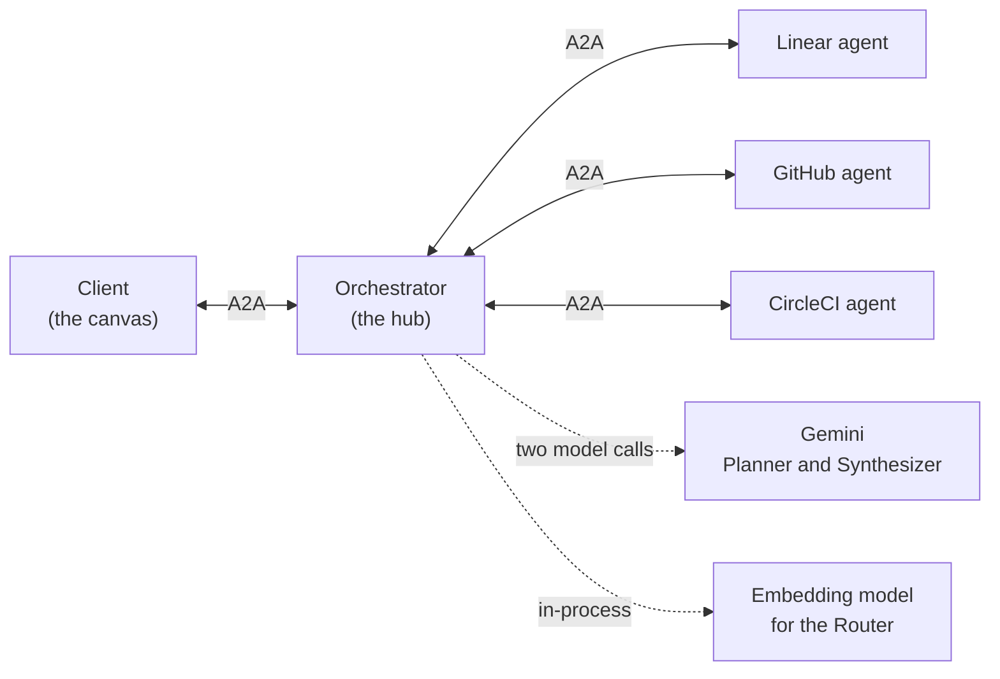
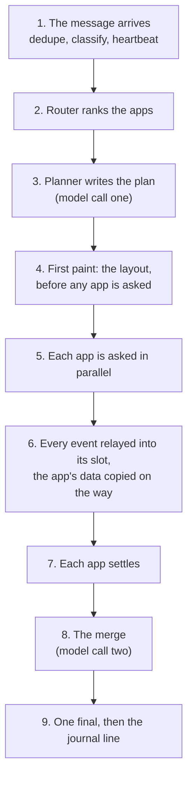
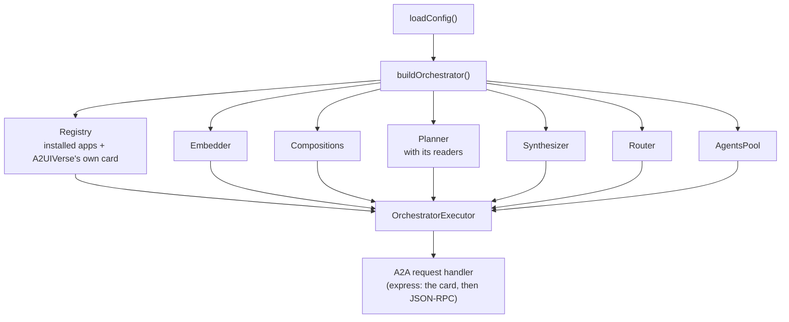
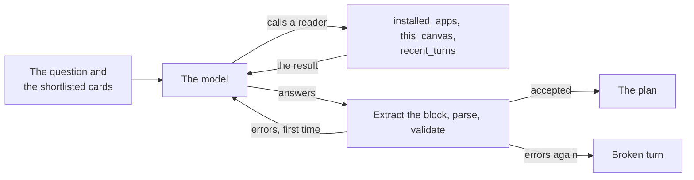
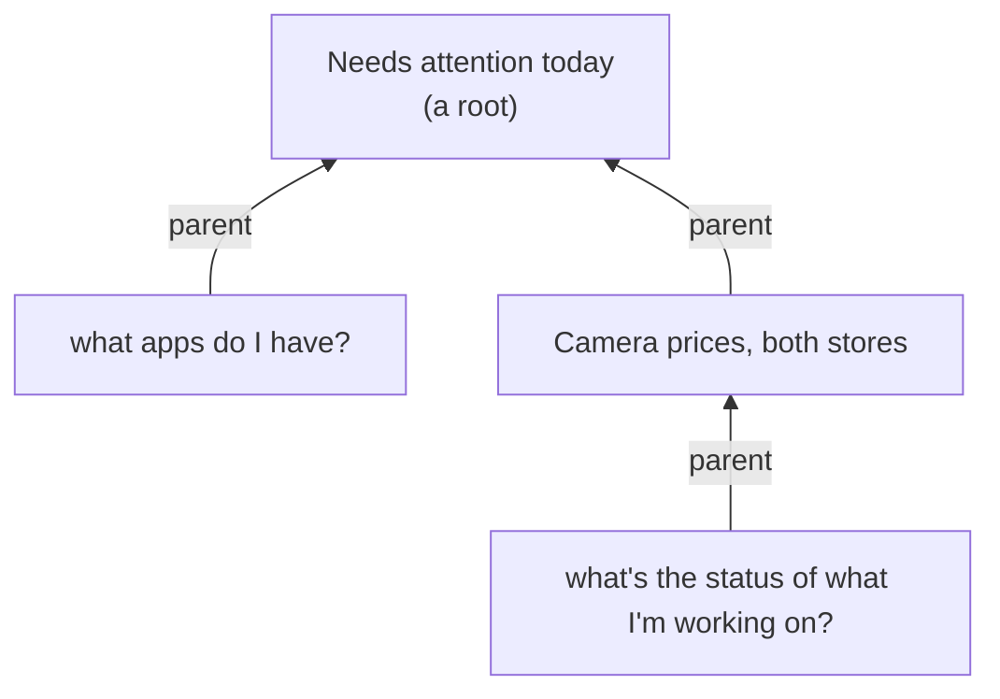
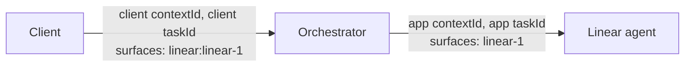

# Orchestrator: how a question becomes one screen

This guide explains the **orchestrator**, the server in the middle of A2UIVerse. The client talks only to it, and it talks to every app. It's written for a frontend engineer meeting A2UIVerse for the first time. It starts with the ideas, follows one question through the orchestrator from start to finish, then opens up the machinery: the data structures, the streams and the timers. It ends with the design decisions and where the code lives.

One example runs through the whole guide: the question _"what's the status of what I'm working on?"_, answered by Linear, GitHub and CircleCI. It's a real recorded session (you can replay it, see [Trying it without a model](#trying-it-without-a-model)), and the numbers below come from its recording and its line in the orchestrator's journal.

<p align="center">
  
  <br>
  <em>The recorded question as the client drew it, waits shortened. Planning took about 7 s; the layout landed at 8.4 s, the three apps' answers between 8.6 and 8.7 s, and the merged view at 24.6 s.</em>
</p>

## The problem it solves

The client wants one screen answering one question, built from several apps. The apps don't know about each other, and each speaks for itself. Something has to sit between them and do five jobs:

1. **Pick the apps.** Out of every installed app, which ones hold part of the answer? There's no list of question types to match against; apps are described only by their own agent cards.
2. **Lay out the screen before anyone answers.** The client should show something at once, not wait for the slowest app.
3. **Ask the apps in parallel and pass their UI through**, into the right slot, without changing what the apps painted.
4. **Stay honest when apps are slow or fail.** One app failing must not break the others, and a slow one must not hold the screen hostage.
5. **Keep every question's answer alive**, so an earlier answer still works after the next question is asked.

There's also a sixth job, merging the apps' answers into one table. It's big enough to have its own guide, [`synthesis.md`](synthesis.md).

The orchestrator does all of this as a **hub**. To the client it's one A2A agent that answers everything. To each app it's an A2A client with a request. Nothing else talks to an app.



## Six ideas to hold on to

### 1. A2A in two minutes

A2UIVerse's processes talk **A2A** (the Agent-to-Agent protocol, version 0.3 here). If you've used a streaming HTTP API, you know most of it already:

- An agent publishes an **agent card** at `/.well-known/agent-card.json`: its name, description, and **skills**, each with example questions.
- A client sends a **message** (JSON-RPC over HTTP) and gets back a **stream of events**: status updates, each carrying a message whose **parts** are text or JSON data.
- Every exchange is a **task** with an id. The stream ends with one event marked `final: true`, whose state says how it ended: `completed`, `failed`, `canceled`.
- Tasks belong to a **context**, a conversation id. Messages in one context share history.

A2UI rides inside A2A: an agent's UI arrives as JSON data parts like `{"version": "v0.9", "createSurface": {…}}`.

### 2. The hub speaks A2A on both sides

The orchestrator is an A2A **server** toward the client and an A2A **client** toward every app. That means every event an app sends travels app → orchestrator → client, and the orchestrator can do its work on the way: stamp where the event came from, keep a copy of the app's data, decide when to merge. The client never learns an app's address.

### 3. A turn is one client message and its stream

Every message the client sends starts a **turn**: one A2A task, one stream, one final. The orchestrator tells the kind of turn from the message's shape alone (`composition/classify.ts`):

| Turn          | The message carries                             | What happens                                               |
| ------------- | ----------------------------------------------- | ---------------------------------------------------------- |
| `utterance`   | text: a question from the palette               | the whole pipeline: route, plan, paint, ask, merge         |
| `action`      | an A2UI action on a surface, like "open run"    | only the app that owns that surface is asked               |
| `operation`   | a press: Retry, Include, Try again, a step, close | an operation on an existing answer                       |
| `clientError` | an error report, like a paint it couldn't draw  | that app's slot is marked failed                           |

An action names its surface as `circleci:circleci-1`, and the part before the colon is the **owner**: the only app that hears about it. A surface owned by `shell` is A2UIVerse's own UI, like the button that opens the Store; that action is only written to the journal.

### 4. Every question is a context, and each context has a composition

Each question the client asks opens a **new A2A context**. The client sends the question with no context id, and the orchestrator mints one. For that context the orchestrator holds a **composition**: everything about that one answer. That's the plan, each app's slot and its state, a copy of each app's data, the merged view, and each app's back-and-forward history.

Compositions stay in memory for the whole session, until the client closes one. A later message names its context, so a click on an older answer lands on that answer's composition. The client calls each of these a **canvas**; the orchestrator speaks of a context and its composition.

A question asked while looking at an older answer names that answer's context as its **parent**. The compositions form a tree, the same tree the client draws as its trail.

### 5. The shell is a source too

The orchestrator paints its own UI, the **shell**, through the same path as any app. The layout is the surface `shell:main`, and the merged view is `shell:synthesis`. Every event carries a **stamp** in its metadata saying where it came from:

```jsonc
{"a2uiverse": {"source": "linear", "role": "fragment"}}   // an app's paint, for Linear's slot
{"a2uiverse": {"source": "shell", "role": "shell"}}       // the layout, or the turn's own status
{"a2uiverse": {"source": "shell", "role": "fragment"}}    // the merged view, for its reserved slot
```

`source` is how the client knows which slot a surface fills.

### 6. Two model calls, everything else deterministic

Only two steps ask a language model (Gemini, through the Vercel AI SDK):

- The **Planner** decides who answers and designs the layout. Every question runs it.
- The **Synthesizer** writes the merged view, when the plan reserved one.

Everything else is ordinary code: the Router's ranking (a small embedding model running in-process, no API key), the relay, the timers, the journal. A question answered by one app costs one model call; a merged answer costs two.

## One question, end to end



**1. The message arrives.** The A2A server hands the message to the orchestrator's executor, which publishes a `working` task first (so a cancel arriving early can find it) and then:

- **Refuses a repeat.** If this message id was seen recently, the turn fails at once with "This request was already received." (see [Refusing a repeat](#refusing-a-repeat)).
- **Classifies it** (idea 3). This one is text, so it's an `utterance`.
- **Checks the context.** A question must open a context of its own. One arriving in a context the session already holds is refused: "A question opens a context of its own."
- **Starts the heartbeat**, an empty event every 30 seconds of silence (see [The heartbeat](#the-heartbeat)).

**2. The Router ranks the apps.** The question is turned into a vector by a small embedding model and compared with a vector of every app's agent card, plus A2UIVerse's own card, which answers questions about the platform. The top five go on the **shortlist**. There's no cut-off score: ranking only narrows the field, and the Planner makes the real choice. When a question is asked from an older answer, that answer's apps stay on the shortlist regardless of rank, so "add GitHub to this" can still plan the apps already on screen.

**3. The Planner writes the plan.** This is the first model call. The Planner gets the question and the shortlisted cards, and answers with a **layout surface**: which apps to ask and what to ask each, plus the screen's layout as a component tree in the shell catalog. Here is what it wrote for the example (trimmed):

```jsonc
{
  "dispatch": [
    {"source": "linear",   "request": "Show the issues assigned to me or currently in progress as a compact list. For each issue, include its identifier, title, status, priority, linked branch or pull request, and the full date and time it was last updated."},
    {"source": "github",   "request": "Show my open and recently updated pull requests as a compact list. For each pull request, include its title, repository, number, branch name, review status, and the full date and time it was last updated."},
    {"source": "circleci", "request": "Show recent pipeline runs for my branches and commits as a compact list. For each run, include the project, branch name, commit, status, and the full date and time it ran."},
    {"source": "shell",    "request": "Where each active work item stands: one row per Linear issue … with its status, priority, linked pull request, and CI pipeline status; most recently updated first. …",
     "columns": ["Issue", "Status", "Priority", "Pull request", "CI status", "Updated"],
     "join": {"home": "linear", "nouns": {"linear": "issues", "github": "PRs", "circleci": "runs"}}}
  ],
  "tree": {"components": [
    {"id": "root",        "component": "Column", "children": ["work-status", "sources"]},
    {"id": "work-status", "component": "Slot", "source": "shell"},
    {"id": "sources",     "component": "Row", "children": ["linear", "github", "circleci"]},
    {"id": "linear",      "component": "Slot", "source": "linear", "weight": 1},
    {"id": "github",      "component": "Slot", "source": "github", "weight": 1},
    {"id": "circleci",    "component": "Slot", "source": "circleci", "weight": 1}
  ]},
  "dataModel": {}
}
```

Notice three things. Each app gets its **own request in its own words**, never your question as typed; each asks for exactly the fields a merge will need, like "the full date and time", without ever mentioning the merge. The `shell` entry is the merged view: its request is the brief for the Synthesizer. And the tree is just `Slot`s, one per entry: the Planner designs the frame, never the apps' contents.

The plan is checked by a validator; if it fails, the model gets one retry. The Planner can also write a short **title**, which names this answer in the client's trail. In the recorded run, planning took 7.2 seconds from the question arriving to the plan accepted.

**4. First paint, before any app is asked.** The orchestrator turns the plan into the `shell:main` surface and sends it to the client at once. On the way, the **shell painter** writes in what only the shell owns: every app's `Slot` is wrapped in an `Attribution` (the app's name above its slot, which the app can't hide), and every slot gets its state:

```jsonc
{"id": "work-status", "component": "Slot", "source": "shell", "state": "pending", "label": "Synthesis", "content": "shell",
 "columns": ["Issue", "Status", "Priority", "Pull request", "CI status", "Updated"], "join": {"home": "linear", "…": "…"}},
{"id": "attribution-linear", "component": "Attribution", "displayName": "Linear", "appId": "linear", "child": "linear", "weight": 1},
{"id": "linear", "component": "Slot", "source": "linear", "weight": 1, "state": "pending", "label": "Linear"}
```

The client can now draw the whole frame, the merged view's column headers over skeleton rows, and a waiting slot per app. **First paint never waits on any app.** In the recording it reached the client 8.4 seconds after the question was sent.

**5. Each app is asked, in parallel.** For every app in the plan, the orchestrator builds an A2A message whose text is the Planner's request for that app, and hands it to the **AgentsPool**. The pool connects to the app, sends the message in that app's own conversation for this context, and streams back its events. The three requests went out within a millisecond of each other.

**6. Every event is relayed into its slot.** As each event arrives, the orchestrator:

1. rewrites the envelope's task and context ids to the client's,
2. stamps it `{source: "linear", role: "fragment"}`,
3. **namespaces** every surface id, so Linear's `linear-1` becomes `linear:linear-1`,
4. **demotes** the app's final event to a plain `working` one, because the hub owns the turn's single final,
5. applies the app's data model changes to **its own copy of the partition** (needed later by the merge),
6. counts every `createSurface` as a step in that app's history (for its back arrow),
7. publishes the event to the client.

In the recording, GitHub's answer reached the client at 8.59 s, Linear's at 8.60 s and CircleCI's at 8.74 s. These apps ran in `deterministic` mode, answering from recordings in 60 to 75 milliseconds each.

**7. Each app settles.** When an app's stream ends, the orchestrator sends the client one more event for that app with no parts and the stamp `settled: true`, which tells the client that app's answer is complete. The app's slot state is decided: it **arrived** if it painted a surface, it **failed** if it ended in error, couldn't be reached, or hit the hard cap. Then the **trigger** is asked whether the merge can run: here, all three arrived, so it's released at once.

**8. The merge.** The Synthesizer, the second model call, writes the merged view as formulas over the apps' data, and the orchestrator checks it before painting it into the reserved slot. In the recorded run its first attempt was refused: it had typed one CircleCI run id wrong, and the check found that the ref "does not resolve in the data shown". The retry fixed it, and the view landed 16.1 seconds after the merge was released. How the merged view is written, checked and kept live is the whole of [`synthesis.md`](synthesis.md).

**9. One final, then the journal line.** Once every app has arrived, failed or hit the hard cap, and the merge released during the turn is done, the orchestrator sends the turn's one `final: true` event, `completed`. The client saw it 24.6 seconds after asking. The turn's line in the **intent journal** is written when the last app's stream has fully drained, so an answer arriving late still makes it onto the line. Here is the recorded line, trimmed:

```jsonc
{
  "turnId": "381ceb10-f93a-4442-adef-f33317d8a8ab",          // the client's task id
  "clientContextId": "2c0e5abc-357a-49a5-a5ea-d6fc544993fd", // the context: this answer's composition
  "at": "2026-09-22T09:50:54.566Z",
  "kind": "utterance",
  "descriptor": "what's the status of what I'm working on?",
  "plan": {"outcome": "planned", "planMs": 7157, "layoutSurface": {"…": "the plan above"}, "attempts": ["…one"], "toolCalls": []},
  "dispatch": [
    {"appId": "github", "vendorContextId": "604f24da-…", "vendorTaskId": "dde42ba0-…", "startedAt": "2026-09-22T09:51:01.724Z", "endedAt": "2026-09-22T09:51:01.784Z", "outcome": "completed"},
    {"appId": "linear",   "…": "…", "outcome": "completed"},
    {"appId": "circleci", "…": "…", "outcome": "completed"}
  ],
  "synthesis": {"outcome": "synthesized", "attempts": ["…the refused one", "…the accepted one"], "deadAirMs": 16126},
  "surfaces": {"created": ["shell:main", "github:notifications-1", "linear:linear-1", "circleci:circleci-1", "shell:synthesis"], "…": "…"},
  "outcome": "completed",
  "embedding": ["…384 numbers: the descriptor, embedded with the Router's model"]
}
```

## Inside the machinery

### The server and its boot

`src/index.ts` loads the configuration and calls `buildOrchestrator` in `src/app.ts`, which wires everything together once:



The A2A SDK's `DefaultRequestHandler` serves the card and runs the executor for every message. CORS lets in only `localhost` and dev-tunnel origins. Each dependency is handed in as an interface, so the tests swap in a fake embedder, planner, synthesizer model or card fetcher, with no model download, no model call and no network.

**Agent cards are fetched once, at boot.** `registry.refreshCards` fetches every app's card in parallel and embeds each one. A card that can't be fetched is `null`, and that app can't be routed to for the rest of the session. The boot log names every such app, since restarting the orchestrator after the app is up is the only fix.

The roster comes from `manifest.json` files one folder below `A2UIVERSE_AGENTS_DIR` when that's set (the launcher sets it), or from the five apps hardcoded in `src/registry/entries.ts` otherwise. The id `shell` is reserved: an app that claims it is refused at boot.

### Refusing a repeat

Through a dev tunnel a request sometimes gets lost, so the client sends a request once more, under the **same message id**, when it hears nothing for 10 seconds. If the first had only been slow, running both would repeat an app's write, like merging a pull request twice.

So the executor keeps the ids it has taken in: a `Set` of at most 256. A JavaScript `Set` iterates in insertion order, so it works as a small **FIFO**: after each add, when the set is over 256, the oldest id (`set.values().next().value`) is deleted. A repeat within the last 256 messages fails at once, and nothing is dispatched. The bound is safe because a resend follows its original within seconds.

### The heartbeat

A dev tunnel's proxy closes a connection that's been idle for 100 seconds, and a turn can easily be idle that long, waiting for a slow app. So every request's stream has a heartbeat (`#heartbeat` in `src/executor.ts`):

1. It **wraps `bus.publish`** so every event sent records the time.
2. A `setInterval` checks every quarter of the interval (the interval is 30 seconds by default).
3. When nothing has gone out for a full interval, it publishes an empty `working` status event: no parts, no stamp, nothing the client draws.
4. When the stream ends, the interval is cleared and `publish` is put back.

Wrapping the function means no other code has to remember to reset the clock.

### Routing: embeddings and cosine similarity

The Router (`src/router/router.ts`) answers one question: which apps are most like this question?

- **Each app is one document.** `corpusDoc(card)` joins the card's name, description, and every skill's name, description, tags and example questions.
- **Documents and questions become vectors.** The embedding model is `Xenova/all-MiniLM-L6-v2`, quantized to 8 bits, running in-process through transformers.js. It downloads once into `STATE_DIR/models` and then works offline. Each text becomes a vector of 384 numbers, **normalized** to length 1.
- **Similarity is a dot product.** For two unit vectors, cosine similarity (how closely they point the same way) is just the sum of the products of their numbers, which is all `cosine()` computes.
- **Rank, cap, keep.** Score every routable app, sort highest first, keep the first five (`A2UIVERSE_SHORTLIST_CAP`), plus any app on screen in the answer the question was asked from.

The app vectors are computed once at boot; each question costs one embedding and one pass over the apps, O(apps × 384). A2UIVerse's own card is ranked the same way, so "what apps do I have?" routes to the platform like any other question to any other app.

### The Planner: a model with tools

`src/planner/planner.ts` makes the Planner's model call with the Vercel AI SDK's `generateText`, in a **tool-calling loop**:



- **The readers** are the Planner's only view of the platform: three tools with no input. `installed_apps` lists the apps and their skills; `this_canvas` describes the answer the question was asked from (which apps hold which slot, whether a merged view stands); `recent_turns` gives one line per question up that answer's chain of parents. Each is a small projection of the orchestrator's own state. None ever returns an app's data. The Planner can answer "what's on my screen?" without seeing what's on it.
- **A step budget.** Each attempt may take at most four steps (`stopWhen: stepCountIs(4)`): the three readers and the answer.
- **One tagged block.** The model answers with its JSON inside `<layout-surface>…</layout-surface>`. `extractTaggedBlock` takes exactly one such block and tolerates text around it. The tag is the orchestrator's own and never `<a2ui-json>`, the tag the client extracts A2UI from, so model output meant for the orchestrator can never be mistaken for UI.
- **The validator** (`src/planner/validate.ts`) checks, in order: the output schema; the tree against the shell catalog pruned to the layout's components (`Slot`, `Row`, `Column`, `Card`, `Text`, `Divider`, `DataList`, `DataListItem`, `Table`, `TableRow`, `Button`), so `Attribution` is simply not a word the Planner has; every dispatched app is on the shortlist, once, with a request; a merged view needs at least two apps; its columns, column marks and join name only dispatched apps; exactly one `Slot` per dispatch entry; none of the painter's own props on a `Slot`; and a data model of plain values, never a formula or a ref.
- **One retry, in the same conversation.** The failed answer and every reader result stay in the message list, and the errors are appended as one more turn: fix this, don't start over. A second failure makes the turn a **broken turn**, its final naming the findings.

The title the Planner writes is clipped to 48 characters before it's sent, and a clip is logged and journaled.

### Painting the layout

`src/composition/shellPainter.ts` is a **pure function** from the composition's state to A2UI parts. It keeps the Planner's components and ids in order, and writes in what only the shell owns:

- **Every app's `Slot` is wrapped in an `Attribution`.** A first pass builds a `Map` from each app slot's id to its wrapper's id, `attribution-<slotId>`. A second pass copies every component, **rewiring** any `child` or `children` reference to a wrapped slot so it points at the wrapper instead. The parent now holds the Attribution, which holds the Slot.
- **The painter's props go on each slot:** `state` and `label`, plus, depending on the slot, the merged view's `columns` and `join`, a failed slot's `failure`, a collapsed merge's reason, and the facts the Retry, Include and Try again lines are drawn from. The Planner may not write any of these; the validator refuses them.

A **repaint** sends the whole `updateComponents` again from the current state. Slots are found by their `source` and every id stays put, so the client updates in place. The first paint has two more parts, ahead of the tree: the Planner's title as the shell's own `paintMeta`, and the plan's data model when it isn't empty.

### The relay: three changes and no more

A2UIVerse promises that **an unmodified A2UI agent composes**. So the relay changes as little as it can, and in only two pure functions, `relayEvent` (`src/agentsPool/relay.ts`) and `composeFragment` (`src/composition/fragmentRelay.ts`). Both copy with object spread; the app's original event is never mutated.

| Change | What | Why |
| --- | --- | --- |
| **Stamp** | `metadata.a2uiverse = {source, role: "fragment"}` | the client places the surface by `source` |
| **Namespace** | `surfaceId` becomes `<appId>:<surfaceId>` on the four A2UI operations | two apps can't collide on one screen |
| **Partition filter** | outbound: each app gets only its own surfaces' data, keys un-namespaced | an app never sees another app's data |

Those are the only changes to content. Two more touch only the **envelope**:

- **Ids.** The app's task and context ids are replaced with the client's on the way in; the client's are stripped and the app's own conversation id set on the way out.
- **Demoted finals.** Under fan-out, three apps end their tasks on one client task. Relaying an app's final would end the client's turn at the first app to answer, so every app's final becomes a plain `working` event, and the executor sends the turn's one real final itself.

One small extra: when an app fails with words ("rate limit exceeded"), those words are taken off the relayed event and put on the app's `Slot` as its `failure`, so the shell's failure tile is the one place they're shown.

### The AgentsPool: one handle per dispatch

`src/agentsPool/agentsPool.ts` is pure transport: it knows nothing about plans or slots. `dispatch(appId, turn)` returns a **handle** right away:

```ts
interface DispatchHandle {
  events: AsyncIterable<VendorEvent>;  // the app's events, relayed, pulled with for await
  done: Promise<DispatchRecord>;       // how it ended; never rejects
  record: DispatchRecord;              // timings, ids, outcome, filled in as it runs
  capped: Promise<void>;               // resolves only if the hard cap fires first
  cancel(): void;                      // abort, and tell the app
}
```

The structures behind it:

- **An async generator.** `events` is an `async function*` that connects, sends, and `yield`s each event as the A2A client streams it. Nothing happens until someone iterates it.
- **An `AbortController` per dispatch**, linked to the turn's signal, so aborting the turn aborts every dispatch at once. `cancel()` aborts it and also sends the app A2A's `tasks/cancel` (fire and forget: a refusal is logged, never fatal), since closing the stream alone would leave the app working.
- **`#inflight: Map<clientTaskId, Set<handle>>`.** One question fans out to several apps under one client task id, so cancelling that task cancels every handle in its set.
- **`#clients: Map<url, Promise<Client>>`**, a cache of connections. It stores the **promise**, not the client, so two dispatches to the same app at once share one connection attempt; a failed attempt is removed so the next one tries again.
- **A vendor context map**, `clientContextId → appId → vendorContextId` (two nested `Map`s). Each answer gets its own conversation with each app, and closing the answer drops them.

**How a dispatch ends.** `completed`; `cancelled` (aborted); or `failed` with a cause: `vendor` when the app ended its task as failed (its words kept), `unreachable` when the connection failed or the stream ended with no final.

**The hard cap** is a `setTimeout` for 300 seconds. When it fires first, `capped` resolves, but the stream is **not** ended: the slot fails as `timeout` right away, and whatever arrives after that is **held**, undrawn, until you press Retry. If the app is still running when you retry, the old dispatch and the new one **race**: the first to answer is drawn and the other is cancelled.

### The pump: two promises per dispatch

`#pump` in `src/executor.ts` drains one handle onto the client's stream. It returns **two** promises, because two different parts of the code are waiting for two different moments:

- **`settled`** resolves when the outcome is known: arrived, failed, cancelled, or the hard cap reached. The merge trigger waits for this.
- **`drained`** resolves when the app's stream is completely finished, even past the hard cap. The journal line waits for this, so a late answer still makes it onto the line.

Inside, an async IIFE loops over `handle.events`. Each event is composed (the relay above) and then either relayed at once, **held** if the hard cap has passed, or **buffered** during a Retry race (so the race's winner can be drawn whole). When the stream ends: the `settled` marker goes out, the slot's state is decided, and `settled` resolves.

### Waiting for the turn to end

The question's turn can't end until every app has arrived, failed or been capped, and the merge released during the turn is done. `#utteranceTurn` waits for this in two layers:

1. `await Promise.all(runs.map(run => run.settled))`: every dispatch settled.
2. A `while` loop for one special case: an app you pressed Retry on before the merge was decided rejoins the group, so the turn waits for it too. The loop waits on a set of **wakers** (callbacks that resolve the current wait), and anything that could change the answer calls `wake()`.

Around this runs the **trigger** (`src/composition/trigger.ts`), a pure decision function the executor asks after every settle: wait, arm the soft deadline, release the merge, or collapse it. The soft deadline is a `setTimeout` restarted on every settle, like a debounce. The rules and a diagram are in [`synthesis.md`](synthesis.md#deciding-when-to-merge).

### Compositions, the trail, and closing

`src/composition/compositions.ts` holds the session's answers in two maps:

- **`#open: Map<contextId, CompositionState>`**, every live answer with its full state.
- **`#closed: Map<contextId, ClosedComposition>`**, a **light record** of each closed one: the question, its title, its parent, when it was opened and closed, which apps had answered, what became of the merged view. It's kept so the chain of parents stays whole through a closed answer.

`ancestry(contextId)` walks **up the parent links**, oldest first, at most five deep, with a `seen` set so a bad link can never loop forever. It's what the Planner's `recent_turns` reader reads.



These are the four questions of the client's trail replay (`?beat=trail`): each is a context with its own composition, and each arrow points to the answer it was asked from.

**Closing** an answer (`#closeComposition`) ends everything about it: the running turn's `AbortController` (a Planner or Synthesizer call in flight aborts with it), every dispatch (each app sent `tasks/cancel`), every press running on it. Its state is let go, its light record kept, and its app conversations forgotten. Later messages in that context are refused: "This context is closed."

### One merge at a time

Several things can ask for a new merge while one is already being made: a Retry landing, an Include press, a click inside an app whose answer changed what the view reads. Letting each start its own model call could paint two merged views racing each other. So each composition allows **one merge in the making**:

- **`state.making`** holds the promise of the merge currently being made, like a lock.
- **`#owe`** records what a request needs (apps to fold in, a fresh merge, a check after a click) in **`state.owed`** and returns a promise that settles when that work is done.
- **`#kick`** starts a call for everything owed, unless a merge is already in the making. When a merge finishes, `#making` calls `#kick` again.

So however many requests pile up while the model is writing, they're answered by **one** next call, and each request's promise settles with how it went: `landed`, `kept`, `collapsed`, `none` or `abandoned`.

A merge also waits for **quiet**. `Presses` (`src/composition/presses.ts`) counts the clicks in flight per app in a `Map<appId, count>`. `quiet()` loops until none of the apps the merge reads has a click in flight, waking each time one ends. A merge whose apps' data changes while the model is writing is thrown away and made again.

### The journal

`src/journal/intentJournal.ts` writes **one JSON line per turn** to `STATE_DIR/intent-journal.jsonl`, appended when the turn closes:

- `open()` returns a small recorder object; the executor calls its methods as the turn runs (`plan`, `dispatched`, `synthesis`, `step`, `refused`…), filling in one entry.
- `close()` writes it **once**: a second call does nothing. It also embeds the turn's **descriptor** (the question verbatim, or "open-run on surface circleci:circleci-1 in circleci" for an action) with the Router's model, for later analysis.
- **It never throws.** A failed embedding writes `null`; a failed file write is logged. The journal must never break a turn.

Separately, every request leaves short lines on stdout (`src/log.ts`) as it runs, the trace of a turn that hasn't closed yet:

```
← utterance task=381ceb10-… ctx=2c0e5abc-… … bytes
plan task=381ceb10-… planned 7157 ms
→ linear task=381ceb10-…
← linear task=381ceb10-… completed 61 ms
merge task=381ceb10-… released (settled)
✓ utterance task=381ceb10-… completed … ms
```

(The line shapes are the code's; the numbers shown are the recorded run's, from its journal line.)

### Id spaces

Three kinds of id cross the orchestrator, and each is rewritten at the boundary:



- **Contexts and tasks.** Relayed events carry only the orchestrator's ids; messages to an app carry only that app's. The vendor context map joins the two.
- **Surfaces.** An app's own id (`linear-1`) on the app's side, the namespaced id (`linear:linear-1`) toward the client, and changed back when the client acts on it.

Set `A2UIVERSE_DEBUG_IDS=1` to see the app's own ids under the stamp while debugging.

## When things go wrong

| What happened | What the client sees |
| --- | --- |
| The Planner's answer failed validation twice | A broken turn: a `failed` final naming the findings |
| No `GOOGLE_API_KEY` | Questions are broken turns; clicks inside apps still work |
| An app failed, couldn't be reached, or hit the hard cap | That app's slot shows the failure tile with Retry; the others carry on |
| An app answered after the hard cap | The answer is held until you press Retry, then drawn at once |
| The client couldn't draw an app's paint | It reports it; that app's slot fails as `invalid` and its data leaves the merge |
| A message id seen within the last 256 | Refused: "This request was already received." |
| A question inside a context the session holds | Refused: "A question opens a context of its own." |
| Anything else in a closed context | Refused: "This context is closed." |
| A press the answer can't take (Retry on an app that didn't fail, nothing to Include) | Refused with a `failed` final saying why |
| An unknown message or shell action | A broken turn |

**One app failing never fails a turn.** Only a turn whose every dispatch was cancelled, or whose answer was closed, ends `canceled`.

For testing failures on purpose, `A2UIVERSE_FAULTS` makes a chosen app `delay`, `hang`, `break` mid-stream, `refuse` the connection, `fail` with a message, or paint something `invalid`, for example `{"github": {"fault": "delay", "seconds": 40}}`. It's for development only, and the boot log says loudly when it's on.

## Design decisions

| Decision | What it buys | What it costs |
| --- | --- | --- |
| **Hub and spoke: the client talks only to the orchestrator** | One place to plan, relay, filter data, merge and journal; apps need no knowledge of each other | Every byte passes through one process |
| **The layout is painted before any app is asked** | The screen appears as soon as the plan is ready, never waiting on the slowest app | The layout is designed without seeing the answers |
| **Routing by ranking, with no threshold** | No list of intents to maintain; a new app is routable by its card alone | The Planner reads up to five cards every question |
| **The relay changes three things, nothing else** | An unmodified A2UI agent composes; apps are written for their own product, never for A2UIVerse | The shell can't fix an app's paint; it can only trim or fail it |
| **Apps' finals demoted; the hub sends the one final** | Under fan-out, the turn ends once, after everyone | The client learns an app is done from the `settled` marker instead |
| **Model output in the orchestrator's own tag, validated, one retry** | The Planner and the Synthesizer share one shape; bad output never reaches the screen; cost is bounded | A second failure is a broken turn |
| **Readers: a closed set of tools, never app data** | The Planner answers questions about the platform without seeing anyone's data; a new question kind is a new reader | Each reader is written by hand |
| **Agent cards fetched once, at boot** | Routing is stable and fast for the whole session | An app started later can't be routed to until a restart |
| **A composition per context, in memory for the session** | Every answer keeps working after the next question; nothing to store or migrate | A reload or restart starts from nothing |
| **One merge in the making, requests batched** | No two merges race to paint; many presses cost one model call | A press may wait for the merge in the making |
| **The hard cap fails the slot but keeps listening** | A slow app doesn't hold the screen, and its late answer isn't lost | The held answer waits for a Retry |
| **Refuse repeated message ids, 256 kept** | A resent request never repeats an app's write | A repeat older than 256 messages would run again |
| **A heartbeat on every stream** | A proxy never cuts a turn waiting on a slow app | An empty event every 30 seconds of silence |

## Trying it without a model

- **Replay the example.** Start the client (`pnpm dev:client`) and open `?beat=9`. The recording was made through the orchestrator, so the replay shows exactly the events it relayed; see the [client README](../../apps/client/README.md#working-without-a-model).
- **Read the journal.** Every turn you run leaves a line in `apps/orchestrator/.state/intent-journal.jsonl`, with the plan, each dispatch's timings and the merge's attempts.
- **The tests** (`pnpm --filter @a2uiverse/orchestrator test`) run the whole orchestrator with no model and no network. `test/fakeVendor.ts` is a real in-process A2A app, scripted per turn. `FakeEmbedder` hashes words into a vector, so texts sharing words rank higher. `FakePlanner` returns a fixed or derived layout, and `FakeSynthesizer` sits behind the Synthesizer's text-in, text-out seam; `HeldSynthesizer` holds each call until the test lets it go, to test what happens meanwhile.
- **Live model tests** run only when asked: `A2UIVERSE_EMBEDDER_LIVE=1`, `A2UIVERSE_PLANNER_LIVE=1` or `A2UIVERSE_SYNTHESIZER_LIVE=1`, the last two with `GOOGLE_API_KEY`.
- **The fault map** (above) plays slow and failing apps against a real run.

Configuration (ports, models, deadlines) is listed in the [orchestrator README](../../apps/orchestrator/README.md).

## Where the code is

All paths are under `apps/orchestrator/src/`.

| Concern | Where |
| --- | --- |
| Boot and wiring | `index.ts`, `app.ts`, `config.ts`, `agentCard.ts` (A2UIVerse's own card) |
| The turn: every message, the pump, the merge in the making | `executor.ts` |
| Classifying a message | `composition/classify.ts` |
| Installed apps and their cards | `registry/` (`registry.ts`, `entries.ts`, `manifests.ts`, `corpus.ts`) |
| Embeddings | `embedder/` |
| Routing | `router/router.ts` |
| The Planner | `planner/` (`planner.ts`, `validate.ts`, `prompt.ts`, `planner.md`, `examples.ts`, `readers.ts`, `platformReaders.ts`, `document.ts`, `getModel.ts`) |
| The Synthesizer | `synthesizer/` (see [`synthesis.md`](synthesis.md)) |
| One model answer, one tag | `authoring/taggedBlock.ts` |
| Talking to apps | `agentsPool/` (`agentsPool.ts`, `relay.ts`, `contextMap.ts`, `faults.ts`) |
| The composition's state and store | `composition/state.ts`, `composition/compositions.ts` |
| Painting the shell | `composition/shellPainter.ts`, `composition/synthesisPainter.ts`, `composition/constants.ts` |
| The relay's composition half and the partition filter | `composition/fragmentRelay.ts`, `composition/partition.ts` |
| The apps' data copies | `composition/partitions.ts` |
| When to merge, presses, what changed, going back | `composition/trigger.ts`, `composition/presses.ts`, `composition/integrity.ts`, `composition/relations.ts`, `composition/history.ts` |
| The journal and the log | `journal/`, `log.ts` |
| Tests and fakes | `../test/` |

## Words used in this guide

| Word | Meaning |
| --- | --- |
| **Hub** | The orchestrator: the one process the client and every app talk to |
| **Agent card** | An A2A agent's public description: name, description, skills with example questions |
| **Task** | One A2A exchange: a message and the stream of events that answers it, ending in one final |
| **Context** | An A2A conversation id. Each question opens a new one |
| **Turn** | One client message and its stream: an utterance, action, operation or client error |
| **Composition** | Everything the orchestrator holds about one question's answer; one per context |
| **Parent** | The context a question was asked from, when it was asked from an older answer |
| **Shell** | A2UIVerse's own UI, painted by the orchestrator: the layout (`shell:main`) and the merged view (`shell:synthesis`) |
| **Stamp** | `metadata.a2uiverse` on every event: the `source` it came from and its `role` |
| **Router** | Ranks the apps' cards against a question with an embedding model |
| **Shortlist** | The Router's top apps, handed to the Planner |
| **Planner** | The first model call: which apps to ask, what to ask each, and the layout |
| **Layout surface** | The Planner's answer: the dispatch list, the layout tree, its data model and title |
| **Reader** | One of the Planner's three tools over the platform's own state |
| **Dispatch** | Asking one app, through the AgentsPool |
| **Relay** | Passing an app's events to the client: stamped, namespaced, final demoted |
| **Partition** | One app's surface data model; the orchestrator keeps a copy of each |
| **Settled** | An app's answer ended: arrived, failed, cancelled, or at the hard cap |
| **Hard cap** | 300 seconds: after it an app's slot fails, and a later answer is held for Retry |
| **Soft deadline** | 10 seconds of quiet after enough apps arrived: the merge goes ahead without the rest |
| **Press** | A reader's Retry, Include or Try again, sent as an operation |
| **Broken turn** | A turn that ends `failed` as a whole, like a plan refused twice |
| **Intent journal** | One JSON line per turn, in `STATE_DIR/intent-journal.jsonl` |
