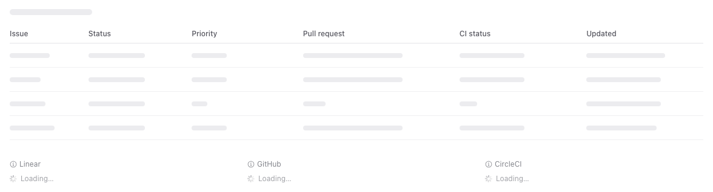
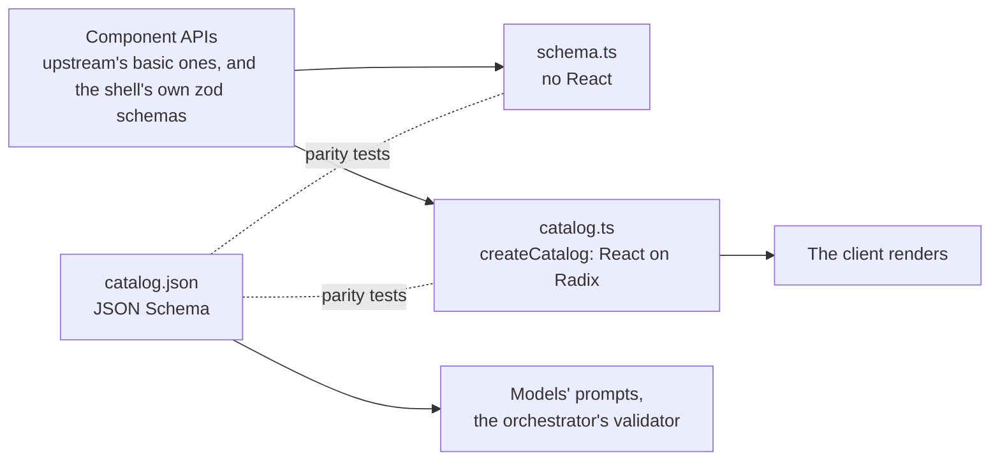
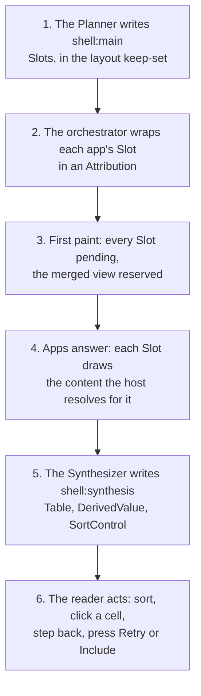
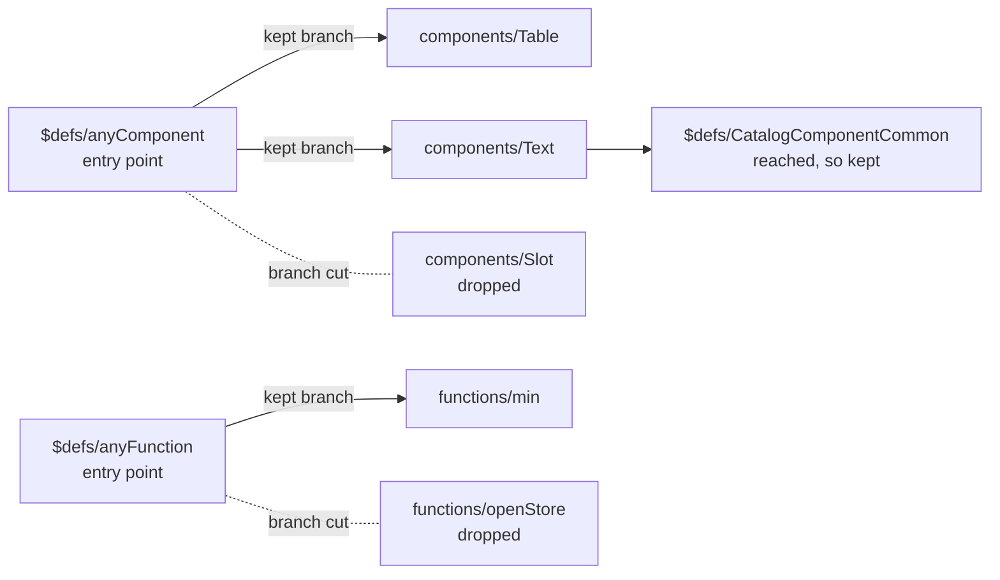

# Shell catalog: the shell's own vocabulary

This guide explains `packages/shell-catalog`, the A2UI catalog A2UIVerse paints its own UI with: the layout that holds each app's answer, the name above every app, the merged view, and the lines that say what went wrong. It's written for a frontend engineer meeting A2UIVerse for the first time. It starts with the ideas, follows the shell's paints through one question, then opens up the machinery, and ends with the design decisions and where the code lives.

One example runs through the whole guide, the same recorded session as [`synthesis.md`](synthesis.md): the question _"what's the status of what I'm working on?"_, answered by Linear, GitHub and CircleCI. Everything on these two screens that isn't an app's own UI is drawn by this catalog.

<p align="center">
  
  <br>
  <em>First paint. A reserved merged view with its planned columns, and a slot per app, each named above and still loading.</em>
</p>

<p align="center">
  
  <br>
  <em>The same layout filled. The table, the sort control and the app names are this catalog's; inside each slot is the app's own.</em>
</p>

## The problem it solves

In A2UIVerse, the shell's own screen is painted the same way an app paints its answer: as A2UI, written by a model. The **Planner**, the orchestrator's first model call, writes the layout surface `shell:main`. The **Synthesizer**, the second, writes the merged view `shell:synthesis`. A model can only write components that exist in a **catalog**, so the shell needs a catalog of its own. That's this package.

It has three jobs:

1. **Say everything the basic catalog says.** A2UI ships a standard **basic catalog** (`Text`, `Row`, `Column`, `Button`, `TextField` and so on). The shell catalog keeps its props exactly, so a model that knows A2UI already knows how to write most of the shell.
2. **Add the words composition needs.** The basic catalog has no way to say "an app's answer goes here", "this is who painted it", or "this value came from two apps and one is missing". The shell catalog adds eight components for that: `Slot`, `Attribution`, `DerivedValue`, `SortControl`, `Table`, `TableRow`, `DataList` and `DataListItem`.
3. **Give the shell one design system, and keep it in its box.** Every component is drawn with [Radix Themes](https://www.radix-ui.com/themes). Several apps' design systems share the page with it (Primer for GitHub, Material-style themes for Gmail and Calendar), so the shell's styles must never leak into an app's slot, and theirs must never leak into the shell.

> "The vocabulary is the boundary." (the first of A2UIVerse's axioms, in `SPEC.md`: a model writes, a closed vocabulary bounds what it can say, a validator checks it, the runtime executes it)

## Six ideas to hold on to

### 1. One catalog, three files that must agree

An A2UI catalog has two sides: the **schema**, which says what components exist and what props they take, and the **implementation**, which draws them. The shell catalog keeps three artifacts, because its two readers live in different places:

| File | What it is | Who reads it |
| --- | --- | --- |
| `catalogs/v0.9.1/catalog.json` | The catalog as JSON Schema: every component, every prop, every function | The models, in their prompts; the orchestrator's validator, which checks what the models wrote |
| `src/schema.ts` | The same components as zod schemas, with no React | Node code that needs the catalog's names and types without rendering anything (the orchestrator imports it as `@a2uiverse/shell-catalog/schema`) |
| `src/catalog.ts` | The React implementation, on Radix Themes | The client, which renders every shell surface with it |



`schema.ts` and `catalog.ts` are built from **the same component APIs**: upstream's `TextApi`, `ButtonApi` and the rest from `@a2ui/web_core`, and the shell components' own `*.schema.ts` files. So those two can't disagree about a prop. `catalog.json` is a separate file, kept in step by tests: every component it declares has an implementation and the other way round, and every function it declares is implemented (see [Keeping the files in step](#keeping-the-files-in-step)).

### 2. The basic catalog, drawn on Radix Themes

The basic catalog's eighteen components are all here, **with upstream's props exactly**. Only the drawing changed: each one is mapped onto its nearest Radix Themes component.

| Basic component | Drawn with Radix | Worth knowing |
| --- | --- | --- |
| `Text` | `Heading` for `h1` to `h4`, `Text` for `body` and `caption` | `h5` is the merged view's small label, one line ending in an ellipsis |
| `Row`, `Column`, `List` | `Flex` | Radix names four of the seven `justify` values as props; the other three are set as CSS on the same element |
| `Card`, `Divider`, `Tabs`, `Slider` | `Card`, `Separator`, `Tabs`, `Slider` | only the selected tab's panel mounts |
| `Modal` | `Dialog` | its content mounts inside the catalog's own portal root |
| `Button` | `Button` | `default` is `surface` gray, `primary` is `solid`, `borderless` is `ghost` |
| `TextField`, `CheckBox`, `DateTimeInput` | `TextField` or `TextArea`, `Checkbox`, a native date input | the first failing check shows under the field in red |
| `ChoicePicker` | `RadioGroup`, `CheckboxGroup`, `SegmentedControl`, or toggle `Button`s | one control per combination of one-or-many and checkbox-or-chips |
| `Icon` | Radix Icons | an unknown icon name draws a question mark carrying the name |
| `Image`, `Video`, `AudioPlayer` | plain elements under the Theme's tokens | |

Keeping upstream's props means the Planner, the Synthesizer, the orchestrator's validator and the client's renderer all speak one vocabulary. Nothing about the shell asks a model to learn a new word for something the basic catalog already says.

### 3. The shell's own components

Eight components exist only in the shell catalog. In the example:

| Component | What it is | In the example |
| --- | --- | --- |
| **`Slot`** | A region of the layout reserved for one source's answer. It draws the answer when there is one, and otherwise its state: loading, failed, or collapsed | One per app, plus one for the merged view (`source: "shell"`) |
| **`Attribution`** | The quiet app name above a slot, and that app's back and forward arrows | "Linear", "GitHub", "CircleCI" above the three slots |
| **`DerivedValue`** | The only way a merged view shows a value: the value plus how sure it is | Every cell of the table |
| **`SortControl`** | "Sort by" with the options and the direction | "Sort by Updated ↓" |
| **`Table`**, **`TableRow`** | A list of like things whose columns line up | The "Active work items" table |
| **`DataList`**, **`DataListItem`** | Labelled facts about one thing | A summary of one item, or an answer about A2UIVerse itself |

`Table` exists because the basic catalog can only draw a list as a heading `Row` over a `Column` of `Row`s, and a `Row` sizes its children by their content, so the columns never line up. A table is the one shape whose columns align by construction.

`Attribution` is written by the orchestrator, never by a model: the Planner writes the `Slot`s, and the orchestrator wraps every app's `Slot` in an `Attribution` it fills from its registry. Its props are plain literals and never data-bound, so a fragment can't rebind who it claims to be.

### 4. Keep-sets: each author sees only its part

Two models write shell surfaces, and each is allowed a different part of the catalog. A **keep-set** names the components and functions one author may use (`src/keep-sets.ts`):

| Keep-set | Components | Functions | Author |
| --- | --- | --- | --- |
| `SYNTHESIS_SURFACE_KEEP_SET` | `DerivedValue`, `SortControl`, `Table`, `TableRow`, `DataList`, `DataListItem`, `Text`, `Column`, `Row`, `Card`, `Divider` | the formula operators and the relations | the Synthesizer, `shell:synthesis` |
| `LAYOUT_SURFACE_KEEP_SET` | `Slot`, `Row`, `Column`, `Card`, `Text`, `Divider`, `DataList`, `DataListItem`, `Table`, `TableRow`, `Button` | `openStore`, `openAppLibrary` | the Planner, `shell:main` |

The orchestrator shows each model `catalog.json` **pruned** to its keep-set, and validates that model's output against **the same pruned catalog**. So the Synthesizer has never heard of `Slot` or `Button`, and a `Slot` in its tree is a validation error, not a judgment call. Neither model gets `Attribution`: it's the orchestrator's alone. [Pruning a catalog](#pruning-a-catalog-graph-reachability) shows how the pruning works.

Beside its pruned catalog, each model reads one guidance doc from `docs/`: `synthesis-guidance.md` (how a merged view is built from these components) for the Synthesizer, and `platform-ui-guidance.md` (how the shell answers a question about A2UIVerse itself) for the Planner.

### 5. The host fills in what changes

The catalog is a library; the **host** is the app that renders with it, here the client. The catalog never reaches into the host. Instead the host gives it two kinds of input:

- **Handlers**, which don't change, go into `createCatalog(options)`:

  | Option | Called when |
  | --- | --- |
  | `onShellAction` | a shell button raises `openStore` or `openAppLibrary` |
  | `onPress` | the reader presses Retry, Include or Try again on a `Slot`, or a back or forward arrow on an `Attribution` |
  | `onNavigate` | the reader clicks a `DerivedValue`, to land on the element it came from |
  | `appDisplayName` | a component needs an app's name for its id |

- **State that changes as the question runs** goes into four React contexts the host provides:

  | Context | What it answers | Read by |
  | --- | --- | --- |
  | `SlotContentContext` | "what's the content for this source?" | `Slot` |
  | `SlotStateContext` | "where does this source's slot stand?" (`pending`, `filled`, `failed`, `collapsed`, or `late` while it waits for Include) | `Table`, the reserved merged view |
  | `PressStateContext` | "which presses are on their way, and can a press be made here at all?" | `Slot`, `Attribution` |
  | `FragmentHistoryContext` | "where does this app stand in its back and forward history?" | `Attribution` |

Every context has a default that says nothing (no content, no state, presses enabled, no history), and every handler is optional: without `onPress` no press button or arrow is drawn, and without `onNavigate` cells aren't clickable. So the catalog renders correctly in a unit test or a replay with no host at all. And the catalog computes nothing on the host's behalf: the host works out, for example, which step is "back" for an app, and the catalog only draws it.

### 6. One Provider, in its own box

Every catalog bundle in A2UIVerse ships **exactly one Provider and one CSS setup, both scoped to its own box** (a review rule in `SPEC.md`). The shell catalog's `Provider` is:

- A Radix `Theme` folded onto a single wrapper element, `.a2uiverse-shell-catalog`, with `display: contents` so the wrapper takes no space in the layout while CSS custom properties still flow through it.
- Radix Themes' stylesheet, **rewritten** so every rule that Radix would put on `:root` lands on that wrapper instead (see [Scoping Radix Themes](#scoping-radix-themes)).
- A **portal root** after its content. Floating things, like the `SortControl`'s dropdown, a `Modal`'s dialog or a `DerivedValue`'s tooltip, mount there, inside the box, instead of at the end of `<body>`.

Under a host Radix `Theme` (the client has one), the Provider inherits the host's accent, gray, radius and scaling, and reads its light or dark appearance. With no host Theme, it fixes `indigo` and `slate`. It paints no background of its own.

The client checks the rule for every catalog on the page: its collision tests fail if any catalog's styles escape its wrapper (see [`client.md`](client.md)).

## One question's paints, end to end



**1. The Planner writes the layout.** Here's the layout from the example, trimmed. It's ordinary A2UI in the shell catalog:

```jsonc
[
  {"id": "root", "component": "Column", "children": ["work-status", "sources"]},
  {"id": "work-status", "component": "Slot", "source": "shell", "content": "shell", "state": "pending", "label": "Synthesis",
   "columns": ["Issue", "Status", "Priority", "Pull request", "CI status", "Updated"],
   "join": {"home": "linear", "nouns": {"linear": "issues", "github": "PRs", "circleci": "runs"}}},
  {"id": "sources", "component": "Row", "children": ["attribution-linear", "attribution-github", "attribution-circleci"]},
  {"id": "attribution-linear", "component": "Attribution", "displayName": "Linear", "appId": "linear", "child": "linear", "weight": 1},
  {"id": "linear", "component": "Slot", "source": "linear", "weight": 1, "state": "pending", "label": "Linear"}
  // …the same for GitHub and CircleCI
]
```

A `Slot` holds **exactly one** of `source` (whose answer fills it) or `gap` (a capability no installed app has; more on that below). `weight` is the basic catalog's flex share: three slots of weight 1 split their row equally. `content: "shell"` marks the merged view's slot as the shell's own content, and `columns` are the view's planned headers.

**2. The orchestrator wraps each app's slot.** The `Attribution` entries above aren't the Planner's: the orchestrator adds one around every app's `Slot`, copying the slot's `weight` onto it so wrapped and bare slots size by one rule. The merged view's slot stays bare, because the merged view is the shell's own page, not something an app painted.

**3. First paint.** The layout reaches the client before any app has answered, so every `Slot` is `pending`:

- An **app's slot** keeps a minimum height of 4rem and draws a small spinner and "Loading…" at its top-left. It names nobody: the `Attribution` above says whose it is. No border and no background: the boundary between apps is never drawn (see [Design decisions](#design-decisions)).
- The **merged view's slot** draws the view to come in the table's own geometry: a bar where the label will be, the planned column headers, and four rows of skeleton bars. The first image above is exactly this.

**4. The apps answer.** The client, as host, fills `SlotContentContext`. Each `Slot` asks it for its source's content, and draws that content the moment it's there. The slot keeps the 4rem floor it reserved, so the layout doesn't jump.

**5. The merged view lands.** The Synthesizer's tree for `shell:synthesis` fills the shell slot. In the example it's a `Column` holding a `Row` (an `h5` label "Active work items" and a `SortControl`) over a `Table` of `TableRow`s whose cells are all `DerivedValue`s. How the values get into those cells is [`synthesis.md`](synthesis.md)'s subject; this catalog only draws them.

**6. The reader acts.** Each interaction goes out through one of the host's handlers:

| The reader | The component | What it raises |
| --- | --- | --- |
| changes the sort | `SortControl` | writes the sort declaration back to its own data model path; the client re-sorts (no request) |
| clicks a cell | `DerivedValue` | `onNavigate(target)`: the client scrolls to that element in the app's slot |
| presses the back arrow | `Attribution` | `onPress({kind: "step", sources: ["circleci"], step: 0})` |
| presses Retry | `Slot` | `onPress({kind: "retry", sources: ["github"]})` |
| presses "Search the Store" | `Slot` with a `gap` | `onShellAction({name: "openStore", query: …})` |

Every press carries the surface and component that raised it, so the client knows which canvas and which slot it came from.

When something goes wrong, the same `Slot` draws it. A failed app's slot becomes the **failure tile**: one sentence, then Retry. A merged view that can't be made collapses to **one line** where its label would be, with the press that can bring it back. [Composing the lines](#composing-the-lines-pure-functions) shows how those sentences are chosen.

## Inside the machinery

### Pruning a catalog: graph reachability

`pruneCatalog` lives in the sdk (`packages/sdk/js/src/a2ui/prune.ts`). It takes `catalog.json` and a keep-set and returns a smaller catalog that is still a valid catalog on its own. Removing components from the top-level lists is the easy part. The subtle part is that a JSON Schema catalog is full of **references**: `"$ref": "#/$defs/anyComponent"` points at a shared definition, and shared definitions point at components and at each other. The pruned catalog must drop every definition that only the dropped components used, and keep every definition something kept still reaches.

That's **graph reachability**. Definitions are nodes, `$ref`s are edges:

1. **Cut the edges to dropped things.** Every union (`oneOf`, `anyOf`) that lists a dropped component or function loses that branch. A union left empty becomes `[false]`, which matches nothing.
2. **Pick the roots.** The kept components and functions, plus any definition nothing in the catalog references at all. Those are the spec's own entry points, like `anyComponent`, `anyFunction` and `theme`.
3. **Walk.** Keep a work list, starting from the roots. Pop a schema, find every local `$ref` (one starting with `#/`) inside it with a recursive scan, and push each definition not seen yet. A `Set` of reached names stops the walk from visiting anything twice.
4. **Keep what was reached**, and drop every other definition.



The picture is the Synthesizer's pruning, in miniature. `anyComponent` and `anyFunction` are unions listing every component and function; they lose the branches to dropped entries. `CatalogComponentCommon`, the props every basic component shares, stays because a kept component still points at it. Refs into A2UI's shared `common_types.json` point outside the catalog, so the walk leaves them as they are.

Each node is visited once, so the walk is linear in the size of the catalog. Pruning also checks its input: a keep-set naming a component or function the catalog doesn't have is an error, not a silent no-op.

### Scoping Radix Themes

Radix Themes' stylesheet is written for a page that uses only Radix: it declares its design tokens (colors, spacing, radius) on `:root`. On A2UIVerse's page that would leak into every app's slot. `scripts/scope-radix.mjs` runs before every build, test and dev run and writes a scoped copy, `src/radix-themes.scoped.css`:

1. **Rewrite `:root`.** Every `:root` selector becomes `.a2uiverse-shell-catalog`, the Provider's wrapper. The script then **checks its own work** and fails the build if any `:root`, or any `html` or `body` selector, survived.
2. **Reset what Radix sets at runtime.** Some custom properties are read by the sheet but never declared in it, because Radix sets them on elements while it runs (`--width` from a layout prop, `--radix-select-trigger-width` from a popover's measurement). Left alone, reading one inside the wrapper would pick up whatever a neighbouring app happened to set. The script computes a **set difference** (the properties the sheet reads, minus the ones it declares) and declares each of those as `initial` on the wrapper. `initial` behaves exactly like "not set", so the fallback applies, while an element's own inline value still wins.
3. **Add one token.** Radix leaves a button's cursor at `default`; the shell's buttons should show the pointer like everything else pressable on the canvas. The script appends `--cursor-button: pointer` under the wrapper's two classes, so it outranks Radix's own rule on the same element.

The client's collision detector finds a package's stylesheets by scanning its JavaScript for `.css` strings. So the script builds the stock sheet's name out of pieces, `['@radix-ui/themes/styles', 'css'].join('.')`, and only the scoped copy is ever found.

### Composing the lines: pure functions

The failure tile and the merged view's lines say different things depending on what happened, what the reader has pressed, and whether that press has reached the orchestrator yet. All of that wording is written by **pure functions** in `src/components/slot/slot.tsx` and `press-lines.ts`: facts in, sentences out, no React. They're tested as plain functions.

- **`failureStatement(failure)`** picks the failure tile's one sentence. The orchestrator paints a cause on the failed `Slot`, one of four:

  | Cause | The tile says |
  | --- | --- |
  | `vendor` | the app's own words when it gave some, else "Couldn't answer." |
  | `unreachable` | "Couldn't be reached." |
  | `timeout` | "No answer within the time allowed." |
  | `invalid` | "Answered, but its screen couldn't be shown." |

  The sentence never names the app: the `Attribution` above already does.

- **`collapseLine(collapse)`** words a collapsed merged view: "The merged view needs Linear issues, which didn't load.", "The merged view needs at least two sources, and only GitHub answered.", or "The merged view couldn't be made."

- **`collapsedLines(facts, presses, …)`** and **`landedLines(…)`** decide which lines a collapsed or a landed merged view shows. For a collapsed view they try, **in priority order**: a merge being made ("Making the merged view…"), a Retry that could bring it back running ("Waiting for Linear, then merging…"), the same Retry pressed but not yet painted, a view that couldn't be made (with Try again), a collapse with its Retry on the line ("Retry Linear", or "Retry all"), and finally the plain collapse line or the Synthesizer's decline. The first rule that matches wins. Under a decline, a late app is then offered with Include.

The facts come from props the orchestrator paints on the merged view's `Slot` (`late`, `working`, `callFailed`, `retrying`, `declined`, `collapse`), and the presses from `PressStateContext`. So a press shows **the moment it's clicked**, before the orchestrator's repaint arrives: Retry turns the tile back into "Loading…" at once. A press that never reached the orchestrator adds "That didn't reach A2UIVerse." beside its button; a stream that broke after it answered says "Lost the connection to A2UIVerse. Ask again to see where this stands."

Two accessibility details ride along. When the button that was pressed disappears, **focus moves to the line that replaced it** (a ref flag records that the button held focus, and the new line takes focus once). And the outcomes the progress line doesn't say are announced through a visually hidden `role="status"` region beside the slot.

One more detail explains why `Slot` reads its props from the component's own model instead of from the props the binder hands it. Upstream's binder merges each repaint over the last one, so a prop the orchestrator stops painting, like `working` once a press finishes, would otherwise keep its old value. Every `Slot` prop is a literal the orchestrator repaints, so the model is the whole truth.

### Drawing a value: `DerivedValue`

`DerivedValue` binds one prop, `cell`, to the cell object the client's evaluator writes (`{value, contributed, of, absent, join?, target?, names?}`; see [`synthesis.md`](synthesis.md#6-a-cell-is-a-value-that-says-how-sure-it-is)). From it the component draws:

- **One mark, carried by contrast.** `cellState(cell)` gives `complete`, `partial`, `absent` or `empty`; the join gives `none`, `guessed` or `broken`. A value that's complete and held by facts is drawn at full strength. Every other reading steps back to gray, except `broken`, which turns amber and keeps a small ⚠. The reading is also written to `data-marked`, so tests and styles can see it.
- **A danger tone, on its own channel.** When the value matches one of the cell's `danger` words (compared the way the `equal` relation compares, word by word), a ✕ in a circle is drawn before it, and it turns red at weight 600 only when it's unmarked. Certainty wins the color: the shell never shouts about a failure that may belong to another row.
- **A tooltip, only where the shell admitted something.** A partial, absent, guessed or broken value explains itself on hover or focus; a complete value held by facts says nothing, because clicking it is the better answer. The tooltip mounts in the Provider's portal root, so showing it moves nothing on the page.
- **A button, when it can go somewhere.** With a `target` and a host `onNavigate`, the value gets `role="button"`, takes focus, and navigates on click, Enter or Space.
- **The full story, always, for assistive technology.** The accessible name carries the value, "needs attention" for a danger value, the contributor detail, the mark and the evidence, whatever the pointer is doing.

A value that names an app (`names: "app"`) is drawn by the host's name for it. The `format` prop renders numbers, currency, and date-times in one fixed form (`en-US`, `America/New_York`, through the same `instant.ts` the client's sort uses), and `prefix` writes a `#` before a pull request number but never before the empty dash.

The join marks themselves come from `cellJoin` in `src/components/derived-value/join.ts`, a **union-find** over the apps linked by facts. `synthesis.md` walks through it in [Marking a join](synthesis.md#marking-a-join-union-find), and the relations it relies on are in [Checking a relation](synthesis.md#checking-a-relation).

### Reserving a column

A `Table` may mark each column to the app whose values it shows (`columnSources`). When that app hasn't answered yet, the column is **reserved**: `Table` asks `SlotStateContext` where that app's slot stands, and `reservedColumnState` turns the answer into one of three states:

| The app's slot | The heading | The cells |
| --- | --- | --- |
| `pending` | "CI status · loading" | a skeleton bar in each cell |
| `failed` | "CI status · unavailable" | the empty dash |
| `late` (arrived after the view was made) | "CI status · not included" | the cells the Synthesizer wrote, until Include adds the real ones |

The table passes the column states down to its rows through a small React context, so each `TableRow` knows which of its cells to hold back. The reserved merged view in the first image uses the same heading and cell geometry, so when the real table lands, nothing moves.

### The way-back arrows

`Attribution` draws the back and forward arrows for its app. It asks `FragmentHistoryContext` where the app stands, by the painted `appId`, and gets `{back?, forward?, busy?}`, each neighbour a `{step, title?}`:

- An arrow is drawn **only when there's somewhere to go**, and only when the host passed `onPress`.
- Each arrow is **named for where it goes**: "Back to" and the paint's title when the app gave that paint one (the `paintMeta` title, see [`a2uiverse-apps`](https://github.com/retz8/a2uiverse-apps#connecting-to-a2uiverse)), just "Back" when it didn't. The name is its tooltip and its accessible name.
- Pressing one raises `{kind: "step", sources: [appId], step}` through the host's press handler.
- The arrows draw **disabled** while `busy` (that app's repaint is on its way) and wherever `PressStateContext` says no press can be made.
- When a pressed arrow disappears, because there's no more history that way, **focus moves to the other arrow, or back to the app's name**.

<p align="center">
  
  <br>
  <em>CircleCI's arrows at the right of its name: Back from a run to its runs list, then Forward.</em>
</p>

The arrows are soft accent icon buttons at the right edge of the name's row, with no border around the row: the boundary is still just the name, the app's own pixels and the whitespace.

### Shell actions

The shell has exactly two actions of its own: **`openStore`**, with an optional `query`, and **`openAppLibrary`**. Each is a catalog function, like the basic catalog's `openUrl`, that a `Button` runs through a `functionCall`. The function does nothing itself: it hands the host one plain object, `{name, surfaceId, query?}`, through `onShellAction`, and the host decides what opening the Store looks like.

The capability tile is the one component that raises an action itself. A `Slot` with a `gap` (a capability no installed app has) draws "No installed app can do this." over a "Search the Store" button, which raises `openStore` with the gap as the query and the slot's own id as `componentId`. The tile keeps a box, unlike every other slot, because it's the shell's own UI with an action in it, not a place held for an app's pixels.

### Keeping the files in step

Two kinds of test keep the three files of [idea 1](#1-one-catalog-three-files-that-must-agree) honest:

- **Name-level parity** (`catalog.parity.test.ts`): the catalog id matches everywhere; every component in `catalog.json` has an implementation and the other way round; the declared functions are exactly upstream's, plus the operators, the relations and the two shell actions.
- **Render-level parity** (`catalog.render-parity.test.tsx`), which is **generated from `catalog.json`**. `fixture/matrix.ts` walks every component and every enum prop, and for each value builds a minimal valid tree: required props sampled from their declared types, a small seed per component so the sample is readable, and the one prop being varied. Every case renders through the real renderer under the Provider and must produce an element, with no validation error and no console error or warning. Add an enum value to `catalog.json` and it's tested automatically.

`keep-sets.test.ts` checks the pruning: a merged view validates against the Synthesizer's pruned catalog while `Slot`, `Attribution` and `Button` don't, and a layout validates against the Planner's while `Attribution`, `DerivedValue` and `SortControl` don't. `scoped-css.test.ts` checks that no `:root` survived in the stylesheet.

## Design decisions

| Decision | What it buys | What it costs |
| --- | --- | --- |
| **The basic catalog's props, exactly** | The models, the validator and the renderer share one vocabulary; a model that knows A2UI knows most of the shell | The shell can't add props of its own to a basic component |
| **Radix Themes as the whole design system** | One design system for everything the shell draws; no token vocabulary of the shell's own to maintain | The shell looks like Radix, and follows Radix's releases |
| **Two faces from the same component APIs** | The schema face and the React face can't disagree about a prop; the orchestrator gets the catalog's names with no React | `catalog.json` is a third copy, kept in step by tests |
| **A keep-set per author, shown and validated alike** | A model can't use what it wasn't shown; "not allowed here" is a validation error, not a judgment | Two lists to keep current as components are added |
| **Handlers as options, changing state as contexts** | The catalog never reaches into the host; defaults make it render in a test or a replay with no host | The host has four contexts to fill |
| **The host computes, the catalog draws** | History, press state and slot state live in one place, the client | The catalog can't be smarter than what it's told |
| **Every line's wording as a pure function** | The words are tested without rendering; one place to change them | The functions take many facts, and their priority order matters |
| **`Slot` reads its own model, not the binder's props** | A prop the orchestrator stops painting really goes away | It works around upstream's binder instead of through it |
| **No boundary drawn around an app's slot** | The layout reads as one page, not tiles; an app's own cards aren't boxed twice | The separation rests on the names and the whitespace |
| **`Attribution` never data-bound, never a model's** | An app can't hide or rename who painted it | The orchestrator has to add it to every layout |
| **One mark, the value's contrast; danger on its own channel** | Partial and guessed read as one statement; a failed build stands out only when it's certain | Guessed is carried visually by color alone; the tooltip and accessible name carry the rest |
| **Floating content in the Provider's portal root** | Popovers stay inside the box and under the scoped styles; a tooltip moves nothing | Every floating component has to be pointed at the portal root |
| **A rewritten, scoped Radix stylesheet** | Nothing the shell brings lands outside its wrapper; runtime variables never borrow from a neighbour | A generated file, rebuilt before every build, test and dev run |

## Trying it without a model

**The design-check page.** From the repo root, `pnpm --filter @a2uiverse/shell-catalog dev` opens the catalog's own fixture on port 5174. It shows:

- every component in every value of every enum prop, under Radix light, Radix dark, and no host Theme;
- the merged view built from a worked timeline example, evaluated, with a live sort;
- every `DerivedValue` reading, from hand-built cells: complete, partial, absent, empty, guessed, broken;
- every `Slot` and `Attribution` state, the capability tile, the presses and their lines, and the way-back arrows;
- the scoping proof: two Providers under two different host Themes in one document.

**Replays in the client.** Start the client (`pnpm dev:client`) and open a replay; see the [client README](../../apps/client/README.md#working-without-a-model).

| Replay | What it shows from this catalog |
| --- | --- |
| `?beat=9` | This guide's example: the layout, the names, the merged view's table and sort |
| `?beat=10` to `?beat=18` | The failure tile, Retry, Include, and every way the merged view collapses |
| `?beat=23` | The way-back arrows, stepping CircleCI back and forward |
| `?beat=7` | A capability gap: the tile and its "Search the Store" button |

## Where the code is

| Concern | Where (`packages/shell-catalog/`) |
| --- | --- |
| The catalog as JSON Schema | `catalogs/v0.9.1/catalog.json` |
| The React-free face | `src/schema.ts` |
| The React face, `createCatalog` | `src/catalog.ts` |
| Keep-sets | `src/keep-sets.ts` (pruning itself: `packages/sdk/js/src/a2ui/prune.ts`) |
| The guidance docs | `docs/synthesis-guidance.md`, `docs/platform-ui-guidance.md` |
| The Provider and its scoped stylesheet | `src/provider.tsx`, `scripts/scope-radix.mjs` |
| The host's contexts | `src/slot-content.ts`, `src/slot-state.ts`, `src/press-state.ts`, `src/fragment-history.ts` |
| `Slot`, the failure tile and the lines | `src/components/slot/slot.tsx`, `src/components/slot/press-lines.ts` |
| `Attribution` and the arrows | `src/components/attribution/attribution.tsx` |
| `DerivedValue` and the join marks | `src/components/derived-value/derived-value.tsx`, `src/components/derived-value/join.ts` |
| `SortControl`, `Table`, `DataList` | `src/components/sort-control/`, `src/components/table/`, `src/components/data-list/` |
| Operators, relations, shell actions | `src/functions/operators.ts`, `src/functions/relations.ts`, `src/functions/shell-actions.ts` |
| Reading time | `src/components/shared/instant.ts` |
| The basic components on Radix | `src/components/<name>/`, helpers in `src/components/shared/` |
| Tests and the design-check page | `src/**/*.test.ts(x)`, `src/testing/render.tsx`, `fixture/` |

In the client, the catalog is built in `apps/client/src/catalogs/resolver.ts` and its contexts are filled in `apps/client/src/canvas/components/CanvasView.tsx`. In the orchestrator, the keep-sets and pruned catalogs are used in `planner/prompt.ts` and `synthesizer/prompt.ts`.

## Words used in this guide

| Word | Meaning |
| --- | --- |
| **Shell** | A2UIVerse's own UI: the layout, the names, the merged view, everything that isn't an app's |
| **Catalog** | The set of components and functions a surface may use: a schema plus an implementation |
| **Basic catalog** | A2UI's standard catalog, whose props the shell catalog keeps exactly |
| **Surface** | One A2UI screen: a component tree and its data model. The shell paints `shell:main` and `shell:synthesis` |
| **Slot** | A region of the layout reserved for one source's answer, or for a missing capability |
| **Attribution** | The app's name above its slot, with its back and forward arrows |
| **Fragment** | One app's surface, drawn inside its slot |
| **Keep-set** | The components and functions one author may use |
| **Pruned catalog** | `catalog.json` narrowed to a keep-set: what that author is shown and validated against |
| **Host** | The app that renders with the catalog: the client |
| **Provider** | The catalog's one wrapper component: its Theme, its scoped styles, its portal root |
| **Portal root** | The element inside the Provider where floating content mounts |
| **Failure tile** | What a failed app's slot shows: one sentence, then Retry |
| **Capability tile** | What a `gap` slot shows: "No installed app can do this." and "Search the Store" |
| **Press** | A reader's Retry, Include, Try again, or back or forward step |
| **Reserved column** | A column whose app hasn't answered, drawn from that app's slot state |
| **Shell action** | `openStore` or `openAppLibrary`: handed to the host, which opens the page |
