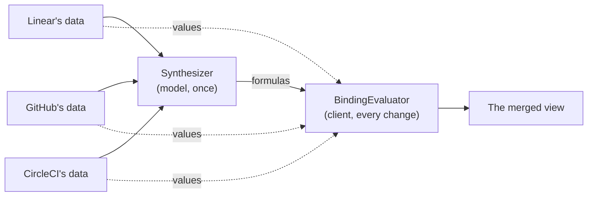
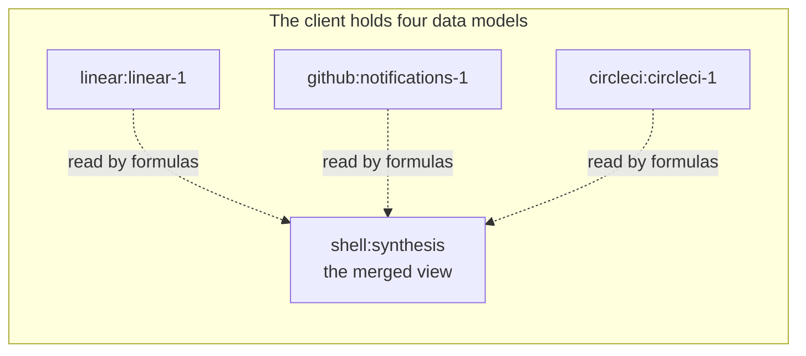
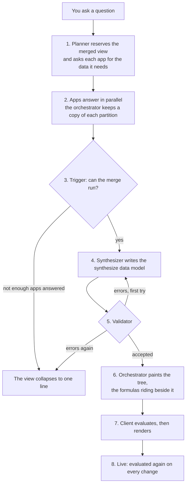
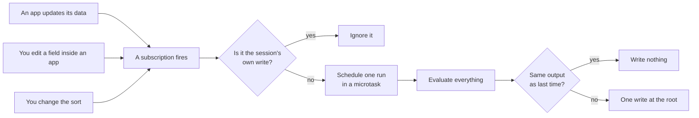
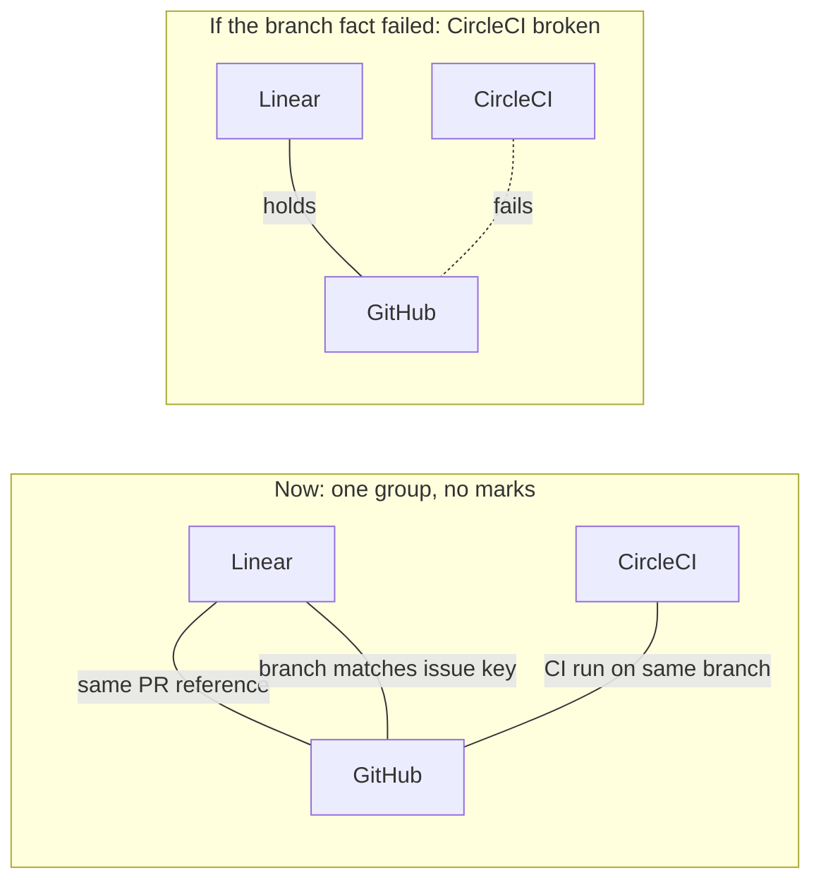
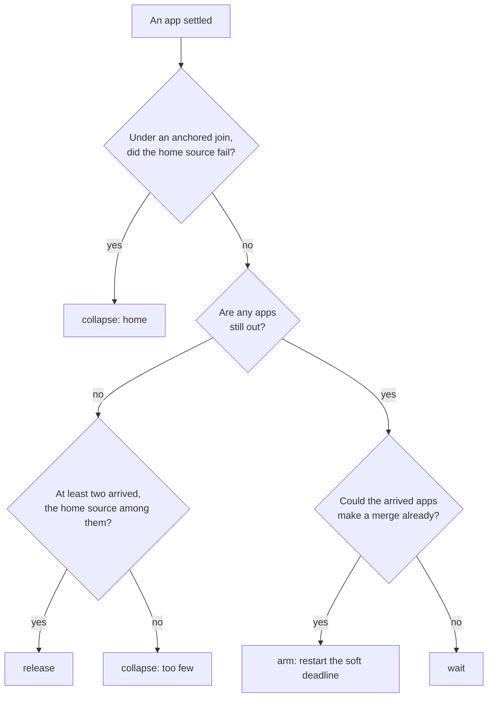
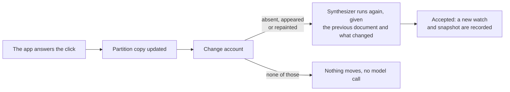

# Synthesis: how the merged view works

This guide explains the **merged view**: the table A2UIVerse draws on top of several apps' answers, joining what they said into one place. It's written for a frontend engineer meeting A2UIVerse for the first time. It starts with the ideas, walks one question from start to finish, then opens up the algorithms and data structures, and ends with the design decisions and where the code lives.

One example runs through the whole guide: the question _"what's the status of what I'm working on?"_, answered by Linear, GitHub and CircleCI. It's a real recorded session, and you can replay it yourself (see [Trying it without a model](#trying-it-without-a-model)).

<p align="center">
  
  <br>
  <em>The merged view is the "Active work items" table. Below it, each app's own answer in its own look.</em>
</p>

## The problem it solves

Three apps answer the question, each with its own UI: Linear lists your issues, GitHub your pull requests, CircleCI your pipeline runs. Each is useful on its own, but the question is about your **work items**, and one work item is spread across all three apps: an issue in Linear, its pull request in GitHub, and that pull request's CI run in CircleCI.

The merged view puts each work item on one row. Building it raises three problems:

1. **Something has to understand the data.** Nothing on the wire says that Linear's issue A2U-5, GitHub's pull request #6 and a CircleCI run on the branch `ekkicb71/a2u-5-say-on-the-canvas-…` are one piece of work. Only reading the data tells you: the issue links "PR #6", the branch name contains "a2u-5", the run is on that branch. That takes a language model, the **Synthesizer**.
2. **A model shouldn't be trusted with values.** If the model copied "In Review" or "Success" into the table, it could copy one wrong, and the copy would go stale the moment an app's data changed.
3. **The table has to stay live.** You keep clicking around inside the apps after the table appears. Calling the model again on every click would be slow and expensive.

A2UIVerse's answer is one rule: **the model writes wiring, never values.** It writes the table the way you'd write a spreadsheet whose cells point at other sheets: each cell is a small formula pointing into one app's data. A plain deterministic program in the client, the **BindingEvaluator**, computes every value from those formulas, and computes them again whenever the data changes.

> "Understanding is expensive so it runs once; arithmetic is cheap so it runs always." (one of A2UIVerse's axioms, in `SPEC.md`)



## Six ideas to hold on to

### 1. Every app's answer has its own data: a partition

In A2UI, an agent answers by painting a **surface**: a tree of components from its catalog, plus a JSON **data model** those components bind to. It works like a React component reading from a store: the component says _which path_ to show, and the data model holds the value.

Here's part of Linear's data model from the example:

```jsonc
// surface "linear:linear-1", Linear's data model (trimmed)
{
  "issues": [
    {"id": "A2U-5", "status": "In Review", "priority": "High", "link": "PR #6", "updatedAt": "Sep 19, 2026, 10:58:36 UTC"},
    {"id": "A2U-7", "status": "In Progress", "priority": "Low", "link": "ekkicb71/a2u-7-shell-action-report-hangs-through-the-tunnel", "updatedAt": "Sep 19, 2026, 10:53:09 UTC"},
    {"id": "A2U-6", "status": "In Progress", "priority": "Medium", "link": "PR #7", "updatedAt": "Sep 18, 2026, 11:53:06 UTC"}
  ]
}
```

A **partition** is one app's surface data model, as A2UIVerse holds it. Two rules keep partitions apart:

- **Surface ids are namespaced** as `<appId>:<surfaceId>`. Linear's `linear-1` becomes `linear:linear-1`, so two apps can never collide on a name.
- **Nothing copies data out of a partition.** No app ever sees another's data. Only the shell, A2UIVerse's own UI, reads across partitions, and the merged view is the shell's.



### 2. A ref points at one value, by key

A **ref** names one value in one partition: the surface, and a pointer into its data model.

```json
{"surface": "linear:linear-1", "pointer": "/issues[id=\"A2U-5\"]/status"}
```

The pointer is a normal JSON Pointer (`/a/b/c`, RFC 6901) with one addition, the **predicate**. `issues[id="A2U-5"]` means "the element of the `issues` array whose `id` is `"A2U-5"`". When no single field identifies an element, tests are joined with commas: GitHub's pull request is `prs[repository="retz8/a2uiverse",number=6]`, since pull request numbers repeat across repositories.

Why not simply `/issues/0/status`? **Because a position is not a name.** If Linear re-sorts its list, position 0 becomes a different issue, and the table would quietly show the wrong issue's status. A key names the element wherever it moves. So A2UIVerse doesn't allow positions into arrays at all: a pointer that uses one doesn't resolve.

Resolving a ref has one way to succeed and four ways not to:

| Answer       | When                                                                          |
| ------------ | ----------------------------------------------------------------------------- |
| `found`      | every step matched, each predicate exactly one element, and the value isn't `null` |
| `missing`    | a key or an element isn't there                                               |
| `ambiguous`  | a predicate matched more than one element                                     |
| `null`       | the value at the end is `null`                                                |
| `positional` | a step addressed an array by position                                         |

All four "not found" answers mean the same thing to the merged view: the ref is **absent**. Absent is not an error. It's what happens when you open an issue inside Linear's slot: Linear replaces its list with the issue's detail, the refs into the list stop resolving, and the cells that read them show it. Go back, and they resolve again.

### 3. A formula is one operator over some refs

Every cell of the merged view is a **formula**: `{op, args}`, one operator over a list of refs.

```json
{"op": "value", "args": [{"surface": "linear:linear-1", "pointer": "/issues[id=\"A2U-5\"]/status"}]}
```

The operators are functions declared in the shell catalog:

| Operator                   | Gives                                                   |
| -------------------------- | ------------------------------------------------------- |
| `value`                    | the one value it points at                              |
| `min`, `max`, `sum`, `avg` | a number over the numbers that resolved                 |
| `count`                    | how many refs resolved                                  |
| `argmin`, `argmax`         | which app holds the smallest or largest value           |
| `source`                   | which app the first resolving ref belongs to            |

Two rules keep formulas simple:

- **Formulas don't nest.** There's no `min(max(…))`, so there's one evaluation path and a short validator.
- **A formula may have no refs.** `{"op": "value", "args": []}` is the honest cell for "this row has nothing here". In the example, issue A2U-7 has no pull request yet, and its "Pull request" cell is exactly that.

### 4. The synthesize data model: what the Synthesizer writes

The Synthesizer answers with one JSON document, the **synthesize data model**. It has four parts:

| Part        | What it is                                                                                   |
| ----------- | -------------------------------------------------------------------------------------------- |
| `dataModel` | The **derived data model**: any JSON shape the model likes, with a formula at every leaf      |
| `tree`      | The merged view's components, in the shell catalog, bound to paths in `dataModel`             |
| `sorts`     | For each list, the keys a reader may sort it by, and the one it starts with                   |
| `note`      | What it delivered and where it departed from what it was asked. Written to the log, never shown |

Here is the first row of the example, as the Synthesizer wrote it (trimmed; `match` is idea 5):

```jsonc
{
  "dataModel": {
    "issues": [
      {
        "issue":     {"op": "value", "args": [{"surface": "linear:linear-1", "pointer": "/issues[id=\"A2U-5\"]/id"}]},
        "status":    {"op": "value", "args": [{"surface": "linear:linear-1", "pointer": "/issues[id=\"A2U-5\"]/status"}]},
        "pr":        {"op": "value", "args": [{"surface": "github:notifications-1", "pointer": "/prs[repository=\"retz8/a2uiverse\",number=6]/number"}]},
        "ciStatus":  {"op": "value", "args": [{"surface": "circleci:circleci-1", "pointer": "/runs[id=\"6039cf16-6db3-4974-af2b-517f8ce26c2a\"]/status"}]},
        "updatedAt": {"op": "value", "args": [{"surface": "linear:linear-1", "pointer": "/issues[id=\"A2U-5\"]/updatedAt"}]},
        "match": { "…": "the evidence that these are one work item" }
      }
      // …one object per issue
    ]
  },
  "sorts": [
    {"path": "/issues", "options": [{"key": "/updatedAt", "label": "Updated"}], "key": "/updatedAt", "direction": "desc"}
  ]
}
```

And part of the tree that binds to it. It's ordinary A2UI: a `Table` repeats a `TableRow` for every element of `/issues`, and each cell is a `DerivedValue` reading one formula path:

```jsonc
[
  {"id": "table", "component": "Table", "columns": ["Issue", "Status", "Priority", "Pull request", "CI status", "Updated"],
   "children": {"path": "/issues", "componentId": "row"}},
  {"id": "row", "component": "TableRow", "children": ["c-issue", "c-status", "c-priority", "c-pr", "c-ci", "c-updated"]},
  {"id": "c-pr", "component": "DerivedValue", "cell": {"path": "pr"}, "format": {"kind": "number", "prefix": "#"}},
  {"id": "c-ci", "component": "DerivedValue", "cell": {"path": "ciStatus"}, "danger": ["Failed"]},
  {"id": "c-updated", "component": "DerivedValue", "cell": {"path": "updatedAt"}, "format": {"kind": "datetime"}}
  // …
]
```

The props on the tree, like the `#` prefix or the `danger` words, are presentation, and they're the model's to write. A value from an app is never a literal in the tree; it always comes through a formula.

When the apps' data gives nothing to merge, the Synthesizer can **decline** instead: `{"declined": true, "reason": "…"}`. The reason is the one line on the screen written in a model's words.

### 5. A match claim says why entries are one thing

Putting refs from Linear, GitHub and CircleCI into one object is a claim: "these are about the same work item". The Synthesizer backs that claim with evidence, under the reserved key `match`. This is the real evidence for row A2U-5:

```jsonc
"match": {
  "same PR reference":        {"op": "contains", "args": [/* Linear's link, "PR #6" */,    /* GitHub's number, 6 */]},
  "branch matches issue key": {"op": "contains", "args": [/* GitHub's branch */,           /* Linear's id, "A2U-5" */]},
  "CI run on same branch":    {"op": "equal",    "args": [/* CircleCI's branch */,         /* GitHub's branch */]}
}
```

Each key is the Synthesizer's own words for what matched. Each value is a **relation**: a formula over exactly two refs, in two different apps. There are three relations:

| Relation   | Holds when                                                                   | Kind      |
| ---------- | ---------------------------------------------------------------------------- | --------- |
| `equal`    | the two values are the same instant, the same number, or the same words     | fact      |
| `contains` | the second value's words appear, in order, inside the first's               | fact      |
| `judged`   | both values are there. The model's judgment, where no fact links the two    | judgment  |

**Facts are checked twice.** Before the orchestrator accepts the document, every fact must hold on the apps' data as it is now; a fact that doesn't is sent back to the model. After that, the client checks every fact again on every change, so a join that stops holding later is shown on screen. A value tied into its row only by a judgment is drawn as **guessed**, and one whose only link stopped holding as **broken**. [Marking a join](#marking-a-join-union-find) shows how.

### 6. A cell is a value that says how sure it is

The evaluator never writes a bare value. At every formula it writes a **cell**:

```json
{"value": "In Review", "contributed": 1, "of": 1, "absent": []}
```

| Field         | Meaning                                                         |
| ------------- | --------------------------------------------------------------- |
| `value`       | the computed value                                              |
| `contributed` | how many refs resolved                                          |
| `of`          | how many refs the formula declared                              |
| `absent`      | the surfaces whose refs didn't resolve                          |
| `join`        | when the row carries a match claim: how the value's tie stands  |
| `target`      | where a click on the cell goes: the element in the app's slot   |
| `names`       | `"app"` when the value is an app id, so it's shown by its name  |

Only one component reads cells: **`DerivedValue`**. The validator rejects a tree that binds a formula path to anything else, so a value computed from part of its sources can never be drawn like a complete one. That guarantee comes from the structure, not from reviewing each view. A cell is in one of four states:

| State      | Meaning                                                | Drawn                                           |
| ---------- | ------------------------------------------------------ | ----------------------------------------------- |
| complete   | every ref resolved                                     | the value at full strength                      |
| partial    | some refs resolved                                     | softer, in gray; hover names what's missing     |
| absent     | refs were declared, none resolved                      | a gray dash; hover says no source is showing it |
| empty      | no refs were declared: 0 of 0                          | a bare dash that says nothing                   |

**Empty and absent are different facts.** Empty is the world being empty: A2U-7 has no pull request. Absent is the shell losing sight of a value it had: you opened something and the list went away. Only absent is disclosed.

How sure a value is, and how its join stands, share one channel: **the value's own contrast**. The less solid its basis, the softer it's drawn. Partial and guessed values step back to gray; a broken one turns amber and keeps a small ⚠, because it may belong to another work item. A complete value held by facts draws nothing extra, and a click on it lands on the value in its app's slot, which answers "where did this come from?" better than a caption could.

Separately, a value the reader must act on gets a **danger tone**: the Synthesizer lists the column's danger words (`"danger": ["Failed"]` above), and a matching value is drawn with a ✕ in a circle, in red when it's complete.

## One question, end to end



**1. The Planner reserves the merged view.** The Planner is the orchestrator's first model call. It picks the apps and designs the screen's layout, and when the answers could be joined it reserves a slot for the merged view. The slot carries a prose **brief** for the Synthesizer (what the view shows and orders by), the view's planned **columns**, each marked to the app whose values it shows, and, when the view is about one kind of thing, a **join hypothesis**:

```jsonc
// the reserved slot in the example's layout (trimmed)
{"component": "Slot", "source": "shell",
 "columns": ["Issue", "Status", "Priority", "Pull request", "CI status", "Updated"],
 "join": {"home": "linear", "nouns": {"linear": "issues", "github": "PRs", "circleci": "runs"}}}
```

A join hypothesis is one of two kinds:

- **Anchored**, when the question owns the things through one app, as "what I'm working on" owns your Linear issues. That app is the **home source**: its entries are the rows, and every other app's entries attach to a row or to nothing.
- **Union**, when the question ranges over things wherever they are, like "all cameras across the stores". There's no home source: every entry any app lists becomes a row, the same thing across apps merged into one row.

The client draws the reserved slot right away, as the table to come: the planned column headers over a few skeleton rows. The Planner also asks each app, in plain words, for the fields a merge will need, like identifiers and full dates. It never mentions the merge or the other apps: an app is always written to its own product, never to A2UIVerse.

**2. The apps answer, and the orchestrator keeps a copy.** Each app's answer is relayed to the client into its slot. On the way through, the orchestrator also applies the app's A2UI messages to **its own copy of the partition**. It needs that copy for two jobs later: checking the Synthesizer's refs against real data, and noticing what changed after you click inside an app. The client sends its data models back with every request, so edits you make inside an app reach the copy too. When an app's stream ends, the orchestrator marks it **settled**.

**3. The trigger releases the merge.** A small decision function weighs every settle: wait, start a timer, release the merge, or give up. [Deciding when to merge](#deciding-when-to-merge) has the rules.

**4. The Synthesizer writes the document.** The orchestrator's second model call gets:

- **A system prompt**, assembled once at boot: the Synthesizer's role, the rules for writing refs, formulas, joins and sorts, the shell catalog's guidance on which components make a merged view, the shell catalog pruned to exactly those components, the output schema, and one worked example.
- **The turn**: your question, the Planner's brief, the planned columns with their apps, any app that isn't in this merge and why, and the live data model of every partition, each with its app's name.

It never sees an app's component tree, only data. It answers with the JSON document inside a `<synthesize-data-model>` tag.

**5. The orchestrator checks it, and hands it back once if needed.** The document goes through one validator. Anything wrong goes back to the model once, as a list of errors beside its own document. A second failure means the view couldn't be made. [Checking the model's work](#checking-the-models-work) lists the checks.

**6. The merged view is painted.** The orchestrator creates the surface `shell:synthesis` in the shell catalog and sends the tree, exactly as written, as ordinary A2UI. On the same event it attaches the **payload**, the `dataModel` and `sorts`, under the metadata key `a2uiverseSynthesis`. The tree travels as A2UI that any renderer understands; the formulas travel beside it, for the client alone. The note goes only to the journal.

**7. The client evaluates before it renders.** The client checks the payload with the same sdk validator the orchestrator used, subscribes to every partition it reads, evaluates every formula, sorts every list, and writes the whole result into the `shell:synthesis` data model in one write. Only then does React render, so the first frame of the merged view already has its values. Here are two cells of the result:

```jsonc
// row A2U-5, "pr": a value from GitHub, tied in by facts
{"value": 6, "contributed": 1, "of": 1, "absent": [],
 "join": {"mark": "none", "apps": ["github"], "evidence": ["…the two relations touching GitHub…"]},
 "target": {"app": "github", "surface": "github:notifications-1", "pointer": "/prs[repository=\"retz8/a2uiverse\",number=6]/number"}}

// row A2U-7, "pr": a formula with no refs, 0 of 0
{"value": undefined, "contributed": 0, "of": 0, "absent": []}
```

`DerivedValue` draws the first as "#6" and the second as a bare dash.

**8. It stays live.** From now on, any change to a partition the view reads makes the client evaluate again, with no model call. [Keeping it live](#keeping-it-live) shows how.

## Inside the machinery

### Resolving a ref

`packages/sdk/js/src/pointer.ts` has the one parser and resolver both processes use, so the orchestrator's check and the client's evaluation can never disagree about what a ref points at.

**Parsing** turns `/prs[repository="retz8/a2uiverse",number=6]/number` into steps:

```
key "prs"  →  predicate [repository = "retz8/a2uiverse", number = 6]  →  key "number"
```

Two details make that harder than `split('/')`:

1. **A slash inside brackets isn't a separator.** `retz8/a2uiverse` contains one. The splitter walks the string keeping a **bracket depth counter**, and splits on `/` only at depth 0.
2. **A comma inside a string isn't a separator either.** The tests are split on commas by a small scanner that tracks whether it's inside a JSON string (and whether the last character was a backslash escape).

Each test's value is parsed with `JSON.parse`, so `number=6` is the number 6 and `id="A2U-5"` is a string. The predicate compares by type: `number="6"` would not match.

**Resolving** walks the steps from the data model's root:

```
for each step:
  key into an object     → that property, or missing
  key into an array      → positional if it looks like an index, else missing
  predicate on an array  → keep the elements where every test's field equals its value
                           exactly one → step into it; none → missing; several → ambiguous
at the end: null → null; anything else → found
```

A predicate is a **linear scan** of the array, O(n) in the array's length times the number of tests. There's no index to build or keep in sync; each resolve reads the data as it is right now.

The same file also has `locatePointer`, which returns the concrete positional path a ref resolves to, like `/prs/2/number`. Navigation uses it when you click a cell, to find the element on screen. A position is read at the moment it's needed and never stored, because it's only true right now.

### Evaluating the model

`apps/client/src/canvas/synthesis/bindingEvaluator.ts` turns the payload plus the partitions into the merged view's data model. It's a **pure function**: `evaluate(payload, partitions, sortChoices)` returns the whole output and changes nothing else. Every change recomputes everything from scratch; there's no dependency graph and no partial update. Because the output depends only on the inputs, it can't drift out of sync, and its tests are just inputs and expected outputs.

It's a **recursive walk that mirrors the derived model's shape**:

```
evaluateNode(node, claim):
  formula → a cell
  array   → the same array, each element evaluated
  object  → if it has "match": evaluate that claim, and use it for everything below
            each other key evaluated, "match" itself left out of the output
```

A match claim applies to every cell below the object that carries it, down to the next object with its own claim. It works like variable scope in code: the nearest enclosing claim wins.

**One formula** becomes a cell like this:

1. Resolve every ref. Split them into **survivors** (found) and **absent** (anything else, or a surface the client doesn't hold).
2. No survivors: the cell has no value, `contributed: 0`.
3. Otherwise call the operator on the survivors' values. Operators are plain catalog functions over a list of values; none of them ever sees a surface id or a ref.
4. `argmin`, `argmax` and `source` return an **index** into the survivors. The evaluator maps it back to the winning ref's app and writes the app id as the value, with `names: "app"`. `DerivedValue` draws the app's display name, while sorting keeps using the stable id.
5. Record `contributed`, `of`, `absent`, the `target` (the first survivor, or the winner for a selector), and the `join` when a claim applies.

Then every sort declaration reorders its list in place (see [Sorting](#sorting)) and the declarations are written at `/sorts`, where the `SortControl` reads them.

### Keeping it live

`apps/client/src/canvas/synthesis/synthesisSession.ts` decides _when_ to run the evaluator. Three kinds of change can alter the merged view, and they all arrive the same way, as a data model subscription:



Each box is a small technique worth knowing:

- **Subscriptions.** The session subscribes to the root of every partition the payload reads, which fires on any nested write, and to `/sorts` on its own surface, where `SortControl` writes back. One mechanism covers all three kinds of change.
- **Coalescing.** An app often sends several data model messages in one batch. The first change sets a `scheduled` flag and queues one `queueMicrotask`; later changes in the same task see the flag and do nothing. Many writes, one evaluation, the same idea as React batching state updates.
- **A reentrancy guard.** The session's own output is a write to the synthesis surface, which includes `/sorts`, which it subscribes to. Without a guard, each write would set off an evaluation of its own. A `writing` flag is set around its own write, and notifications during it are ignored.
- **Skipping unchanged output.** The new output is compared with the last as a JSON string. If nothing changed, nothing is written, so nothing re-renders.
- **One write at the root.** The whole model, rows and sort declarations together, is written in one `set('/')`. No render can ever see new rows beside old sort choices.

Two more cases keep the subscriptions right. When an app repaints a surface the view reads, the new surface gets a fresh data model, so the session watches it again. When one is deleted, its refs simply go absent. And while an action's repaint is on its way, the session can **hold**: the view keeps its last values instead of evaluating over a screen the formulas weren't written for, and is released when the new answer lands.

### Sorting

A sort declaration names a list and the keys it may be sorted by. The evaluator sorts each list in place after computing its cells.

- **The comparator** looks at the two cells' values: two numbers compare as numbers; two values that read as times compare as instants (see [Reading time](#reading-time)); anything else compares as strings with `localeCompare`.
- **Absent cells sort last in both directions.** The comparator checks "is either one absent?" before it applies the direction, so flipping ascending to descending never brings empty rows to the top.
- **The sort is stable on purpose.** Each element is paired with its original index before sorting, and ties are broken by that index: nothing moves when nothing differs.
- **A list inside every row.** A sort path steps through arrays with `*`: `/rows/*/offers` means "the `offers` list inside every element of `rows`". The sdk's `reachSortPath` expands the path with a depth-first walk into every array it reaches, and one declaration, with one reader's choice, sorts them all alike.
- **Your choice sticks.** When you change the sort, `SortControl` writes the declaration back at `/sorts/N`; the session records the choice by the list's path. It survives a re-synthesis as long as its key is still one of the options.

Sorting never leaves the client: no request, no model call.

### Reading time

The apps paint time however they like. In the example alone: Linear writes `Sep 19, 2026, 10:58:36 UTC`, GitHub `2026-09-19T07:07:33Z`, CircleCI `2026-09-18 11:52:36 UTC`. Nothing on the wire asks an app for a format, and the Synthesizer converts nothing. Instead the runtime reads time itself, in `packages/shell-catalog/src/components/shared/instant.ts`:

- A value is a time only if it has a **four-digit year and a clock** (`10:58`). Anything else, like a bare date or `11:30 – 12:15`, stays text.
- The common shapes (ISO 8601, `2026-09-18 11:52:36 UTC`) are read directly.
- Otherwise the value is tidied: a zone named in brackets like `(America/New_York)` is honoured, a range is cut to its start, and separators like `·` and `at` are dropped. Then the JavaScript engine reads what's left.
- A time with no zone at all is read as wall time in **`America/New_York`**, a zone fixed in code. It's never the viewer's machine zone, because that isn't where the day happened.

The same function feeds the sort comparator and `DerivedValue`'s `datetime` format, which shows every readable time in one form, US English in `America/New_York`. So what sorts together shows together: Linear's `Sep 19, 2026, 10:58:36 UTC` appears in the table as "Sep 19, 2026, 6:58 AM".

### Checking a relation

`packages/shell-catalog/src/functions/relations.ts` decides whether `equal` and `contains` hold. Both work on **tokens**: the text normalized (Unicode NFKC), lowercased, and split into runs of letters and digits. In scripts written without spaces, like Chinese or Thai, each character is a token of its own.

```
"ekkicb71/a2u-5-say-on-the-canvas-when-an-utterance-fails"
  → ekkicb71 · a2u · 5 · say · on · the · canvas · when · an · utterance · fails
"A2U-5"
  → a2u · 5
```

**`contains(a, b)`** asks whether b's tokens appear **as a contiguous run** inside a's. It slides a window of b's length along a's tokens and compares at each position, O(n × m) for token lists that are a few dozen long at most. Above, `a2u · 5` appears at position 1, so "branch matches issue key" holds. The same way, `PR #6` becomes `pr · 6`, which contains `6`, and "same PR reference" holds.

**`equal(a, b)`** tries three readings, in order:

1. **As instants**, when both read as times. They're compared at the coarser of the two precisions, so `10:58` equals `10:58:36`.
2. **As numbers**, when both read as one. `readNumber` accepts a currency symbol and grouping separators (`$1,299.00`), but rejects a spelling that could mean two numbers: `1,234` is 1234 in one convention and 1.234 in another, so it isn't a number at all.
3. **As token sequences**: the same words in the same order.

When both sides are lists of plain values, `equal` compares them as sets and `contains` asks whether every member of b is among a's.

### Marking a join: union-find

`packages/shell-catalog/src/components/derived-value/join.ts` decides each value's mark from its row's evaluated relations. The question it answers: which apps are tied into the row by facts, and which aren't?

That's a **connected components** problem. Apps are nodes, and every fact that holds is an edge. The code uses a **union-find** (disjoint set) structure, with path compression in `find`:

1. Start with each app in its own group.
2. For every fact that holds, or whose refs are momentarily absent (absence doesn't cut a link), **union** its two apps' groups. A fact that fails adds no edge. A `judged` relation adds no edge either, since it isn't evidence.
3. The **largest group is the row's core**, and its apps are unmarked. If two groups tie for largest, there's no core.
4. An app outside the core whose every link has failed is **broken**. Any other app outside the core is **guessed**.

A cell's mark is the worst mark among the apps it reads that resolved. Here's row A2U-5, and what would change if CircleCI's run moved to another branch:



In the second case the core is {Linear, GitHub}, CircleCI's only link fails, and the CI status cell turns amber with ⚠. If the CircleCI link had been `judged` instead, CircleCI would be outside the core with a link that hasn't failed, so its values would be drawn as guessed.

### Deciding when to merge

`apps/orchestrator/src/composition/trigger.ts` is a **pure decision function**. Each time an app settles, it looks at which apps were dispatched, which have settled, and which arrived with a surface, and returns one of four decisions:



The timers around it:

- **The soft deadline** is patience after the pack. Once the apps that arrived could make a merge on their own, it starts a 10 second timer, and every further settle restarts it, like a debounce. When it fires, the merge is released over what arrived. The apps still out aren't cancelled: they fill their own slots when they answer.
- **The home source never waits on the soft deadline.** Without it there's nothing to merge, so the view waits for it, and collapses at once if it fails.
- **The hard cap** fails an app 300 seconds after it was asked. An answer arriving after that is kept, not drawn, until you press Retry.

Both lengths come from the orchestrator's environment (`A2UIVERSE_SOFT_DEADLINE_SECONDS`, `A2UIVERSE_HARD_CAP_SECONDS`).

The release is the question's **one automatic merge**. Every later Synthesizer call has a reader's press behind it, so the merged view never changes without a visible reason. And a composition makes **one merge at a time**: a merge whose input partitions change while the model is writing is thrown away and made again over the data as it now stands.

### Noticing what changed after a click

When you click inside an app's slot, only that app is asked (an **action turn**). After it answers, the orchestrator has to decide: does the merged view still fit, or does the Synthesizer need to run again? `apps/orchestrator/src/composition/integrity.ts` builds a **change account** with four lists:

| List        | What it holds                                                                 | Calls the Synthesizer? |
| ----------- | ----------------------------------------------------------------------------- | ---------------------- |
| `absent`    | refs that no longer resolve, each once                                       | yes                    |
| `appeared`  | entries whose key wasn't in their list when the view was accepted             | yes                    |
| `repainted` | apps the view reads nothing from, whose data changed                          | yes                    |
| `unheld`    | facts under `match` that now fail, while both refs still resolve              | no                     |

The data structures behind each list:

- **`absent`**: every ref is resolved against the orchestrator's partition copies; a `Set` of `surface + pointer` strings makes sure each ref is counted once.
- **`appeared`** needs to know what a list held before. At every accept, the orchestrator records a **watch**: for every array any ref selects into with a predicate, the **set of keys** it holds. An array is identified by its surface, its pointer, and the (sorted) field names its predicates use; a key is the JSON of those fields' values, like `[6,"retz8/a2uiverse"]` for the fields `number` and `repository`. After the action, the keys held now minus the keys in the watch are the appeared entries: a **set difference**. The watch also keeps arrays from earlier accepted documents, and records an empty set when an array isn't there, so a list that comes back later shows its keys as appeared.
- **`repainted`** catches an app the view reads nothing from, which has no ref to go absent and no watched array. At every accept the orchestrator snapshots every surface's data as JSON; a different snapshot now means it painted again, and its new data might belong in a row.
- **`unheld`** runs every `equal` and `contains` under `match` again.



A re-synthesis is told the user is looking at the view: re-point what broke, attach each new entry or leave it out, keep the tree and its shape unless the data no longer supports them, and say what changed in the note. Facts that stopped holding don't call the model by themselves, because the client already marks those values broken; they ride along in whatever re-synthesis runs next.

Several common changes cost nothing: an app re-sorting its list (keys don't move), an edit that leaves every key resolving, and a value changing inside an app the view reads.

### Going back: the remembered wiring

Each app's slot has its own back and forward arrows. The history behind them is kept on both sides: `apps/orchestrator/src/composition/history.ts` and `apps/client/src/canvas/history/fragmentHistory.ts`.

**A stack per app.** Every `createSurface` an app sends is one **step** in its stack, stored as `{length, at}`. Both sides count creates the same way, in stream order, so step 2 means the same paint on both. The client keeps each step's paint (its tree and data model, as last seen); the orchestrator keeps only the numbers. A new paint after a step back drops the forward steps, the way a browser drops its forward history when you follow a new link.

**A combination is where every app stands.** For example `{circleci: 1, github: 0, linear: 0}` means CircleCI is on its second paint (a run's detail) and the others on their first. Its key is the JSON of the `[app, index]` pairs **sorted by app**, so the same combination always produces the same string.

**The wiring memory is a map** from combination key to the merged view's accepted document (and the set of apps it merged). A document is filed under the current combination every time one is accepted. When a stack drops forward steps, every entry that named one of the dropped indices is purged, since its index now belongs to a different paint.

When you step, the client restores the paint at once and tells the orchestrator. Then the merged view goes one of three ways:

| Case        | What's found                                                                                     | What happens                                                           |
| ----------- | ------------------------------------------------------------------------------------------------ | ---------------------------------------------------------------------- |
| **Seen**    | an entry at exactly this combination                                                             | its wiring is restored and evaluated at once, no model call           |
| **Covered** | an entry over fewer apps, each of them at the step it's on now (the one naming most apps wins, then the latest) | restored the same way; apps that painted since are offered for Include |
| **Unseen**  | nothing                                                                                          | the change account above decides whether the Synthesizer runs          |

Finding a covering entry is a **linear scan** over the map, checking each entry's apps against the current combination. A walk started by one step is abandoned if you step again before it finishes, since the combination it was for is no longer on screen.

<p align="center">
  
  <br>
  <em>A seen combination. Opening a CircleCI run empties the CI column (its refs into the runs list go absent); Back restores the remembered wiring with no model call.</em>
</p>

### Checking the model's work

A2UIVerse lets models write UI and wiring, but never unchecked. Its first axiom: **the vocabulary is the boundary**. The model writes, a closed vocabulary bounds what it can say, a validator checks it, and only then does the runtime execute it. `apps/orchestrator/src/synthesizer/validate.ts` runs these checks, in order:

1. **Shape.** The output schema; every leaf of `dataModel` is a formula; every pointer parses; one sort declaration per list; every sort option is a formula with at least one ref in every element.
2. **The tree**, checked by the sdk's A2UI validator against the shell catalog pruned to a merged view's components: known components and props, exactly one `root`, unique ids, no child that doesn't exist, no cycles, no orphans.
3. **The rules.** A formula path renders only through `DerivedValue`; every operator is one the catalog declares; relations appear only inside `match`, and only relations appear there; nothing in the tree binds a path under `match`.
4. **The data, now.** Every ref resolves in the orchestrator's partition copies, and every `equal` and `contains` holds. A failing fact is reported with both values and one instruction: write a fact that holds, or don't attach the entry. It never suggests `judged`, which the checker can't check.
5. **The columns.** One source mark per planned column, and every column planned for an app that isn't in this merge is kept.

If anything fails, the model gets **one retry**: its own document, plus one line per error. A second failure is `malformed`, and the view shows "The merged view couldn't be made." with Try again.

The client checks the payload again when it arrives, with the same sdk validator. The two processes ask different questions on purpose. The orchestrator asks "does every ref resolve **now**, in my copy?", so the model is never allowed to point at nothing. The client asks at every evaluation, when a surface may since have been drilled into or torn down, and answers with a cell state, never an error.

## When things go wrong

A merged view that can't be shown collapses to **one line** where its label would be, and gives its space back. Every line comes with the press that can bring the view back, except the decline:

| Cause                               | The line                                                                      | The press   |
| ----------------------------------- | ----------------------------------------------------------------------------- | ----------- |
| The Synthesizer declined            | its reason, in the model's words                                              | none        |
| The home source failed              | "The merged view needs Linear issues, which didn't load."                     | Retry Linear |
| Fewer than two apps answered        | "The merged view needs at least two sources, and only GitHub answered."       | Retry all   |
| The model's document failed twice, or the call failed | "The merged view couldn't be made."                         | Try again   |

Around a view that did land:

- **A late app** fills its own slot for free. The view stays as it is, the late app's column reads "not included", and a line above the view offers **Include**, which runs a re-synthesis folding it in.
- **Retry** asks one failed app again with its original request.
- **Try again** makes a merge whose model call failed, over every app that arrived.
- A re-synthesis that fails **keeps the landed view** and says so beside the press that tries again.

If the client can't accept a payload at all (in practice, the two sides disagreeing about the contract), it reports the failure to the orchestrator, which marks the merged view's slot as failed.

## Design decisions

| Decision | What it buys | What it costs |
| --- | --- | --- |
| **Wiring, never values** | Every value on screen traces back to an app's data; the view stays live; the model runs once | An app that paints no stable key for its entries can't have them merged |
| **Keys, never positions** | An app re-sorting its list moves nothing and costs nothing; "valid" just means "resolves" | An app that reuses an id for a different thing resolves to the wrong entry, undetected. Accepted, not solved |
| **Absent is a state, not an error** | Opening something inside an app narrows the view locally, and going back restores it, both free | Every cell has to say what it's missing |
| **One resolver in the sdk for both processes** | The orchestrator's check and the client's evaluation can't disagree | A change to the pointer grammar changes both processes at once |
| **A pure, whole recompute** | Output depends only on inputs; tests are inputs and outputs; nothing drifts | Every cell is recomputed on every change |
| **Formulas don't nest** | One evaluation path, a short validator | Fewer kinds of view can be expressed |
| **Formula cells only through `DerivedValue`** | A partial value can't look complete, enforced by the validator rather than by review | The model has fewer choices for drawing a cell |
| **One root write, skipped when unchanged** | No render sees half an update; no needless re-render | A JSON comparison per evaluation |
| **Facts checked at accept and live** | A wrong join is refused before it's shown; a join that breaks later is marked | A `judged` link can't be checked, only marked as guessed |
| **One mark: the value's contrast** | Partial and guessed read as one statement; only broken escalates | Guessed is carried visually by color alone; the hover detail and the accessible name carry the rest |
| **Only the first merge is automatic** | Every later model call has a press behind it; the view never changes without a visible reason | A late app waits for Include |
| **The runtime reads time, in a fixed zone** | Apps paint time however they like; sorting and display agree | Everyone sees times in `America/New_York` |
| **Wiring remembered per combination** | Stepping back to a screen already seen restores the view with no model call | The memory grows with each combination seen, for the life of the canvas |

Two things are deliberately left as they are. The wait between the last app's answer and the merged view appearing (**dead air**) is measured in the journal, not yet reduced; streaming the merged view in as the model writes it is on the backlog. And the Synthesizer's judgment of which entries match is taught by rules and an example but can't be enforced, so it varies from run to run.

## Trying it without a model

Start the client (`pnpm dev:client`) and open a replay; see the [client README](../../apps/client/README.md#working-without-a-model).

| Replay                 | What it shows                                                                                     |
| ---------------------- | ------------------------------------------------------------------------------------------------- |
| `?beat=9`              | This guide's example, recorded: Linear, GitHub and CircleCI joined, with real match claims       |
| `?beat=synthesis`      | Two camera stores merged                                                                          |
| `?beat=join`           | A list of offers inside every row under one sort, then a repaint that breaks a join              |
| `?beat=navigation`     | Clicking cells: a rendered field, a field no app shows, a join held by judgment alone             |
| `?beat=23`, `?beat=24` | Stepping back to a combination seen (restored, no call) and one never seen (the change account)   |

In the orchestrator's tests, the model sits behind a one-method **text seam** (text in, text out), and a `FakeSynthesizer` plays it. `A2UIVERSE_SYNTHESIZER_LIVE=1` runs the real model once.

## Where the code is

| Concern | sdk (`packages/sdk/js/src`) | Orchestrator (`apps/orchestrator/src`) | Client (`apps/client/src`) | Shell catalog (`packages/shell-catalog`) |
| --- | --- | --- | --- | --- |
| The contract | `synthesis.ts`, `../../contracts/composition.v0.8.json` | `synthesizer/document.ts` | | |
| Refs and pointers | `pointer.ts`, `walk.ts` | `composition/partitions.ts` | `canvas/synthesis/bindingEvaluator.ts` | |
| Checking the model's work | `validate.ts`, `a2ui/` | `synthesizer/validate.ts` | `canvas/synthesis/intake.ts` | `src/keep-sets.ts` |
| The prompt | | `synthesizer/prompt.ts`, `synthesizer/synthesis.md`, `synthesizer/examples.ts` | | `docs/synthesis-guidance.md` |
| The model call | | `synthesizer/synthesizer.ts` | | |
| When to merge, the presses | | `composition/trigger.ts`, `composition/presses.ts` | `canvas/composition/columnState.ts` | `src/components/slot/press-lines.ts` |
| What changed after a click | | `composition/integrity.ts`, `composition/relations.ts` | | |
| Going back | `composition.ts` | `composition/history.ts` | `canvas/history/fragmentHistory.ts` | |
| Painting the view | | `composition/synthesisPainter.ts` | | |
| Evaluating and staying live | | | `canvas/synthesis/bindingEvaluator.ts`, `canvas/synthesis/synthesisSession.ts` | `src/functions/operators.ts`, `src/functions/relations.ts`, `src/components/derived-value/join.ts` |
| Reading time | | | | `src/components/shared/instant.ts` |
| Clicking a cell | `pointer.ts` (`locatePointer`) | | `canvas/navigation/` | `src/components/derived-value` |
| Tests and fixtures | `*.test.ts` | `../test/orchestrator.test.ts`, `../test/fakeSynthesizer.ts` | `beats/synthesisFixture.ts`, `beats/joinFixture.ts`, `beats/durableBeats.ts` | |

## Words used in this guide

| Word | Meaning |
| --- | --- |
| **Shell** | A2UIVerse's own UI: the layout, the merged view, everything that isn't an app's |
| **Canvas** | One question's answer on screen. Every question opens a new one |
| **Composition** | The orchestrator's state for one canvas: its layout, apps, partitions and merged view |
| **Slot** | A region of the layout reserved for one app, or for the merged view |
| **Surface** | One A2UI screen: a component tree and its data model |
| **Partition** | One app's surface data model, kept apart from every other |
| **Ref** | A surface id plus a pointer to one value in it |
| **Predicate** | The `[field="value"]` part of a pointer, selecting an array element by key |
| **Formula** | `{op, args}`: one operator over some refs |
| **Relation** | `equal`, `contains` or `judged`: the evidence under `match` |
| **Match claim** | An object's `match`: why its refs are about one thing |
| **Cell** | What the evaluator writes at a formula: the value and how sure it is |
| **Synthesize data model** | The Synthesizer's document: `dataModel`, `tree`, `sorts`, `note` |
| **Payload** | The `dataModel` and `sorts`, sent to the client beside the painted tree |
| **Planner** | The orchestrator's first model call: picks the apps, designs the layout |
| **Synthesizer** | The orchestrator's second model call: writes the merged view |
| **BindingEvaluator** | The client's pure function from payload and partitions to the view's data |
| **Join hypothesis** | The Planner's guess at what one row is: anchored on a home source, or a union |
| **Home source** | Under an anchored join, the app whose entries are the rows |
| **Settled** | An app's answer ended: arrived, failed, or out of time |
| **Press** | A reader's Retry, Include or Try again |
| **Step** | A back or forward move in one app's slot |
| **Combination** | Every app's current step, the key the wiring is remembered under |
| **Change account** | What changed under the merged view after a click: absent, appeared, repainted, unheld |
| **Watch** | The keys each list held when the view was accepted |
